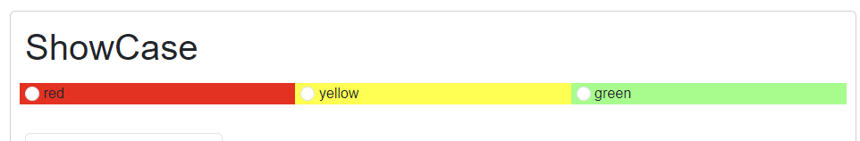
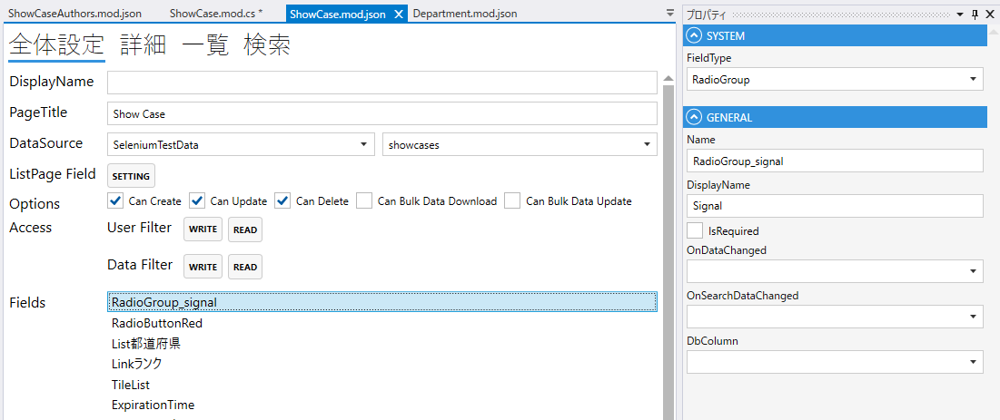

# RadioGroupField

## これは何か

**複数のラジオボタンをまとめるコンテナ**。選択された値を保持します。実際のラジオボタンは [RadioButton](RadioButton.md) を配置するか、`PopulateRadioButtons` で自動生成します。



## いつ使うか

- 3〜5 個程度の選択肢から 1 つを選ばせる
- 選択肢が常に画面に見えている方がよい場合（[Select](Select.md) はクリックで開く必要がある）

---

## デザイナでの設定



### 固有プロパティ

| プロパティ | 型 | 既定値 | 説明 |
|---|---|---|---|
| **DbColumn** | string | `""` | 対応する DB 列名 |
| **AllowOrSearch** | bool | `false` | 検索で OR を許可（複数選択） |
| **PopulateRadioButtons** | bool | `false` | List 内で候補を自動生成 |
| **ShowRadioButtonText** | bool | `false` | 生成するラジオボタンにテキスト表示 |

共通プロパティは [Field 共通プロパティ](common_properties.md) を参照。

---

## 使い方の 2 パターン

### パターン A: RadioButton を個別配置

RadioGroupField を 1 つ置き、その配下に複数の [RadioButton](RadioButton.md) を配置します。
RadioButton の `GroupField` プロパティで親の RadioGroupField を指定します。

### パターン B: PopulateRadioButtons で自動生成

List の中で使う場合、`PopulateRadioButtons: true` にすると列単位でラジオボタンが自動展開されます。

---

## スクリプトから

### プロパティ

| 名前 | 型 | 説明 |
|---|---|---|
| `Value` | string? | 選択値 |
| `DisplayText` | string? | 表示テキスト |
| `DisplayTextAndValue` | IReadOnlyDictionary\<string, string\> | 候補 |
| `SearchValue` | string? | 検索値 |
| `SearchValues` | List\<string\> | 複数選択検索値 |
| `SearchIsEmpty` | bool? | 空検索 |
| `IsInverted` | bool | NOT 検索 |

共通プロパティは [Field 共通プロパティ](common_properties.md) を参照。

### よく使う例

```csharp
// 選択値を取得
var status = RankGroup.Value;

// 検索条件を設定
await RankGroup.SetSearchValueAsync("A");
```

---

## 関連項目

- [Field 共通プロパティ](common_properties.md)
- [RadioButton](RadioButton.md)
- [Select](Select.md) — プルダウン
