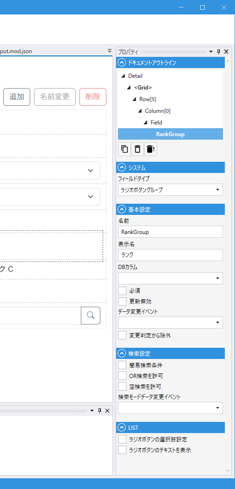
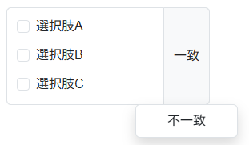

# RadioGroupField (ラジオボタングループ)

## これは何か

**「選択された値」を保持する本体**。RadioGroup 自体が値を持ち、DB カラムにも保存されます。
UI 上のラジオボタン群は [RadioButtonField](RadioButton.md) で表現します。RadioButton たちは**親となる RadioGroupField を指定**することで同じグループにまとめられ、選択状態が RadioGroup の値に反映されます。

> **UI 表示なしで値の入れ物だけとして使うこともできます**。レイアウトに RadioGroupField を配置しなくても、RadioButtonField を並べておけば、選択された値は RadioGroupField に保持されます。一覧（List）で自動的にラジオボタンを並べる場合は `PopulateRadioButtons` オプションを使います。

## いつ使うか

- 3〜5 個程度の選択肢から 1 つを選ばせる
- 選択肢が常に画面に見えている方がよい場合（[Select](Select.md) はクリックで開く必要がある）
- List 内で各行のラジオ選択を並べる場合（`PopulateRadioButtons`）

---

## RadioGroupField と RadioButtonField の役割分担

| 役割 | RadioGroupField | RadioButtonField |
|---|---|---|
| 値を持つか | **持つ**（`string`、DB 列にマッピング可） | 持たない（`IsModified` 常に false） |
| DB 保存 | される | されない |
| UI | 任意（配置なしでも動作） | このフィールドが実際のラジオボタン |
| グループへの所属 | — | `GroupField` で RadioGroup を指定 |
| 選択時の挙動 | 選択された RadioButton の `Value` が RadioGroup に代入される | クリックで親の `SetValueAsync(Value)` を呼ぶ |

### 典型的な配置

```
RadioGroupField (Name = "Rank")    ← 値の本体、DB 列と対応
├─ RadioButtonField (GroupField = "Rank", Value = "A", Text = "ランク A")
├─ RadioButtonField (GroupField = "Rank", Value = "B", Text = "ランク B")
└─ RadioButtonField (GroupField = "Rank", Value = "C", Text = "ランク C")
```

レイアウトには 3 つの RadioButton を並べます。RadioGroup 自体の配置は任意です。

---

## デザイナでの設定



### プロパティ一覧

#### システム

| C#名 | 日本語表示名 | 説明 |
|---|---|---|
| - | フィールドタイプ | `ラジオボタングループ` 固定 |

#### 基本設定

| C#名 | 日本語表示名 | 型 | 既定値 | 説明 |
|---|---|---|---|---|
| **Name** | 名前 | string | `""` | フィールド識別子。RadioButton の `GroupField` で参照される |
| **DisplayName** | 表示名 | string | `""` | 画面表示用の名前 |
| **DbColumn** | DBカラム | string | `""` | 対応する DB 列名（選択値が保存される） |
| **IsRequired** | 必須 | bool | `false` | 入力必須 |
| **IsUpdateProtected** | 更新無効 | bool | `false` | 更新時に値を変更できないようにする |
| **OnDataChanged** | データ変更イベント | string | `""` | 値変更時のスクリプトイベント |
| **IgnoreModification** | 変更判定から除外 | bool | `false` | 変更検知（IsModified）から除外 |

#### 検索設定

| C#名 | 日本語表示名 | 型 | 既定値 | 説明 |
|---|---|---|---|---|
| **IsSimpleSearchParameter** | 簡易検索条件 | bool | `false` | 簡易検索の対象にする |
| **AllowOrSearch** | 直接入力または選択 | bool | `false` | 検索時の複数選択（OR）を許可 |
| **AllowEmptySearch** | 空検索を許可 | bool | `false` | 空での検索を許可する |
| **OnSearchDataChanged** | 検索モードデータ変更イベント | string | `""` | 検索条件が変更された時のスクリプトイベント |

#### LIST（一覧での表示）

| C#名 | 日本語表示名 | 型 | 既定値 | 説明 |
|---|---|---|---|---|
| **PopulateRadioButtons** | ラジオボタンの選択肢設定 | bool | `false` | List 内でグループの候補を自動でラジオボタンに展開 |
| **ShowRadioButtonText** | ラジオボタンのテキストを表示 | bool | `false` | 自動生成するラジオボタンにテキスト表示 |

---

## スクリプトから

### プロパティ

| 名前 | 型 | 説明 |
|---|---|---|
| `Value` | string? | 現在選択されている値（= 選択中の RadioButton の `Value`） |
| `DisplayText` | string? | 選択中の RadioButton の `Text` |
| `DisplayTextAndValue` | IReadOnlyDictionary\<string, string\> | 候補（同じグループの RadioButton を走査して作られる辞書） |
| `SearchValue` | string? | 検索値 |
| `SearchValues` | List\<string\> | 複数選択検索値 |
| `SearchIsEmpty` | bool? | 空検索 |
| `IsInverted` | bool | NOT 検索 |

共通プロパティは [Field 共通プロパティ](common_properties.md) を参照。

### よく使う例

```csharp
// 選択値を取得
var rank = RankGroup.Value;  // "A" / "B" / "C"

// プログラム的に値を設定
await RankGroup.SetValueAsync("A");

// 検索条件を設定
await RankGroup.SetSearchValueAsync("A");
```

---

## 検索での挙動

検索フォームでは **候補のドロップダウン** が出ます。レイアウト上ではラジオボタンが並ぶ Field ですが、検索 UI は SelectField と同じドロップダウン形式です。選んだ値で **一致** 検索が基本です。

### 簡易検索（`IsSimpleSearchParameter=true`）


ドロップダウンのみ。選んだ値で一致検索。

### 詳細検索（`IsSimpleSearchParameter=false`）


ドロップダウンの右側に **モード切替（`一致` ボタン）** が出ます。クリックで **一致** / **不一致** を切り替えられます。

| モード | 挙動 |
|---|---|
| **一致**（既定） | 選んだ値と等しいデータ（`= 値`） |
| **不一致** | 選んだ値と異なるデータ（`!= 値`） |

### 詳細検索 + 空検索を許可（`IsSimpleSearchParameter=false`, `AllowEmptySearch=true`）


モード切替に **空** / **空以外** が追加されます。

### Or 検索（`AllowOrSearch=true`）



候補がチェックボックスのリストに変わり、**複数選択** できます。選択した複数値のうちいずれかに一致するデータが対象（`OR` 結合）。モード切替で **不一致** にすれば「いずれにも一致しない」検索になります。

検索全体の仕組みは [SearchField](Search.md#検索の仕組み) を参照。

---

## 関連項目

- [Field 共通プロパティ](common_properties.md)
- [RadioButton](RadioButton.md) — グループ内のラジオボタン 1 つ
- [Select](Select.md) — プルダウン
- [SearchField](Search.md) — 検索全体の仕組み
