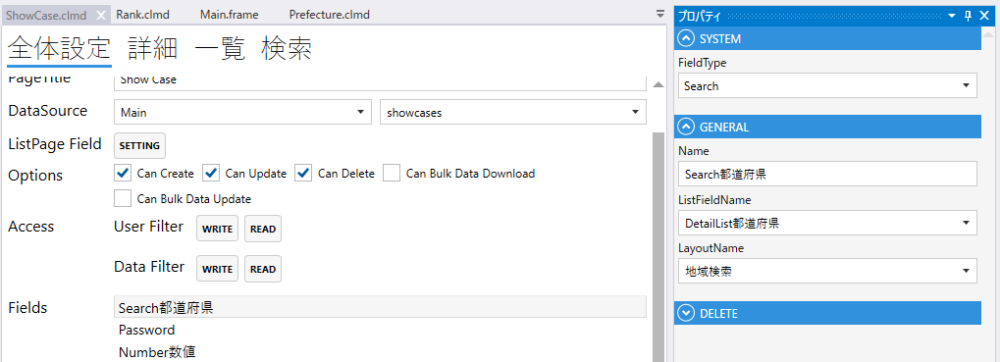
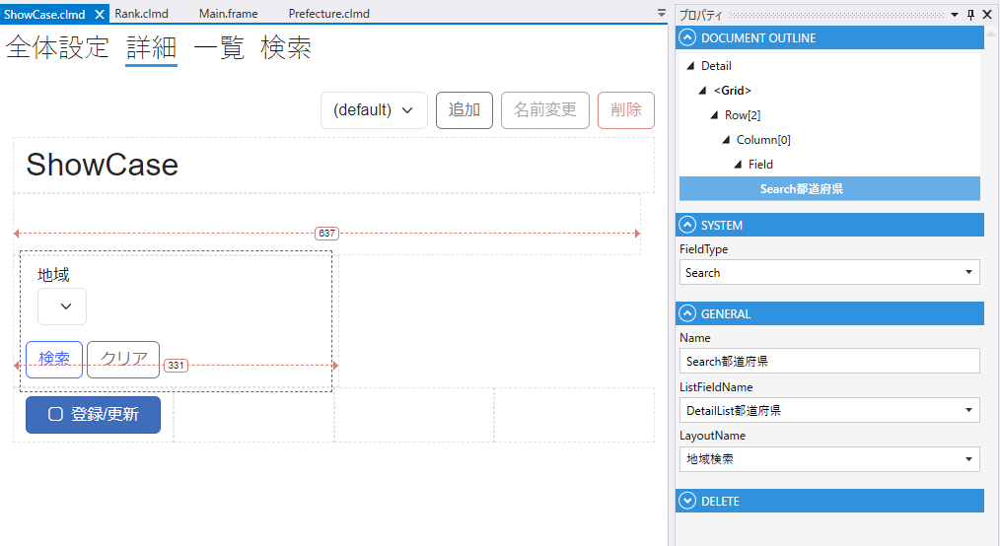

# Search

1. FieldType
    - Searchを設定する
2. Name
    - フィールド名の設定. 全体設定時に表示される.
3. ListFieldName
    - DetailList, TileList, で作成したFieldから選択する
4. LayoutName
    - ListFieldに指定したModuleの検索タブで作成した検索フォームから選択する

## スクリプト
| プロパティ名          | 型       | 説明             |
|-----------------|---------|----------------|
| BackgroundColor | string? | Fieldの背景色      | 
| Color           | string? | Fieldの色        |
| IsEnabled       | bool    | Fieldの有効/無効    |
| IsVisible       | bool    | Fieldの表示/非表示   |
| IsViewOnly      | bool    | Fieldの編集可/編集不可 |
| SearchModule    | Module  | 検索するモジュール      |
