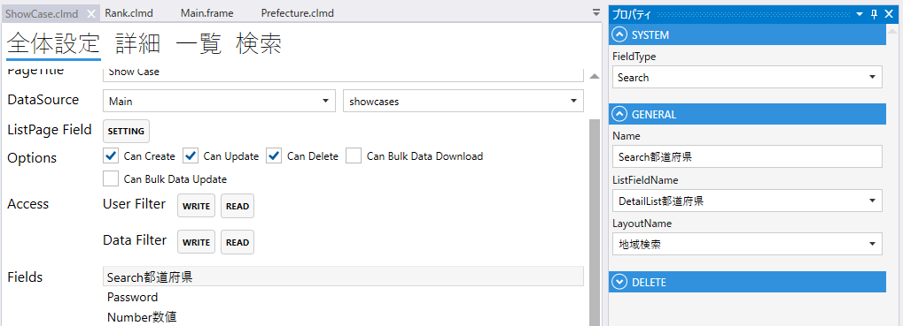
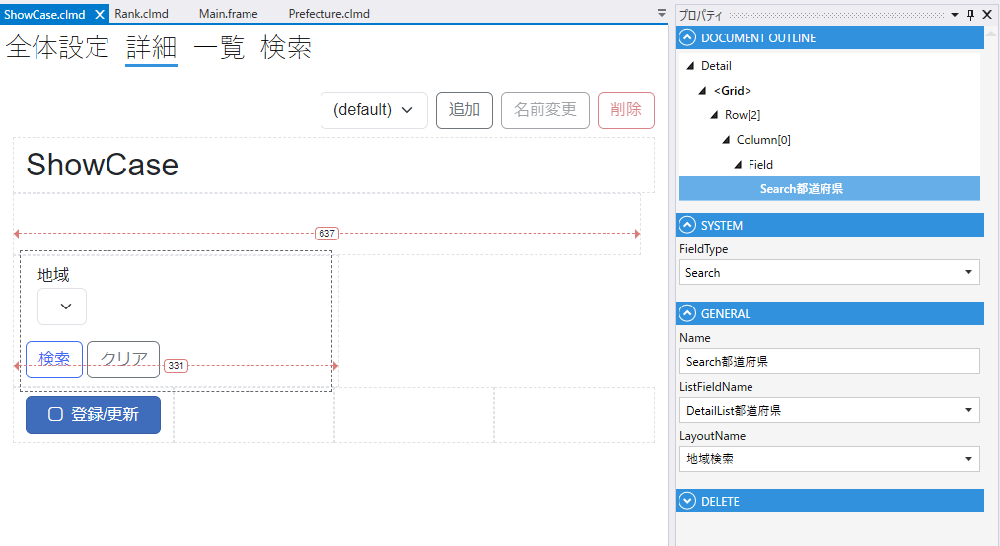

# SearchField

## これは何か

**検索条件の入力欄と実行ボタンを提供するフィールド**。[List](List.md) / [DetailList](DetailList.md) / [TileList](TileList.md) などと組み合わせて、画面上部の検索バーを構成します。


## いつ使うか

- 一覧画面に検索条件を付けたい時（通常は一覧画面に自動で配置される）
- 独自の場所に検索バーを追加したい時

---

## デザイナでの設定



### 固有プロパティ

| プロパティ | 型 | 既定値 | 説明 |
|---|---|---|---|
| **ResultsViewFieldName** | string | `""` | 検索結果を表示する List 系 Field の Name |
| **LayoutName** | string | `""` | 検索入力用の Search レイアウト名 |
| **OnSearched** | string | `""` | 検索実行後のスクリプト |
| **UserUrlParameter** | bool | `false` | URL に検索条件を反映する |
| **SearchUrlParameterKey** | string | `""` | 検索条件の URL パラメータキー（既定 `"q"`） |
| **PageIndexUrlParameterKey** | string | `""` | ページ番号の URL パラメータキー（既定 `"p"`） |
| **SearchInitializationTriggerUrlParameter** | string | `""` | 初期化トリガとなる URL パラメータ |

共通プロパティは [Field 共通プロパティ](common_properties.md) を参照。



---

## スクリプトから

### プロパティ・メソッド

| 名前 | 型・戻り値 | 説明 |
|---|---|---|
| `SearchModule` | Module | 検索入力用の子モジュール |
| `Condition` | ModuleSearcher | 現在の検索条件 |
| `ExecuteSearch()` | Task | 検索を実行 |
| `ExecuteClear()` | Task | 検索条件をクリア |
| `InvokeSearchInitialization()` | Task | 検索入力の初期化を発動 |

共通プロパティは [Field 共通プロパティ](common_properties.md) を参照。

### よく使う例

```csharp
// 検索バーの Field にアクセス
Search.SearchModule.Name.Value = "山田";
await Search.ExecuteSearch();

// クリア
await Search.ExecuteClear();
```

---

## 関連項目

- [Field 共通プロパティ](common_properties.md)
- [List](List.md) / [DetailList](DetailList.md) / [TileList](TileList.md) — 検索結果の表示先
- [Module 検索設定](../module/module_search.md)
