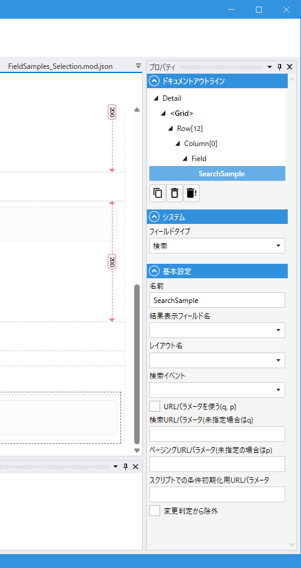

# SearchField (検索)

## これは何か

**検索条件の入力欄と実行ボタンを提供するフィールド**。[List](List.md) / [DetailList](DetailList.md) / [TileList](TileList.md) などと組み合わせて、画面上部の検索バーを構成します。

## いつ使うか

- 一覧画面に検索条件を付けたい時（通常は一覧画面に自動で配置される）
- 独自の場所に検索バーを追加したい時

SearchField は `結果表示フィールド名` で指定した List 系 Field と連動し、そのモジュールの検索レイアウトに従って検索 UI を構築します。

---

## デザイナでの設定



### プロパティ一覧

#### システム

| C#名 | 日本語表示名 | 説明 |
|---|---|---|
| - | フィールドタイプ | `検索` 固定 |

#### 基本設定

| C#名 | 日本語表示名 | 型 | 既定値 | 説明 |
|---|---|---|---|---|
| **Name** | 名前 | string | `""` | フィールド識別子 |
| **ResultsViewFieldName** | 結果表示フィールド名 | string | `""` | 検索結果を表示する List / DetailList / TileList の Name |
| **LayoutName** | レイアウト名 | string | `""` | 結果表示モジュールの Search レイアウト名 |
| **OnSearched** | 検索イベント | string | `""` | 検索実行後のスクリプト |
| **UserUrlParameter** | URLパラメータを使う(q, p) | bool | `false` | 検索条件・ページ番号を URL に反映する |
| **SearchUrlParameterKey** | 検索URLパラメータ(未指定場合はq) | string | `""` | 検索条件の URL パラメータ名（既定 `q`） |
| **PageIndexUrlParameterKey** | ページングURLパラメータ(未指定の場合はp) | string | `""` | ページ番号の URL パラメータ名（既定 `p`） |
| **SearchInitializationTriggerUrlParameter** | スクリプトでの条件初期化用URLパラメータ | string | `""` | 指定した URL パラメータがあるとき、スクリプトでの検索条件初期化をトリガ |
| **IgnoreModification** | 変更判定から除外 | bool | `false` | 変更検知から除外 |

> SearchField には `表示名` / `必須` はありません。値を持つのは子の入力 Field 側です。

---

## スクリプトから

### プロパティ・メソッド

| 名前 | 型・戻り値 | 説明 |
|---|---|---|
| `SearchModule` | Module? | 検索入力用の子モジュール（`SearchModule.Xxx.SearchValue = ...` のようにアクセス） |
| `ExecuteSearch()` | Task | 検索を実行 |
| `ExecuteClear()` | Task | 検索条件をクリア（`InvokeOnClearAsync` 相当） |
| `InvokeSearchInitialization()` | Task | 検索入力の初期化スクリプトを発動 |

共通プロパティは [Field 共通プロパティ](common_properties.md) を参照。

### よく使う例

```csharp
// 検索バーの Field にアクセスして値を設定、検索実行
Search.SearchModule.Name.SearchValue = "山田";
await Search.ExecuteSearch();

// 条件クリア
await Search.ExecuteClear();
```

---

## 関連項目

- [Field 共通プロパティ](common_properties.md)
- [List](List.md) / [DetailList](DetailList.md) / [TileList](TileList.md) — 検索結果の表示先
- [Module 検索設定](../module/module_search.md)
