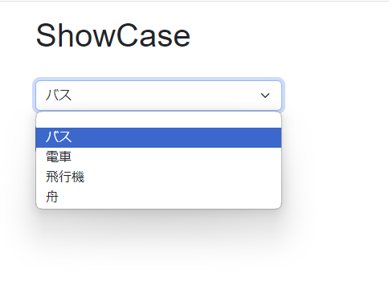
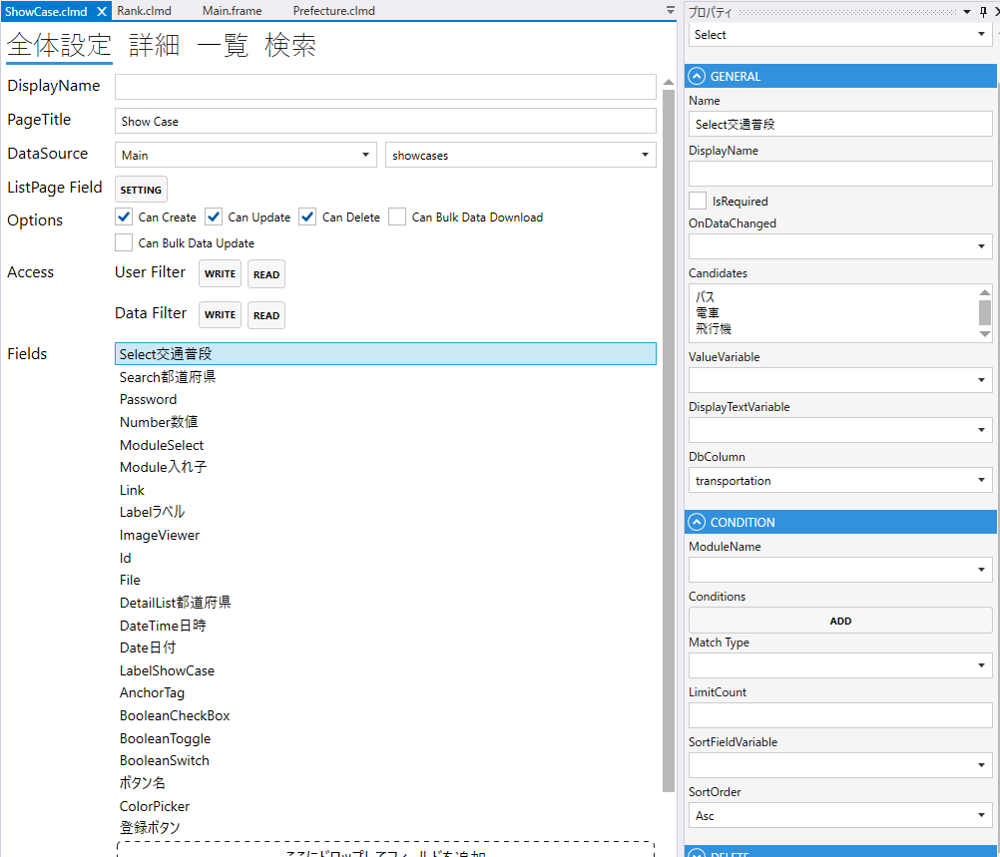
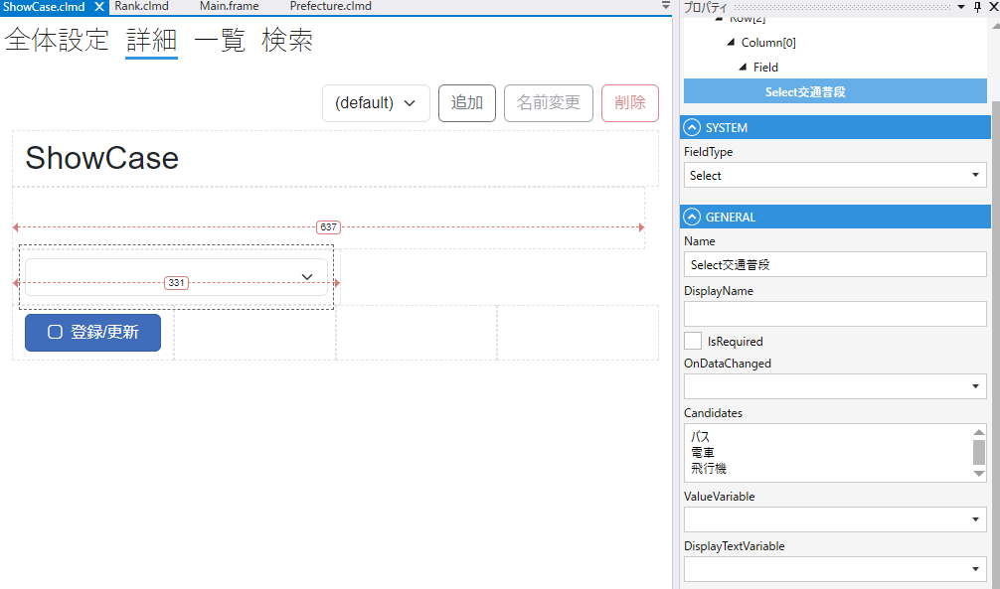

# Select

### GENERAL
1. FieldType
    - Selectを設定する
2. Name
    - フィールド名の設定. 全体設定時に表示される.
3. DisplayName
    - TBD
4. IsRequired
    - 登録時，必須にする
5. OnDataChanged
   - 変更時のスクリプト
6. Candidates
   - Selectの選択肢
7. ValueVariable
   - TBD
8. DisplayTextVariable
   - TBD
9. DbColumn
    - テーブルのカラムの設定

### CONDITION
- ModuleName
  - モジュールを選択肢にする場合に指定する.
- Conditions
  - 表示する条件を設定する
- MatchType
  - 条件の結合. `And` or `Or`
- LimitCount
  - 表示する最大
- SortFieldValue
  - ソートに使用するフィールド
- SortOrder
  - ソート順. `Asc` or `Desc`

## スクリプト
| プロパティ名              | 型       | 説明                    |
|---------------------|---------|-----------------------|
| AllowReloadLinkData | bool    | 再読み込みを許可するか           | 
| BackgroundColor     | string? | Fieldの背景色             | 
| Color               | string? | Fieldの色               |
| DisplayText         | string? | Fieldの色               |
| IsEnabled           | bool    | Fieldの有効/無効           |
| IsModified          | bool    | Fieldが変更されたどうか        |
| IsVisible           | bool    | Fieldの表示/非表示          |
| IsViewOnly          | bool    | Fieldの編集可/編集不可        |
| SearchValue         | string? | 検索条件のinputフィールドのvalue |
| Value               | string  | Fieldの値               |

| メソッド名                | 戻り値 | 説明         |
|----------------------|-----|------------|
| ReloadCandidates()   | なし  | 選択肢をリロードする |
| SetSearchCondition() | なし  | 検索条件をセットする |

