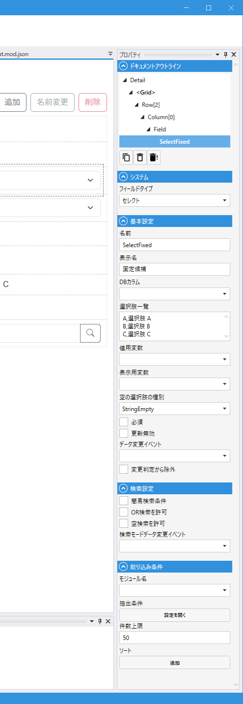

# SelectField (セレクト)

## これは何か

**プルダウンから選択するフィールド**。候補は直接指定することも、他モジュールから動的に引くこともできます。

## いつ使うか

- ステータス・カテゴリ・都道府県など、あらかじめ決まった選択肢からの選択
- 他モジュールのデータを候補として表示（例: 担当者一覧から選ぶ）
- 3 つ以上の選択肢で検索条件を複数選びたい場合

選択肢が 2 つなら [Boolean](Boolean.md)、ラジオボタン表示なら [RadioGroup](RadioGroup.md) が向きます。

---

## デザイナでの設定



### プロパティ一覧

#### システム

| C#名 | 日本語表示名 | 説明 |
|---|---|---|
| - | フィールドタイプ | `セレクト` 固定 |

#### 基本設定

| C#名 | 日本語表示名 | 型 | 既定値 | 説明 |
|---|---|---|---|---|
| **Name** | 名前 | string | `""` | フィールド識別子 |
| **DisplayName** | 表示名 | string | `""` | 画面表示用の名前 |
| **DbColumn** | DBカラム | string | `""` | 対応する DB 列名（Join 可） |
| **Candidates** | 選択肢一覧 | List\<string\> | `[]` | 固定候補。1 行 1 候補、`"値,表示文字"` 形式 |
| **ValueVariable** | 値用変数 | string | `""` | モジュール候補で「値」として使う Field 名 |
| **DisplayTextVariable** | 表示用変数 | string | `""` | モジュール候補で「表示文字」として使う Field 名 |
| **EmptyCandidateType** | 空の選択肢の種別 | enum | `StringEmpty` | 未選択時の扱い |
| **IsRequired** | 必須 | bool | `false` | 入力必須 |
| **IsUpdateProtected** | 更新無効 | bool | `false` | 更新時に値を変更できないようにする |
| **OnDataChanged** | データ変更イベント | string | `""` | 値変更時のスクリプトイベント |
| **IgnoreModification** | 変更判定から除外 | bool | `false` | 変更検知（IsModified）から除外 |

#### 検索設定

| C#名 | 日本語表示名 | 型 | 既定値 | 説明 |
|---|---|---|---|---|
| **IsSimpleSearchParameter** | 簡易検索条件 | bool | `false` | 簡易検索の対象にする |
| **AllowOrSearch** | 直接入力または選択 | bool | `false` | 検索時の複数選択（OR）を許可 |
| **AllowEmptySearch** | 空検索を許可 | bool | `false` | 空での検索を許可する |
| **OnSearchDataChanged** | 検索モードデータ変更イベント | string | `""` | 検索条件が変更された時のスクリプトイベント |

#### 絞り込み条件（モジュール候補）

モジュールから候補を引く場合の設定です。固定候補（Candidates）を使う場合は不要です。

| C#名 | 日本語表示名 | 型 | 既定値 | 説明 |
|---|---|---|---|---|
| **SearchCondition.ModuleName** | モジュール名 | string | `""` | 候補を取得するモジュール名 |
| **SearchCondition.Condition** | 抽出条件 | MultiMatchCondition | - | 候補の絞り込み条件（「設定を開く」から編集） |
| **SearchCondition.LimitCount** | 件数上限 | int | `50` | 取得する候補の最大件数 |
| **SearchCondition.SortConditions** | ソート | List | `[]` | 候補の表示順 |

---

## 候補の指定方式

### 固定候補（Candidates）

シンプルに決め打ちの選択肢を並べたい場合。
`値,表示文字` の形式で 1 行 1 候補を記述します。表示文字を省略すると値がそのまま表示されます。

```
A,選択肢 A
B,選択肢 B
C,選択肢 C
```

### モジュール候補（SearchCondition）

他モジュールのデータを候補にする場合:

1. `SearchCondition.ModuleName` で対象モジュールを指定
2. `ValueVariable` で値として使う Field を指定
3. `DisplayTextVariable` で表示文字として使う Field を指定
4. 必要に応じて `Condition` / `LimitCount` / `SortConditions` で絞り込み

---

## スクリプトから

### プロパティ

| 名前 | 型 | 説明 |
|---|---|---|
| `Value` | string? | 選択値 |
| `DisplayText` | string? | 表示テキスト |
| `DisplayTextAndValue` | IReadOnlyDictionary\<string, string\> | 候補の辞書 |
| `SearchValue` | string? | 検索値 |
| `SearchValues` | List\<string\> | 複数選択検索値 |
| `SearchIsEmpty` | bool? | 空検索 |
| `IsInverted` | bool | NOT 検索 |
| `AllowReloadLinkData` | bool | 候補の再読み込み許可 |

### メソッド

| 名前 | 戻り値 | 説明 |
|---|---|---|
| `SetValueAsync(string?)` | Task | 値を設定 |
| `SetCandidates(...)` | void | 候補を差し替える |
| `ReloadCandidates()` | Task | 候補を再取得 |
| `SetAdditionalCondition(ModuleSearcher)` | void | 候補の絞り込み条件を追加 |
| `SetNotFlag(bool)` | void | NOT 検索フラグを設定 |

共通プロパティは [Field 共通プロパティ](common_properties.md) を参照。

### よく使う例

```csharp
// 選択値に応じて別の Field を出し分け
void Status_OnDataChanged()
{
    ReasonField.IsVisible = Status.Value == "rejected";
}

// 候補を動的に差し替え
Category.SetCandidates(new Dictionary<string, string> {
    { "A", "カテゴリ A" },
    { "B", "カテゴリ B" }
});
await Category.ReloadCandidates();

// 他モジュール連携時、候補を条件で絞り込む
var cond = new ModuleSearcher<Department>();
cond.AddEquals(d => d.IsActive.Value, true);
Assignee.SetAdditionalCondition(cond);
await Assignee.ReloadCandidates();
```

---

## 関連項目

- [Field 共通プロパティ](common_properties.md)
- [Link](Link.md) — 検索ダイアログ付きで他モジュールの 1 件を選ぶ
- [RadioGroup](RadioGroup.md) — ラジオボタン表示
