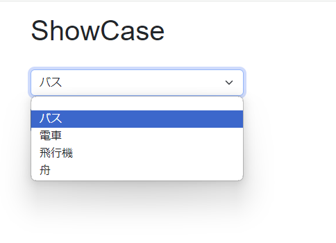
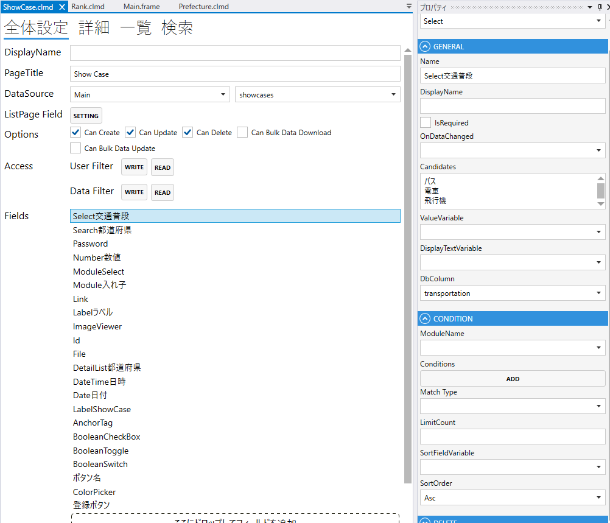
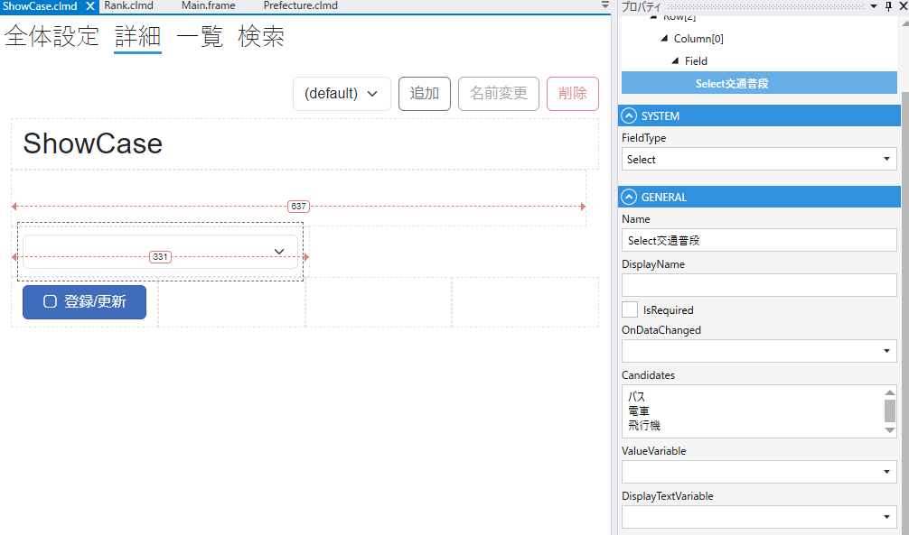

# SelectField

## これは何か

**プルダウンから選択するフィールド**。候補は直接指定することも、他モジュールから動的に引くこともできます。



## いつ使うか

- ステータス・カテゴリ・都道府県など、あらかじめ決まった選択肢からの選択
- 他モジュールのデータを候補として表示（例: 担当者一覧から選ぶ）
- 3 つ以上の選択肢で検索条件を複数選びたい場合

選択肢が 2 つなら [Boolean](Boolean.md)、ラジオボタン表示なら [RadioGroup](RadioGroup.md) が向きます。

---

## デザイナでの設定



### 固有プロパティ

| プロパティ | 型 | 既定値 | 説明 |
|---|---|---|---|
| **DbColumn** | string | `""` | 対応する DB 列名（Join 可） |
| **Candidates** | List\<string\> | `[]` | 固定候補。`"値,表示文字"` 形式で記述 |
| **SearchCondition** | SearchCondition | - | 候補を他モジュールから引く場合の条件 |
| **ValueVariable** | string | `""` | 候補元モジュールの「値」として使う Field 名 |
| **DisplayTextVariable** | string | `""` | 候補元モジュールの「表示文字」として使う Field 名 |
| **EmptyCandidateType** | enum | `StringEmpty` | 空候補の扱い |
| **AllowOrSearch** | bool | `false` | 検索で OR を許可（複数選択可） |

共通プロパティは [Field 共通プロパティ](common_properties.md) を参照。



### CONDITION（他モジュールから候補を引く場合）

`SearchCondition` の中身として以下を指定します:

- **ModuleName** — 候補を取得するモジュール名
- **Conditions** — 候補の絞り込み条件
- **MatchType** — 条件の結合（`And` / `Or`）
- **LimitCount** — 表示する最大件数
- **SortFieldValue** — ソートに使う Field
- **SortOrder** — ソート順（`Asc` / `Desc`）

---

## スクリプトから

### プロパティ

| 名前 | 型 | 説明 |
|---|---|---|
| `Value` | string? | 選択値 |
| `DisplayText` | string? | 表示テキスト |
| `DisplayTextAndValue` | IReadOnlyDictionary\<string, string\> | 候補の辞書 |
| `SearchValue` | string? | 検索値 |
| `SearchValues` | List\<string\> | 複数選択検索値 |
| `SearchIsEmpty` | bool? | 空検索 |
| `IsInverted` | bool | NOT 検索 |

### メソッド

| 名前 | 戻り値 | 説明 |
|---|---|---|
| `SetValueAsync(string?)` | Task | 値を設定 |
| `SetCandidates(...)` | void | 候補を差し替える |
| `ReloadCandidates()` | Task | 候補を再取得 |
| `SetAdditionalCondition(ModuleSearcher)` | void | 候補の絞り込み条件を追加 |
| `SetNotFlag(bool)` | void | NOT 検索フラグを設定 |

共通プロパティは [Field 共通プロパティ](common_properties.md) を参照。

### よく使う例

```csharp
// 選択値に応じて別の Field を出し分け
void Status_OnDataChanged()
{
    ReasonField.IsVisible = Status.Value == "rejected";
}

// 候補を動的に差し替え
Category.SetCandidates(new Dictionary<string, string> {
    { "A", "カテゴリ A" },
    { "B", "カテゴリ B" }
});
await Category.ReloadCandidates();

// 他モジュール連携時、候補を条件で絞り込む
var cond = new ModuleSearcher<Department>();
cond.AddEquals(d => d.IsActive.Value, true);
Assignee.SetAdditionalCondition(cond);
await Assignee.ReloadCandidates();
```

---

## 関連項目

- [Field 共通プロパティ](common_properties.md)
- [Link](Link.md) — 検索ダイアログ付きで他モジュールの 1 件を選ぶ
- [RadioGroup](RadioGroup.md) — ラジオボタン表示
