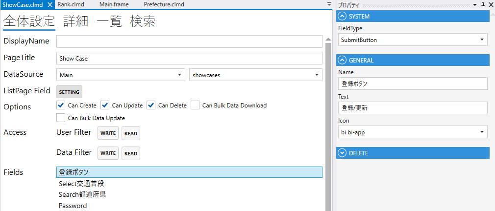
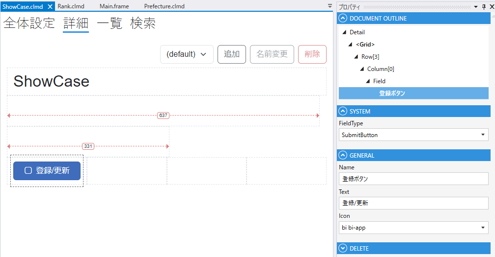

# SubmitButton

送信ボタンのフィールド

1. FieldType
    - SubmitButtonを設定する
2. Name
    - フィールド名の設定. 全体設定時に表示される.
3. Text
    - 画面に表示するボタン名称
4. Icon
    - アイコン設定

## スクリプト
| プロパティ名              | 型       | 説明                    |
|---------------------|---------|-----------------------|
| BackgroundColor     | string? | Fieldの背景色             | 
| Color               | string? | Fieldの色               |
| IsEnabled           | bool    | Fieldの有効/無効           |
| IsVisible           | bool    | Fieldの表示/非表示          |
| IsViewOnly          | bool    | Fieldの編集可/編集不可        |

