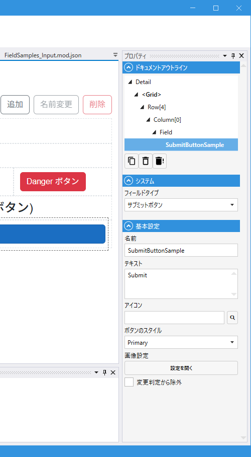

# SubmitButtonField (サブミットボタン)

## これは何か

**データを登録・更新するための標準ボタン**。配置するだけで、現在のモジュールのバリデーション＋ Submit が動作します。

## いつ使うか

- 詳細画面で「登録」「更新」ボタンとして使う
- 追加の処理を挟まず、そのまま DB 保存したい場合

処理を挟みたい場合は [Button](Button.md) を使い、スクリプト内で `await Submit()` を呼び出します。

---

## 自動で行われる処理

クリック時、以下が順に実行されます:

1. `Module.ValidateInput()` を実行
2. バリデーションに失敗した場合は `UIService.NotifyError` で通知して中断
3. 成功したら `Module.SubmitAsync()` を呼び出し、DB へ保存
4. 保存結果に応じて `NotifySuccess` / `NotifyError` で通知

スクリプトイベントは**ありません**（`OnClick` は持たない）。処理を挟みたい場合は [Button](Button.md) を使い、スクリプトから `await Submit()` を呼び出します。

---

## デザイナでの設定

### プロパティ一覧

#### システム

| C#名 | 日本語表示名 | 説明 |
|---|---|---|
| - | フィールドタイプ | `サブミットボタン` 固定 |

#### 基本設定

| C#名 | 日本語表示名 | 型 | 既定値 | 説明 |
|---|---|---|---|---|
| **Name** | 名前 | string | `""` | フィールド識別子 |
| **Text** | テキスト | string | `"Submit"` | ボタンのラベル |
| **Icon** | アイコン | string | `""` | アイコン |
| **Variant** | ボタンのスタイル | enum | `Primary` | Bootstrap 準拠のスタイル（`Primary` / `Success` / `Danger` など。[Button の Variant](Button.md#variantボタンのスタイル) 参照） |
| **ImageResourceSet** | 画像設定 | ButtonImageSet | - | 状態別の画像リソース |
| **IgnoreModification** | 変更判定から除外 | bool | `false` | 変更検知から除外 |

> SubmitButton は `OnClick` / `ShowTextInToolTip` / `IsRequired` / `DisplayName` などを持ちません。横幅は常に親要素いっぱいに広がります（`IsBlock = true` 固定）。

---

## スクリプトから

スクリプト公開メンバーは共通の `IsEnabled` / `IsVisible` / `Color` などのみです。[Field 共通プロパティ](common_properties.md) を参照。

独自処理を足したい場合は [Button](Button.md) + `await Submit()` への置き換えを検討してください。

---

## 関連項目

- [Field 共通プロパティ](common_properties.md)
- [Button](Button.md) — 独自処理を挟みたい時
- [チュートリアル: スクリプトの基本](../tutorials/tutorial_script.md)
