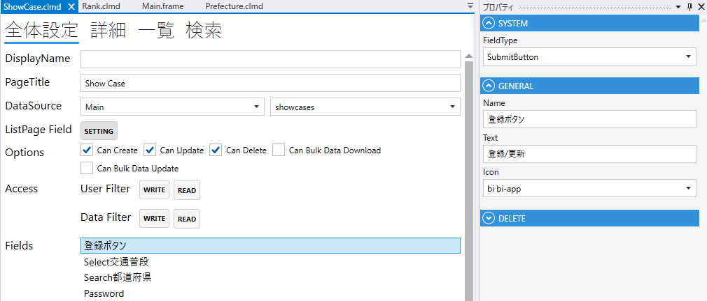
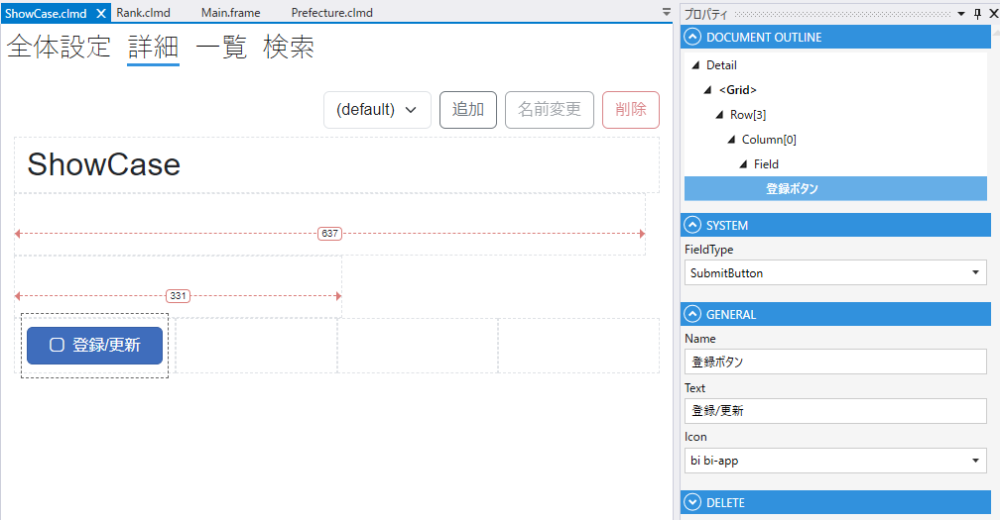

# SubmitButtonField

## これは何か

**データを登録・更新・削除するための標準ボタン**。配置するだけで、現在のモジュールの CRUD が動作します。

## いつ使うか

- 詳細画面で「登録」「更新」「削除」ボタンとして使う
- 追加の処理を挟まず、そのまま DB 保存したい場合

処理を挟みたい場合は [Button](Button.md) を使い、スクリプト内で `await Submit()` / `await Delete()` を呼び出します。

---

## デザイナでの設定

### 固有プロパティ

| プロパティ | 型 | 既定値 | 説明 |
|---|---|---|---|
| **Text** | string | `"Submit"` | ボタンのラベル |
| **Icon** | string | `""` | アイコン |
| **Variant** | enum | `Primary` | ボタンの見た目 |
| **ImageResourceSet** | object | - | 画像ボタンとして使う場合 |
| **IsBlock** | bool | `true` | 横幅いっぱいに広げる |

共通プロパティ（Name など）は [Field 共通プロパティ](common_properties.md) を参照。

---

## 自動で行われる処理

クリックすると、以下が順に実行されます:

1. Module 全体の `ValidateInput()` 実行
2. エラーがあれば中断（画面にエラー表示）
3. エラーがなければ `Submit()` を呼び出し、DB へ保存

> 削除ボタンを別途置きたい場合は [Button](Button.md) + `await Delete()` を使います。

---

## スクリプトから

共通プロパティのみ利用可能です。[Field 共通プロパティ](common_properties.md) を参照。

独自処理を足したい場合は [Button](Button.md) + `await Submit()` への置き換えを検討してください。

---

## 関連項目

- [Field 共通プロパティ](common_properties.md)
- [Button](Button.md) — 独自処理を挟みたい時
- [チュートリアル: スクリプトの基本](../tutorials/tutorial_script.md)
