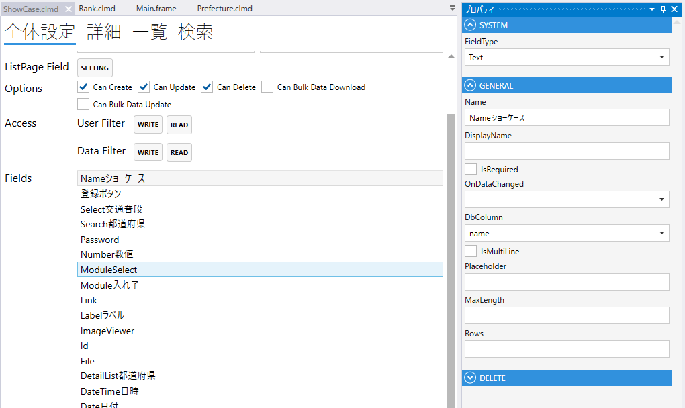
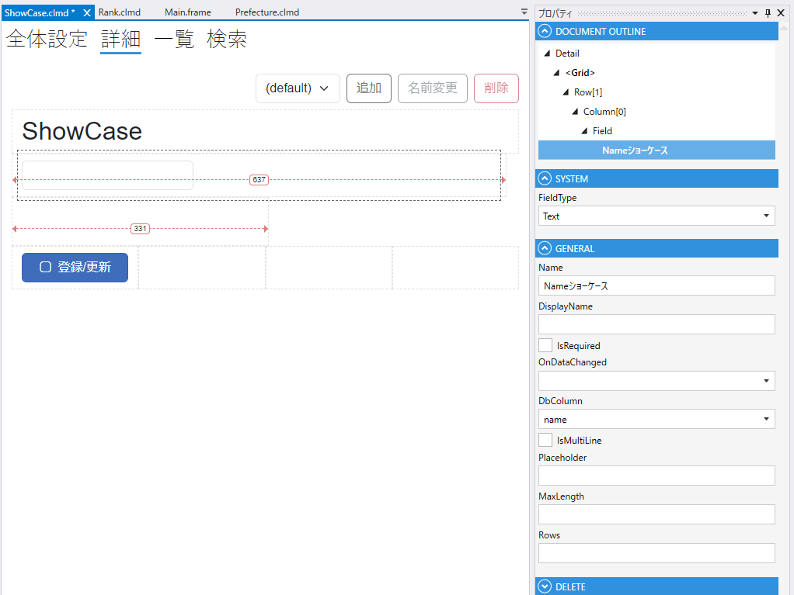

# Text

テキストを表示する

1. FieldType
    - Textを設定する
2. Name
    - フィールド名の設定. 全体設定時に表示される.
3. DisplayName
    - TBD
4. DbColumn
    - テーブルのカラムの設定
5. Placeholder
    - placeholderの設定
6. MaxLength
   - 最大文字数の設定
7. Rows
   - textareaにする場合，行数を指定する. 

## スクリプト
| プロパティ名          | 型               | 説明                                            |
|-----------------|-----------------|-----------------------------------------------|
| Value           | string?         | Fieldの値                                       |
| SearchValue     | string?         | 検索条件のinputフィールドのvalue                         |
| Comparison      | MatchComparison | 検索条件のinputフィールドの条件区分 `Equal`, `Like`が使用できる |
| BackgroundColor | string?         | Fieldの背景色                                     | 
| Color           | string?         | Fieldの色                                       |
| IsEnabled       | bool            | Fieldの有効/無効                                   |
| IsVisible       | bool            | Fieldの表示/非表示                                  |
| IsViewOnly      | bool            | Fieldの編集可/編集不可                                |
| IsModified      | bool            | Fieldが変更されたどうか                                |
