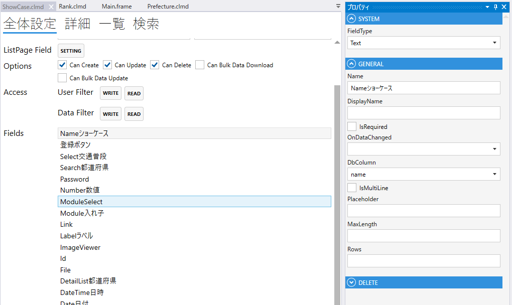
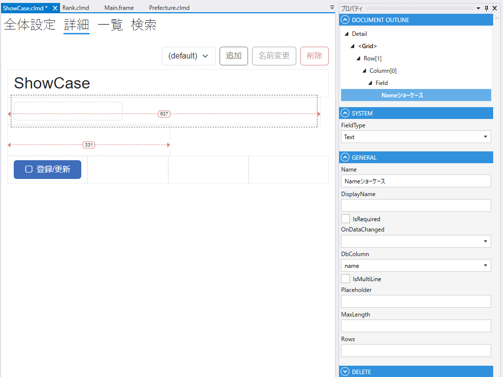

# TextField

## これは何か

**文字列を入力・表示するフィールド**。1 行の入力欄としても、複数行（textarea）としても使えます。


## いつ使うか

- 名前・タイトル・住所など一般的な文字列入力
- コメント・説明文など複数行の入力（`IsMultiline` をオン）
- DB 文字列カラムの表示・編集

---

## デザイナでの設定



### 固有プロパティ

| プロパティ | 型 | 既定値 | 説明 |
|---|---|---|---|
| **DbColumn** | string | `""` | 対応する DB 列名 |
| **Placeholder** | string | `""` | 未入力時に表示される案内文 |
| **IsMultiline** | bool | `false` | 複数行入力（textarea）にする |
| **IsAutoFitRows** | bool | `false` | 入力内容に応じて行数を自動調整 |
| **Rows** | int? | null | 表示行数（IsMultiline 時） |
| **MaxLength** | int? | null | 最大文字数 |
| **TextEditEmptyType** | enum | `StringEmpty` | 空入力時に `""` を保持するか `null` にするか |
| **ShouldTrimAfterEdit** | bool | `false` | 編集後に前後の空白を自動削除 |
| **SearchComparisonDefaultValue** | MatchComparison? | null | 検索の既定比較（`Equal` / `Like`） |

共通プロパティ（Name, DisplayName, IsRequired, OnDataChanged など）は [Field 共通プロパティ](common_properties.md) を参照。



---

## スクリプトから

### プロパティ

| 名前 | 型 | 説明 |
|---|---|---|
| `Value` | string? | 入力値 |
| `SearchValue` | string? | 検索値 |
| `SearchComparison` | MatchComparison | 検索比較（`Equal` / `Like` のみ有効） |
| `SearchIsEmpty` | bool? | 「空」を検索条件にする |

共通プロパティ（IsEnabled / IsVisible / Color など）は [Field 共通プロパティ](common_properties.md) を参照。

### よく使う例

```csharp
// 値を取得・設定
var name = Name.Value;
Name.Value = "山田太郎";

// 必須チェックして Submit
if (string.IsNullOrEmpty(Name.Value))
{
    Name.SetError("名前を入力してください");
    return;
}

// 検索条件を動的に設定
await Name.SetSearchValueAsync("山田");
await Name.SetSearchComparisonAsync(MatchComparison.Like);
```

---

## 関連項目

- [Field 共通プロパティ](common_properties.md)
- [Password](Password.md) — パスワード入力
- [MarkupString](MarkupString.md) — HTML 表示
- [スクリプト概要](../overview/script.md)
