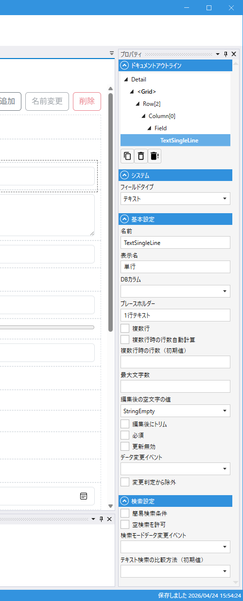

# TextField (テキスト)

## これは何か

**文字列を入力・表示するフィールド**。1 行の入力欄としても、複数行（textarea）としても使えます。

## いつ使うか

- 名前・タイトル・住所など一般的な文字列入力
- コメント・説明文など複数行の入力（「複数行」をオン）
- DB 文字列カラムの表示・編集

---

## デザイナでの設定



### プロパティ一覧

#### システム

| C#名 | 日本語表示名 | 説明 |
|---|---|---|
| - | フィールドタイプ | `テキスト` 固定 |

#### 基本設定

| C#名 | 日本語表示名 | 型 | 既定値 | 説明 |
|---|---|---|---|---|
| **Name** | 名前 | string | `""` | フィールド識別子 |
| **DisplayName** | 表示名 | string | `""` | 画面表示用の名前（ラベル・ヘッダー）。空なら Name が使われる |
| **DbColumn** | DBカラム | string | `""` | 対応する DB 列名 |
| **Placeholder** | プレースホルダー | string | `""` | 未入力時の案内文 |
| **IsMultiline** | 複数行 | bool | `false` | 複数行入力（textarea）にする |
| **IsAutoFitRows** | 複数行時の行数自動計算 | bool | `false` | 入力内容に応じて行数を自動調整 |
| **Rows** | 複数行時の行数（初期値） | int? | null | 表示行数（IsMultiline 時） |
| **MaxLength** | 最大文字数 | int? | null | 入力可能な最大文字数 |
| **TextEditEmptyType** | 編集後の空文字の値 | enum | `StringEmpty` | 空入力時に `""` を保持するか `null` にするか |
| **ShouldTrimAfterEdit** | 編集後にトリム | bool | `false` | 編集後に前後の空白を自動削除 |
| **IsRequired** | 必須 | bool | `false` | 入力必須 |
| **IsUpdateProtected** | 更新無効 | bool | `false` | 更新時に値を変更できないようにする |
| **OnDataChanged** | データ変更イベント | string | `""` | 値変更時のスクリプトイベント |
| **IgnoreModification** | 変更判定から除外 | bool | `false` | 変更検知（IsModified）から除外 |

#### 検索設定

| C#名 | 日本語表示名 | 型 | 既定値 | 説明 |
|---|---|---|---|---|
| **IsSimpleSearchParameter** | 簡易検索条件 | bool | `false` | 簡易検索の対象にする |
| **AllowEmptySearch** | 空検索を許可 | bool | `false` | 空での検索を許可する |
| **OnSearchDataChanged** | 検索モードデータ変更イベント | string | `""` | 検索条件が変更された時のスクリプトイベント |
| **SearchComparisonDefaultValue** | テキスト検索の比較方法（初期値） | enum? | null | 検索の既定比較（`Equal` / `Like`） |

---

## スクリプトから

### プロパティ

| 名前 | 型 | 説明 |
|---|---|---|
| `Value` | string? | 入力値 |
| `SearchValue` | string? | 検索値 |
| `SearchComparison` | MatchComparison | 検索比較（`Equal` / `Like` のみ有効） |
| `SearchIsEmpty` | bool? | 「空」を検索条件にする |

共通プロパティ（IsEnabled / IsVisible / Color など）は [Field 共通プロパティ](common_properties.md) を参照。

### よく使う例

```csharp
// 値を取得・設定
var name = Name.Value;
Name.Value = "山田太郎";

// 必須チェックして Submit
if (string.IsNullOrEmpty(Name.Value))
{
    Name.SetError("名前を入力してください");
    return;
}

// 検索条件を動的に設定
await Name.SetSearchValueAsync("山田");
await Name.SetSearchComparisonAsync(MatchComparison.Like);
```

---

## バリエーション

### 単行入力（`IsMultiline: false`）

一般的な 1 行テキスト入力。

### 複数行入力（`IsMultiline: true`, `Rows: 3`）

textarea として表示。`Rows` で表示行数を指定、`IsAutoFitRows: true` にすると入力内容に応じて行数が自動調整される。

### 文字数制限つき（`MaxLength: 50`）

入力可能な文字数の上限を設定。ユーザーはそれ以上入力できなくなる。

---

## 検索での挙動

| 設定 | UI | 挙動 |
|---|---|---|
| `IsSimpleSearchParameter=true` | 入力欄のみ | **部分一致** (`LIKE %値%`) 固定 |
| `IsSimpleSearchParameter=false` | 入力欄 + 比較演算子ドロップダウン | 部分一致 / 一致（+空白/空白でない: `AllowEmptySearch=true` 時） |

例: 「シャツ」で検索 → 商品名に「シャツ」を含むすべて。

詳細は [検索ガイド](../designer/search.md#textfieldテキスト) を参照。

---

## 関連項目

- [Field 共通プロパティ](common_properties.md)
- [Password](Password.md) — パスワード入力
- [MarkupString](MarkupString.md) — HTML 表示
- [検索ガイド](../designer/search.md) — 検索レイアウトと検索モード
- [スクリプト概要](../overview/script.md)
