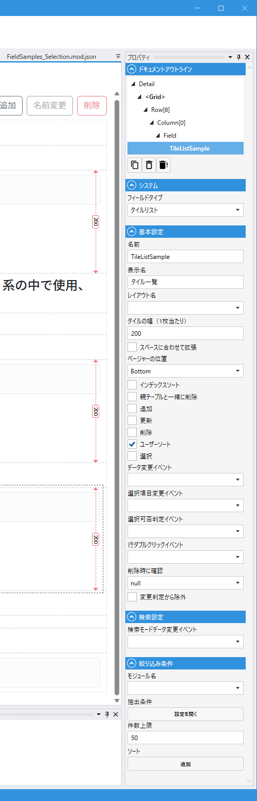

# TileListField (タイルリスト)

## これは何か

**複数件のデータを横方向に並べて、幅が足りなくなれば折り返して表示するタイル形式のフィールド**。各タイルは詳細レイアウトで描画されます。

## いつ使うか

- 画像ギャラリー・製品カタログ
- ダッシュボードのカード群
- タッチ UI で大きめのタップ領域を並べる場合

表形式なら [List](List.md)、カード（縦並び）なら [DetailList](DetailList.md) を使います。

---

## デザイナでの設定



### プロパティ一覧

#### システム

| C#名 | 日本語表示名 | 説明 |
|---|---|---|
| - | フィールドタイプ | `タイルリスト` 固定 |

#### 基本設定

| C#名 | 日本語表示名 | 型 | 既定値 | 説明 |
|---|---|---|---|---|
| **Name** | 名前 | string | `""` | フィールド識別子 |
| **DisplayName** | 表示名 | string | `""` | 画面表示用の名前 |
| **LayoutName** | レイアウト名 | string | `""` | 各タイルに使う Detail レイアウト名 |
| **TileWidth** | タイルの幅（1枚当たり） | int | `200` | 1 タイルの幅（px） |
| **FillSpaces** | スペースに合わせて拡張 | bool | `false` | 折り返し時の余白を均等に埋めるように各タイルを伸縮 |
| **PagerPosition** | ページャーの位置 | enum | `Top` | ページャーの位置（`Top` / `Bottom`） |
| **UseIndexSort** | インデックスソート | bool | `false` | 表示順を Index として保存 |
| **DeleteTogether** | 親テーブルと一緒に削除 | bool | `false` | 親データ削除時に一括削除 |
| **CanCreate** | 追加 | bool | `false` | 親画面から新規作成を許可 |
| **CanUpdate** | 更新 | bool | `false` | 親画面から編集を許可 |
| **CanDelete** | 削除 | bool | `false` | 親画面から削除を許可 |
| **CanUserSort** | ユーザーソート | bool | `true` | ユーザーソートを許可 |
| **CanSelect** | 選択 | bool | `false` | タイル選択を許可 |
| **OnDataChanged** | データ変更イベント | string | `""` | データ変更時のスクリプト |
| **OnSelectedIndexChanged** | 選択項目変更イベント | string | `""` | 選択タイル変更時のスクリプト |
| **OnSelectedIndexChanging** | 選択可否判定イベント | string | `""` | 選択変更前のスクリプト（引数 `int index` → `bool`） |
| **OnDoubleClickRow** | 行ダブルクリックイベント | string | `""` | タイルダブルクリック時のスクリプト（引数 `int index`） |
| **ConfirmBeforeDelete** | 削除時に確認 | bool? | null | 削除前に確認ダイアログを出す |
| **IgnoreModification** | 変更判定から除外 | bool | `false` | 変更検知（IsModified）から除外 |

#### 検索設定

| C#名 | 日本語表示名 | 型 | 既定値 | 説明 |
|---|---|---|---|---|
| **OnSearchDataChanged** | 検索モードデータ変更イベント | string | `""` | 検索条件が変更された時のスクリプト |

#### 絞り込み条件（表示データ）

| C#名 | 日本語表示名 | 型 | 既定値 | 説明 |
|---|---|---|---|---|
| **SearchCondition.ModuleName** | モジュール名 | string | `""` | 表示するデータのモジュール |
| **SearchCondition.Condition** | 抽出条件 | MultiMatchCondition | - | 絞り込み条件 |
| **SearchCondition.LimitCount** | 件数上限 | int | `50` | 表示する最大件数 |
| **SearchCondition.SortConditions** | ソート | List | `[]` | ソート順 |

---

## TileWidth と FillSpaces

- **TileWidth** — 1 枚のタイルの横幅（px）
- **FillSpaces** がオフの場合 — 各タイルは `TileWidth` ぴったりで並び、折り返し行には余白が残る
- **FillSpaces** がオンの場合 — 横に並べられる最大枚数で割って各タイルを広げ、余白を潰す

---

## スクリプトから

スクリプト API は [List](List.md#スクリプトから) と共通です（内部的にも同じ `ListField` ランタイムクラスを使用）。

- プロパティ: `Rows` / `RowCount` / `SelectedIndex` / `Page` / `PageCount` / `TotalCount` / `Limit` / `AllowLoad` / `IsValid` / `SearchComparison`
- メソッド: `AddRow` / `AddRows` / `InsertRow` / `InsertRows` / `UpdateRow` / `DeleteRow` / `DeleteAllRows` / `Reload` / `SetAdditionalCondition` / `SetSelectedIndexAsync` / `SetSearchComparisonAsync` / `ShowCustomDialog`

共通プロパティは [Field 共通プロパティ](common_properties.md) を参照。

---

## 検索での挙動

TileListField を**検索レイアウトに配置**すると、「親レコードを、関連する子レコードの有無で絞り込む」検索 UI として機能します。

例: 顧客モジュールに注文を表示する `Orders` という TileListField があるとき、顧客の検索画面に `Orders` を置くと、「注文を持っている顧客」「注文を持っていない顧客」を絞り込めます。

### 検索 UI


ドロップダウンが 1 つだけ出ます。選択肢は次の 3 つ:

| 選択肢 | 挙動 |
|---|---|
| **（空欄）** | この条件で絞り込まない |
| **行を持つ** | 関連する子レコードが**1 件以上ある**親レコードのみ表示（SQL の `EXISTS` 相当） |
| **行を持たない** | 関連する子レコードが**1 件もない**親レコードのみ表示（SQL の `NOT EXISTS` 相当） |

### 子レコードの絞り込み条件

「どのレコードを子と見なすか」は、TileListField のプロパティ **`SearchCondition.Condition`** で指定した条件で決まります。通常は親と子を結ぶ外部キー関係（`Orders.CustomerId == Customer.Id` 等）を設定しておきます。

`SearchCondition.Condition` に追加の条件（例: `Status == "有効"`）を入れると、それも子の絞り込みに反映されます。例えば「**有効な**注文を持っている顧客だけ表示」という検索になります。

### スクリプトから

検索 UI の状態は `SearchComparison` プロパティで読み書きできます。

```csharp
// 検索条件をプログラム的に設定
await Orders.SetSearchComparisonAsync(MatchComparison.Exists);

// 解除
await Orders.SetSearchComparisonAsync(null);
```

`SearchComparison` に設定できる値は `Exists` / `NotExists` / `null` のみです。

検索全体の仕組みは [SearchField](Search.md#検索の仕組み) / [モジュール検索設定](../module/module_search.md) を参照。

---

## 関連項目

- [List](List.md) — 表形式
- [DetailList](DetailList.md) — 縦並びカード形式
- [Field 共通プロパティ](common_properties.md)
