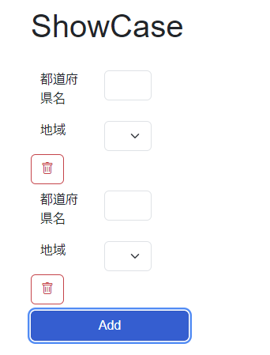
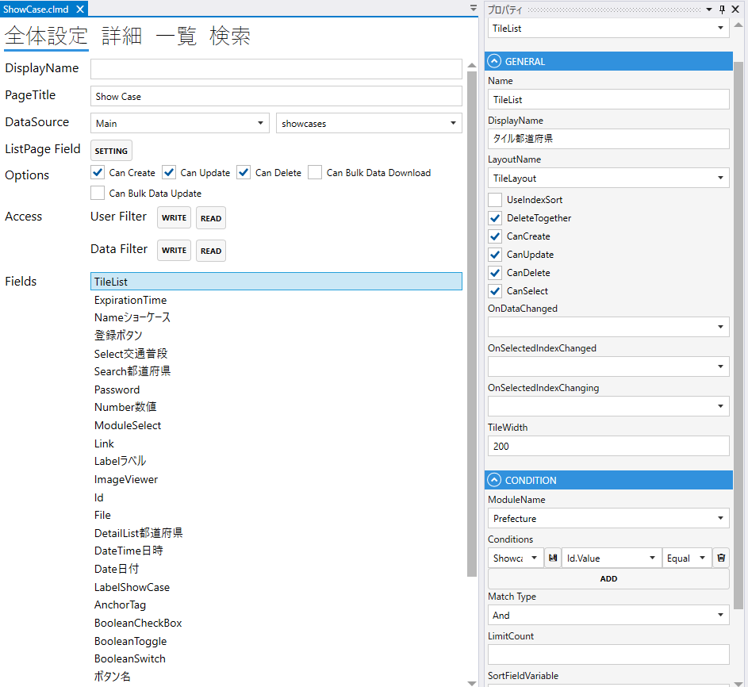
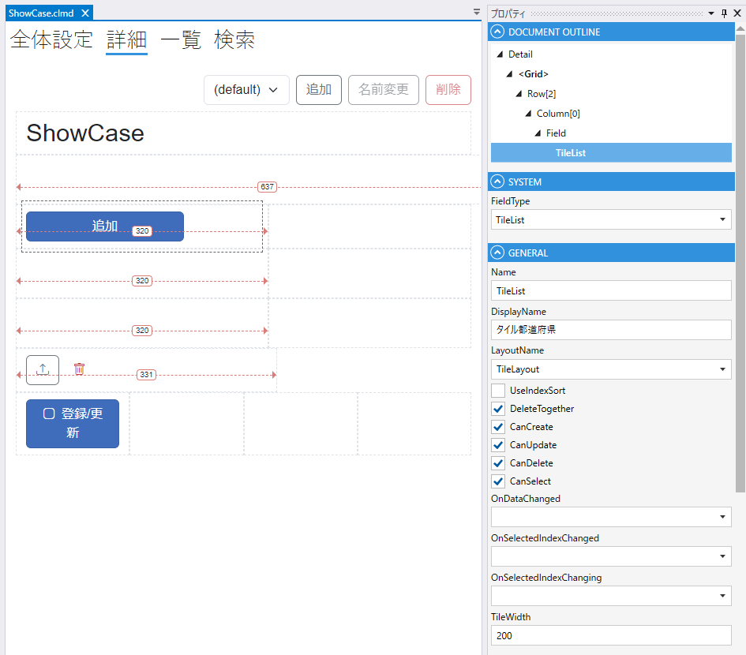

# TileListField

## これは何か

**複数件のデータを横方向に並べて、はみ出たら折り返すタイル形式で表示するフィールド**。

## いつ使うか

- 画像ギャラリー・製品カタログ
- ダッシュボードのカード群
- タッチ UI で大きめのタップ領域を並べる場合

表形式なら [List](List.md)、カード（縦並び）なら [DetailList](DetailList.md) を使います。

---

## デザイナでの設定

### 固有プロパティ

| プロパティ | 型 | 既定値 | 説明 |
|---|---|---|---|
| **LayoutName** | string | `""` | 各タイルに使う Detail レイアウト名 |
| **TileWidth** | int | `200` | 1 タイルの幅（px） |
| **FillSpaces** | bool | `false` | 折り返し時に余白を均等割りする |
| **PagerPosition** | enum | `Top` | ページャーの位置 |
| **UseIndexSort** | bool | `false` | 表示順を Index として保存 |
| **DeleteTogether** | bool | `false` | 親データ削除時に一括削除 |
| **CanCreate** / **CanUpdate** / **CanDelete** / **CanSelect** | bool | `false` | 操作許可 |
| **OnDataChanged** / **OnSelectedIndexChanged** / **OnSelectedIndexChanging** | string | `""` | 各種スクリプトイベント |

共通プロパティは [Field 共通プロパティ](common_properties.md) を参照。

### CONDITION

表示データの絞り込みは [List の CONDITION](List.md#condition表示データの絞り込み) と同じです。

---

## スクリプトから

プロパティ・メソッドは [List](List.md#スクリプトから) と同じです:

- `Rows` / `RowCount` / `SelectedIndex` / `Page` / `Limit`
- `AddRow()` / `UpdateRow()` / `DeleteRow()` / `DeleteAllRows()`
- `Reload()` / `SetAdditionalCondition(ModuleSearcher)`

共通プロパティは [Field 共通プロパティ](common_properties.md) を参照。

---

## 関連項目

- [List](List.md) — 表形式
- [DetailList](DetailList.md) — カード形式
- [Field 共通プロパティ](common_properties.md)
