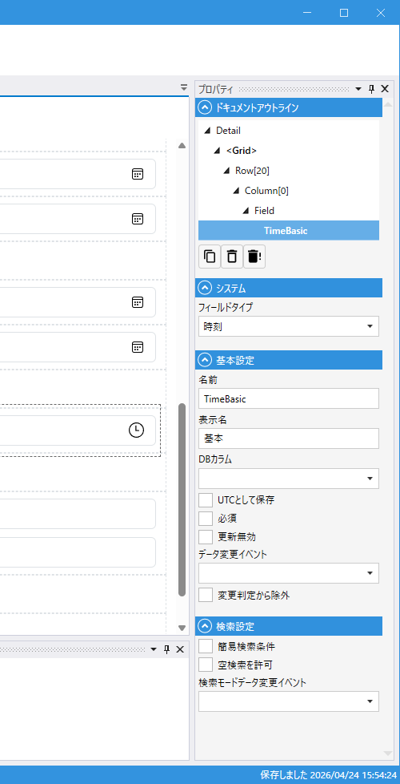

# TimeField (時刻)

## これは何か

**時刻を入力・表示するフィールド**。日付は持たない純粋な時刻（`TimeOnly`）型です。

## いつ使うか

- 営業時間（開店〜閉店）、シフト開始・終了時刻
- 所要時間でない「時刻」の入力（所要時間は数値で持つほうが扱いやすい）
- DB の `TIME` カラムの表示・編集

---

## デザイナでの設定



### プロパティ一覧

#### システム

| C#名 | 日本語表示名 | 説明 |
|---|---|---|
| - | フィールドタイプ | `時刻` 固定 |

#### 基本設定

| C#名 | 日本語表示名 | 型 | 既定値 | 説明 |
|---|---|---|---|---|
| **Name** | 名前 | string | `""` | フィールド識別子 |
| **DisplayName** | 表示名 | string | `""` | 画面表示用の名前 |
| **DbColumn** | DBカラム | string | `""` | 対応する DB 列名 |
| **SaveAsUtc** | UTCとして保存 | bool | `false` | UTC で保存する |
| **IsRequired** | 必須 | bool | `false` | 入力必須 |
| **IsUpdateProtected** | 更新無効 | bool | `false` | 更新時に値を変更できないようにする |
| **OnDataChanged** | データ変更イベント | string | `""` | 値変更時のスクリプトイベント |
| **IgnoreModification** | 変更判定から除外 | bool | `false` | 変更検知（IsModified）から除外 |

#### 検索設定

| C#名 | 日本語表示名 | 型 | 既定値 | 説明 |
|---|---|---|---|---|
| **IsSimpleSearchParameter** | 簡易検索条件 | bool | `false` | 簡易検索の対象にする |
| **AllowEmptySearch** | 空検索を許可 | bool | `false` | 空での検索を許可する |
| **OnSearchDataChanged** | 検索モードデータ変更イベント | string | `""` | 検索条件が変更された時のスクリプトイベント |

---

## スクリプトから

### プロパティ

| 名前 | 型 | 説明 |
|---|---|---|
| `Value` | TimeOnly? | 時刻の値 |
| `SearchMin` | TimeOnly? | 検索の最小時刻 |
| `SearchMax` | TimeOnly? | 検索の最大時刻 |
| `SearchIsEmpty` | bool? | 「空」を検索条件にする |

共通プロパティは [Field 共通プロパティ](common_properties.md) を参照。

### よく使う例

```csharp
// 営業時間をチェック
if (OpenTime.Value > CloseTime.Value)
{
    CloseTime.SetError("閉店時刻は開店時刻より後にしてください");
}

// 検索: 午前のみ
await OpenTime.SetSearchMinAsync(new TimeOnly(0, 0));
await OpenTime.SetSearchMaxAsync(new TimeOnly(12, 0));
```

---

## 検索での挙動

DateField と同じ範囲検索。詳細は [検索ガイド](../designer/search.md#datefield--datetimefield--timefield) を参照。

---

## 関連項目

- [Field 共通プロパティ](common_properties.md)
- [Date](Date.md) / [DateTime](DateTime.md)
- [検索ガイド](../designer/search.md) — 時刻範囲検索
