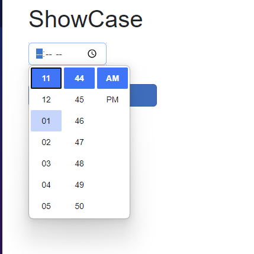
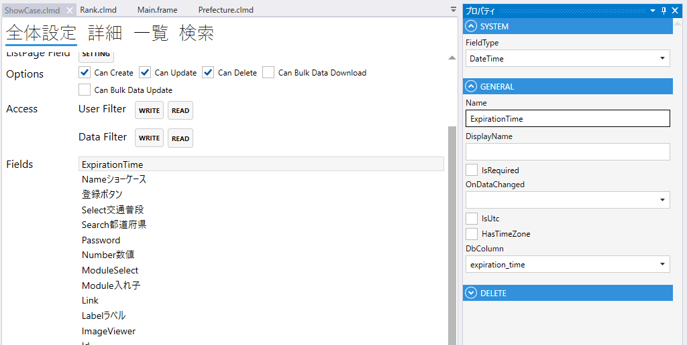
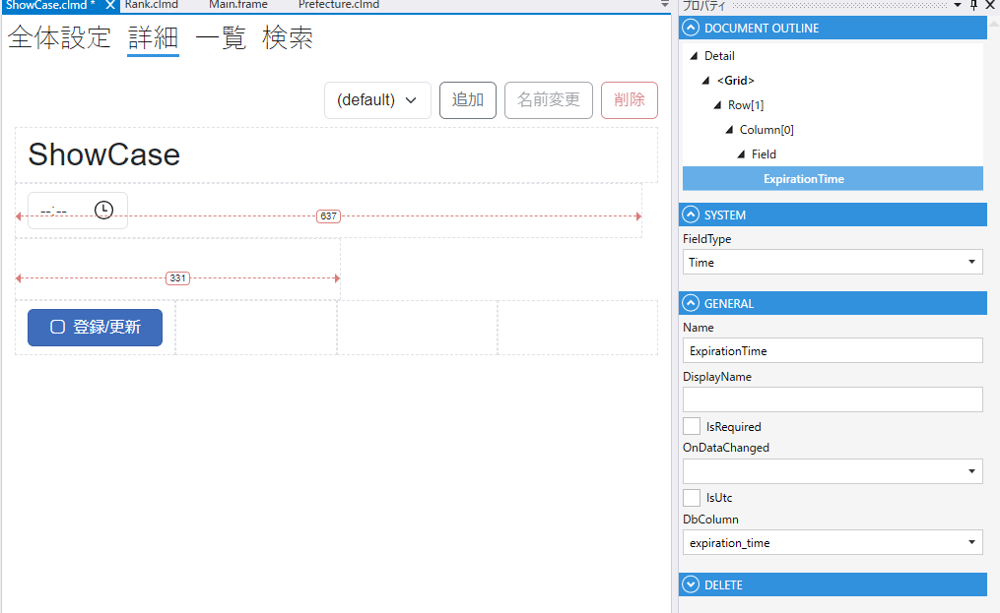

# TimeField

## これは何か

**時刻を入力・表示するフィールド**。日付は持たない純粋な時刻（`TimeOnly`）型です。



## いつ使うか

- 営業時間（開店〜閉店）、シフト開始・終了時刻
- 所要時間でない「時刻」の入力（所要時間は数値で持つほうが扱いやすい）
- DB の `TIME` カラムの表示・編集

---

## デザイナでの設定



### 固有プロパティ

| プロパティ | 型 | 既定値 | 説明 |
|---|---|---|---|
| **DbColumn** | string | `""` | 対応する DB 列名 |
| **SaveAsUtc** | bool | `false` | UTC で保存する |

共通プロパティは [Field 共通プロパティ](common_properties.md) を参照。



---

## スクリプトから

### プロパティ

| 名前 | 型 | 説明 |
|---|---|---|
| `Value` | TimeOnly? | 時刻の値 |
| `SearchMin` | TimeOnly? | 検索の最小時刻 |
| `SearchMax` | TimeOnly? | 検索の最大時刻 |
| `SearchIsEmpty` | bool? | 「空」を検索条件にする |

共通プロパティは [Field 共通プロパティ](common_properties.md) を参照。

### よく使う例

```csharp
// 営業時間をチェック
if (OpenTime.Value > CloseTime.Value)
{
    CloseTime.SetError("閉店時刻は開店時刻より後にしてください");
}

// 検索: 午前のみ
await OpenTime.SetSearchMinAsync(new TimeOnly(0, 0));
await OpenTime.SetSearchMaxAsync(new TimeOnly(12, 0));
```

---

## 関連項目

- [Field 共通プロパティ](common_properties.md)
- [Date](Date.md) / [DateTime](DateTime.md)
