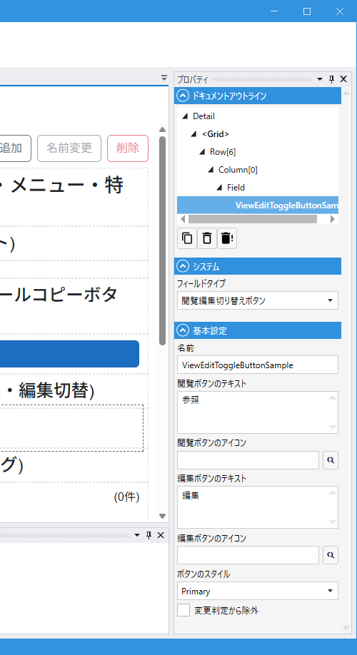

# ViewEditToggleButtonField (閲覧編集切り替えボタン)

## これは何か

**モジュールの閲覧モードと編集モードを切り替えるトグルボタン**。配置しておくと、画面が最初は閲覧モードで開き、ボタンを押すと編集モードになります。

## いつ使うか

- 基本は閲覧画面、必要なときだけ編集させたい UI
- 誤操作で編集してしまうのを避けたい画面
- 「編集」「保存」「キャンセル」のフローを 1 ボタンで完結させたい時

---

## 動作の仕組み

### 初期化時

1. 画面を閲覧モードで開く
2. ボタン自身は操作可能のまま
3. **Module 内の [SubmitButtonField](SubmitButton.md) を全て非表示に**（閲覧中は登録ボタンを見せない）
4. Module 内の [CopyModuleButtonField](CopyModuleButton.md) は操作可能のまま

### クリック時

- **閲覧モード → 編集モード**: 編集モードへ切り替え + SubmitButtonField を表示
- **編集モード → 閲覧モード**: 閲覧モードへ戻し + SubmitButtonField を非表示 + データを再読込して編集内容を破棄

### 注意点

**この Field を配置すると、同じ Module 内の全 SubmitButtonField が自動で表示制御されます**。想定と違う動きに見える場合、SubmitButtonField の表示がこの Field の制御を受けていないか確認してください。

---

## デザイナでの設定

### プロパティ一覧

#### システム

| C#名 | 日本語表示名 | 説明 |
|---|---|---|
| - | フィールドタイプ | `閲覧編集切り替えボタン` 固定 |

#### 基本設定

| C#名 | 日本語表示名 | 型 | 既定値 | 説明 |
|---|---|---|---|---|
| **Name** | 名前 | string | `""` | フィールド識別子 |
| **ToViewText** | 閲覧ボタンのテキスト | string | `"View"` | 編集モード中に表示される（押すと閲覧に戻る） |
| **ToViewIcon** | 閲覧ボタンのアイコン | string | `""` | 同上 |
| **ToEditText** | 編集ボタンのテキスト | string | `"Edit"` | 閲覧モード中に表示される（押すと編集に入る） |
| **ToEditIcon** | 編集ボタンのアイコン | string | `""` | 同上 |
| **Variant** | ボタンのスタイル | enum | `Primary` | [Button の Variant](Button.md#variantボタンのスタイル) 参照 |
| **IgnoreModification** | 変更判定から除外 | bool | `false` | 変更検知から除外 |

現在のモードに応じて、`ToEditText/Icon` と `ToViewText/Icon` のどちらが表示されるかが自動で切り替わります。

---

## スクリプトから

スクリプト公開メンバーは共通プロパティ（`IsEnabled` / `IsVisible` / `Color` など）のみです。
`Text` / `Icon` プロパティは内部で自動切替のため `[ScriptHide]` になっています。

共通プロパティは [Field 共通プロパティ](common_properties.md) を参照。

---

## 関連項目

- [Field 共通プロパティ](common_properties.md)
- [SubmitButton](SubmitButton.md) — この Field が自動で表示制御する対象
- [CopyModuleButton](CopyModuleButton.md) — 参照モード中でも使えるよう維持される
