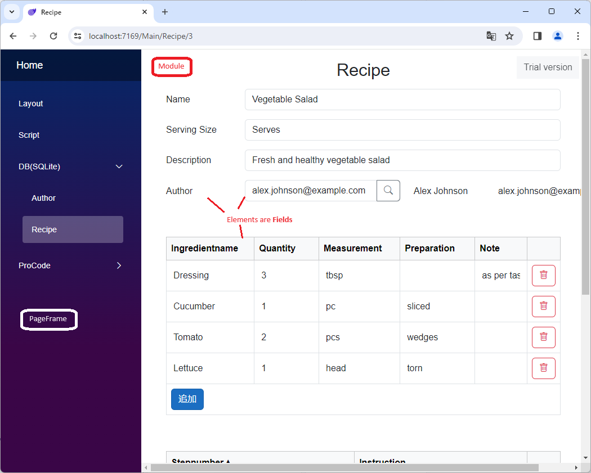
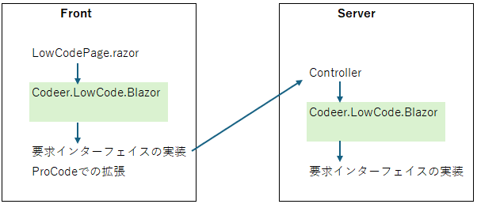
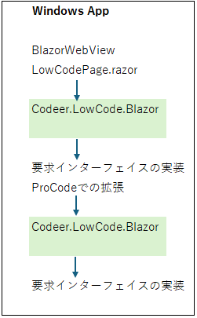

# コア概念

Codeer.LowCode.Blazor を使うにあたって、最初に把握しておくと理解が早まる用語を紹介します。
詳しい設定方法は各リファレンスへのリンクをたどってください。

---

## 全体像

アプリは **PageFrame** の中に **Module** が表示される構造です。Module は **Field** から構成されます。



---

## PageFrame — アプリの外枠

PageFrame はアプリ全体の**枠**を定義します。ヘッダー・サイドバー・フッターと、中央で切り替わるコンテンツ領域を持ちます。

- ホームに表示される Module
- ヘッダー・左右サイドバー・フッターに固定表示される Module
- アプリ内から呼び出せる Module の一覧

これらを PageFrame で指定します。サイトマップに相当する設定です。

→ 詳細: [PageFrame](../designer/page_frame.md)

---

## Module — 画面とデータの単位

Module は **画面 1 つ分 + それが扱うデータ**をまとめた単位です。C# の class に近い概念です。

1 つの Module には以下が詰まっています:

- **Field の集まり** — データと UI の部品
- **画面レイアウト** — 詳細 / 一覧 / 検索の 3 種類を定義可能
- **DB との対応** — テーブルや View にマッピングできる
- **スクリプト** — イベントハンドラやメソッドを C# ライクな構文で記述
- **権限設定** — 参照 / 編集を条件で制御

Module を DB テーブルにマッピングすると、**追加・編集・削除・一覧・検索が自動で動く**ようになります。追加で書くコードはほぼゼロです。

→ 詳細: [Module](../module/module.md)

### Module の 3 つのレイアウト

| レイアウト | 用途 |
|---|---|
| **詳細（Detail）** | 1 件のデータを編集する画面（追加・編集ダイアログ含む） |
| **一覧（List）** | データを一覧表示する画面 |
| **検索（Search）** | 一覧の上に表示される検索条件 |

3 種類すべて作る必要はなく、必要なものだけ定義できます。また、それぞれ複数のバリエーションを定義して使い分けることも可能です。

---

## Field — Module を構成する部品

Field は Module の中に配置する**部品**です。TextField、NumberField、DateField のような入力部品が代表例ですが、ボタンやラベル、画像ビューワーなど UI を持つもの全般が Field です。

- 大部分の Field は**値を持つ**（DB カラムと対応付け可能）
- UI を持たず、データ入出力だけに使う Field もある
- スクリプトから Field の値やプロパティを操作できる

Field には 30 種類以上のバリエーションがあります。

→ 詳細: [Field 一覧](../fields/field.md)

### System Field（特別な役割を持つ Field）

名前で役割が決まっている Field です。DB を使うアプリで必要になる機能に対応します。

| 名前 | 役割 |
|---|---|
| **Id** | Module のデータのキー。追加・更新に必須 |
| **LogicalDelete** | 論理削除フラグ |
| **CreatedAt / UpdatedAt** | 作成・更新時刻 |
| **Creator / Updater** | 作成者・更新者（認証機能と組み合わせ） |
| **OptimisticLocking** | 楽観ロック |

---

## Layout — Field の並べ方

Module の各画面（詳細 / 一覧 / 検索）は**レイアウト**の中に Field を並べて作ります。3 種類のレイアウトがあります。

| レイアウト | 特徴 |
|---|---|
| **GridLayout** | 行 × 列のグリッドに配置。業務アプリの標準 |
| **CanvasLayout** | 自由な座標に配置。ダッシュボードなど |
| **FlowLayout** | 横に並べて折り返し。タグリストなど |

ネストも可能で、GridLayout の中に FlowLayout を入れる、といった組み方ができます。

→ 詳細: [レイアウト](../module/layout.md)

---

## Script — C# ライクな軽量スクリプト

画面の挙動はスクリプトで記述できます。C# とほぼ同じ構文で書け、コード補完も効きます。

```csharp
// 例: ボタンがクリックされたときの処理
if (await Name.ValidateInput())
{
    await Submit();
    await MessageBox.Show("保存しました");
}
```

特徴:

- 基本的にはクライアント（ブラウザ）側で実行されるが、サーバー側実行もサポート
- Field の値・プロパティをそのまま参照できる
- プロコードで追加した関数や .NET ライブラリを呼び出せる
- 一般的な演算・画面制御・WebAPI 呼び出し・Excel/PDF 操作が可能

→ 詳細: [スクリプト](../overview/script.md)

---

## プロコード — 必要に応じた C# 拡張

どうしても標準機能で足りない部分は、C# / Blazor のコードを追加して実装できます。

- **カスタム Field** — 独自 UI を持つ Field を作り、デザイナから使えるようにする
- **カスタムページ** — Razor ページを追加
- **WebAPI** — サーバー側の独自エンドポイント
- **スクリプトから呼び出す関数** — ローコードから使える C# 関数

Codeer.LowCode.Blazor は Blazor ライブラリなので、**既存の .NET エコシステムがそのまま使える**のが強みです。

→ 詳細: [プロコード](../overview/procode.md)

---

## ユーザーコード — テンプレートが生成するプロジェクト一式

Visual Studio のテンプレートでプロジェクトを作成すると、ライブラリ本体だけでなく、**お客様側で自由に変更できるプロジェクト一式**が生成されます。認証の切り替えやインフラ依存部分はここで実装されており、プロジェクト要件に合わせてカスタマイズできます。

Web アプリの構成:



デスクトップアプリ（クライアントサーバー型）の構成:



→ 詳細: [ユーザーコード](../user_code/user_code.md)

---

## 次に読む

- [入手とライセンス](installation.md)
- [クイックスタート](../quickstart/quickstart.md) — 10 分で動かしてみる
