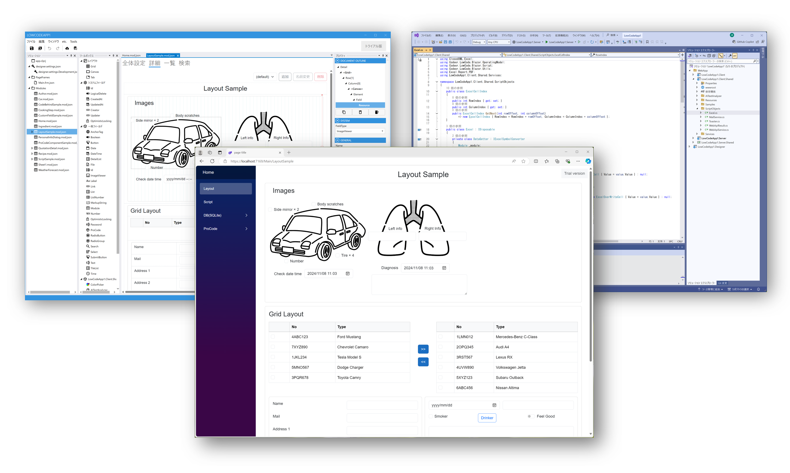

# Codeer.LowCode.Blazor とは

Codeer.LowCode.Blazor は、**Blazor アプリにローコード機能を組み込むためのライブラリ**です。
デザイナ（WPF 製のビジュアルエディタ）で画面やデータモデルを設定し、ホットリロードで Web アプリに即座に反映できます。

---

## できること

- データベースと連携した業務アプリを、**ほぼ画面設定だけで構築**
- 一覧 / 詳細 / 検索 / ダイアログを組み合わせた CRUD 画面
- 認証・認可・監査ログ・楽観ロックなど、業務アプリで必要になる機能の標準サポート
- Excel 入出力、PDF 帳票、メール送信
- Blazor だけでなく **WPF / WinForms のデスクトップアプリ**としても展開可能
- AI（OpenAI API）によるテキスト解析・モジュール自動生成

---

## 3 つの開発スタイルをシームレスに組み合わせる

| スタイル | 作業内容 | こんな時に |
|---|---|---|
| **ノーコード** | デザイナでドラッグ＆ドロップ、プロパティ設定 | 一般的な入力画面・一覧画面 |
| **ローコード** | C# ライクなスクリプトで処理を記述 | 画面連動・計算・API 呼び出し |
| **プロコード** | .NET / Blazor のコードを追加 | 特殊画面・独自 UI コンポーネント |

同じプロジェクト内でこの 3 つを自由に組み合わせられます。ノーコードで作った画面の一部だけをプロコードで置き換える、スクリプトから .NET ライブラリを呼び出す、といった連携がすべてシームレスです。

---

## 対応 DB

PostgreSQL / Microsoft SQL Server / Oracle Database / SQLite

---

## こんなプロジェクトにおすすめ

- 開発コストと期間を抑えたい
- RDB を中心にした業務アプリを作りたい
- 既存のデータ・システムを活用したい
- WinForms や WebForms をモダンなフレームワークにリプレイスしたい
- リリース後も継続的にカスタマイズしていきたい

---

## サードパーティ UI ライブラリとの連携

MudBlazor / Radzen.Blazor / IgniteUI と高い互換性があります。
ローコードで作った画面の中にこれらのコンポーネントを埋め込めます。

- [MudBlazor サンプル](https://lowcodedemo.azurewebsites.net/MudBlazor/MudBlazorHome)
- [Radzen.Blazor サンプル](https://lowcodedemo.azurewebsites.net/RadzenBlazor/RadzenBlazorHome)
- [IgniteUI サンプル](https://lowcodedemo.azurewebsites.net/Bootstrap/ChartSample)

---

## 次に読む

- [コア概念](concepts.md) — PageFrame / Module / Field / Layout など、このフレームワークを理解する上で必須の用語
- [入手とライセンス](installation.md) — 試用開始・ライセンス
- [クイックスタート](../quickstart/quickstart.md) — 10 分でサンプルアプリを動かす
