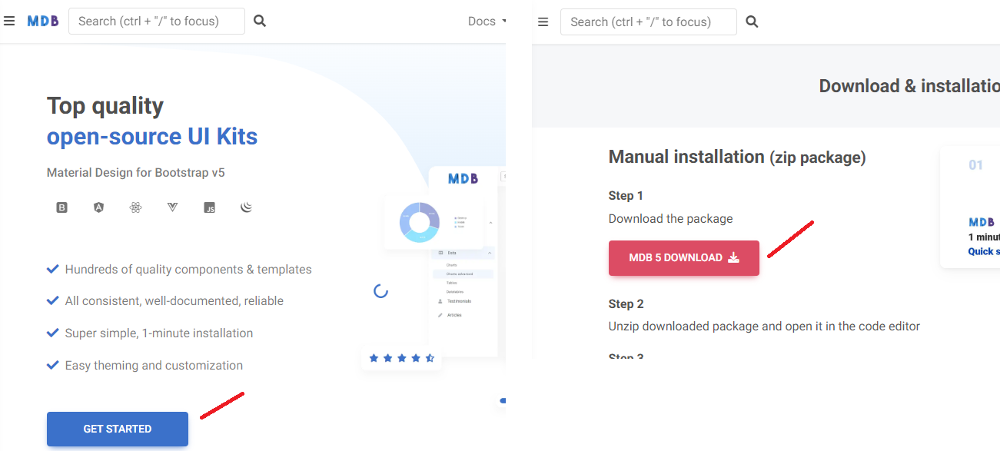
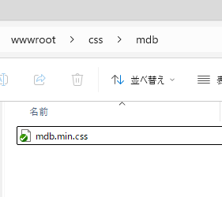

# Bootstrap テーマの適用

## ダウンロード

ここでは[Material Design for Bootstrap](https://mdbootstrap.com/) からテーマをダウンロードします。



## ファイルを投入

`wwwroot`内の任意のフォルダを作成し、CSSを追加します。 ここでは、`wwwroot/css/mdb`に追加しています。



## index.html を編集する

`wwwroot/index.html`の`<head>` にCSSのlink を追加します。

```diff
      <link href="css/bootstrap/bootstrap.min.css" rel="stylesheet" />
+     <link href="css/mdb/mdb.min.css" rel="stylesheet"/>
      <link href="css/app.css" rel="stylesheet" />
```

ここまででBootstrapテーマが適用されています。

# その他の設定

## Noto Sansを適用する

Noto Sans JapaneseをFont Familyとして適用します。 `wwwroot/index.html`の`<head>`を編集します。

```
      <link href="css/bootstrap/bootstrap.min.css" rel="stylesheet" />
      <link href="css/mdb/mdb.min.css" rel="stylesheet"/>
+     <link rel="preconnect" href="https://fonts.googleapis.com">
+     <link rel="preconnect" href="https://fonts.gstatic.com" crossorigin>
+     <link href="https://fonts.googleapis.com/css2?family=Noto+Sans+JP:wght@100..900&display=swap" rel="stylesheet">
      <link href="css/app.css" rel="stylesheet" />
```

次に`wwwroot/css/app.css` を編集します。

```diff
  html, body {
-     font-family: 'Helvetica Neue', Helvetica, Arial, sans-serif;
+     font-family: 'Noto Sans Japanese', 'Helvetica Neue', Helvetica, Arial, sans-serif;
  }
```

ここまでで全体のフォントがNoto Sans Japanese になりました。

## 無駄なスタイルの削除

`wwwroot/css/app.css` から不要なスタイルを削除します。

```diff
- .btn-primary {
-     color: #fff;
-     background-color: #1b6ec2;
-     border-color: #1861ac;
- } 
- 
- .btn:focus, .btn:active:focus, .btn-link.nav-link:focus, .form-control:focus, .form-check-input:focus {
-   box-shadow: 0 0 0 0.1rem white, 0 0 0 0.25rem #258cfb;
- }
```

## サイドバーの設定

Home部分の文字色を調整します。`wwwroot/css/app.css` を編集します。

```diff
+ .navbar-brand {
+   --mdb-navbar-brand-color: white;
+   --mdb-navbar-brand-hover-color: white;
+ }
```

デザイナでサイドバーの色を白(#ffffff)やグレー(#607d8b)に設定します。

## List内のバリデーション表示を調整する

ListのCSSを調整します。`wwwroot/css/app.css` にスタイルを追加します。

```diff
+ .was-validated .form-control:invalid, .form-control.is-invalid {
+   margin-bottom: 0;
+   background-image: url("data:image/svg+xml,%3csvg xmlns='http://www.w3.org/2000/svg' viewBox='0 0 12 12' width='12' height='12' fill='none' stroke='%23dc4c64'%3e%3ccircle cx='6' cy='6' r='4.5'/%3e%3cpath stroke-linejoin='round' d='M5.8 3.6h.4L6 6.5z'/%3e%3ccircle cx='6' cy='8.2' r='.6' fill='%23dc4c64' stroke='none'/%3e%3c/svg%3e");
+ }
+ 
+ .table>:not(caption)>*>* {
+   padding: .5rem .5rem;
+ }
+ 
+ table.table tr.can-select.selected {
+   --mdb-table-bg: #d9ecff;
+ }
+
+ .sidebar {
+   --mdb-nav-link-padding-x: 1rem;
+   --mdb-nav-link-padding-y: 0.5rem;
+ }
+
+ .form-select {
+   padding-block: .27rem;
+ }
+
+ .input-group > .form-select {
+   height: calc(2.08rem + 2px);
+ }
```

