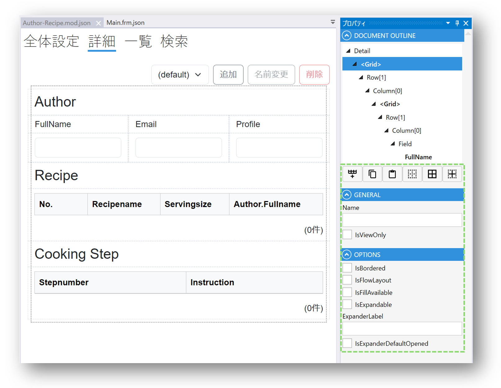
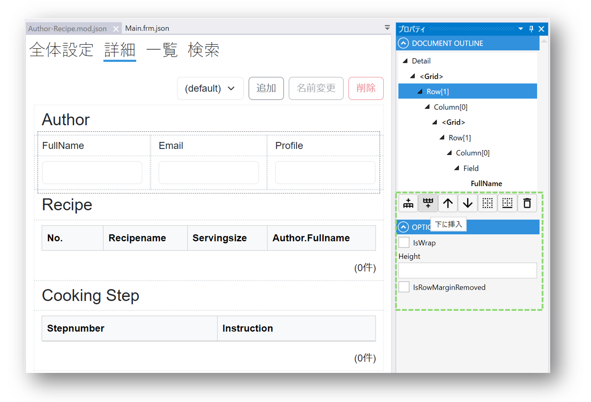
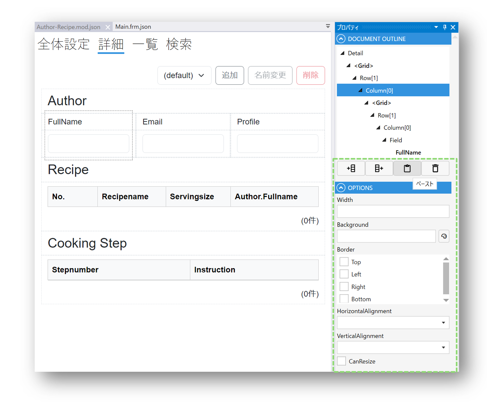
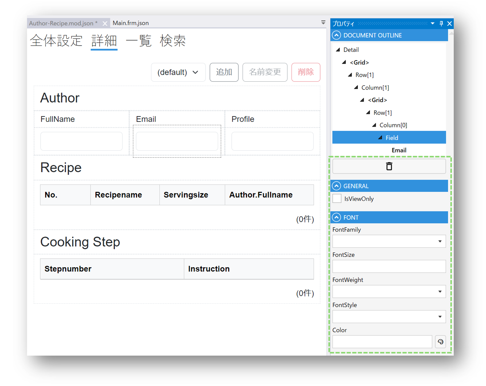

# Document OutlineとPropertyパネル
## 概要
Document OutlineとPropertyパネルは[Desinger](designer/designer.md)で[Module](module/module.md)を編集する際に使われます。

詳細/一覧/検索レイアウトで[Field](fields/field.md)を選択したときは、Document Outlineパネルは現在選択中のFieldのDocumentにおける位置関係を表示します。

## Document Outlineで選択中の種類別の設定可能項目
現在選択中のFieldによって、Document Outlineパネルでできる操作が変わるとともに、Propertyパネルの設定項目も変わります。

また、Document Outlineパネルで現在選択中のFieldの親Fieldを簡単に選択することが可能です。
## Gridの場合
行の追加や枠線関連の設定ができます。

## Rowの場合
行の上下への新行追加や行の位置設定、枠線設定などができます。

## Columnの場合
列の左右の新列の追加や枠線、背景などの設定ができます。

## Fieldの場合
読み取り専用(IsViewOnly)やフォントなどが設定できます。

## その他
Fieldによって設定可能な項目がことなりますので、選択してみてお試しください。