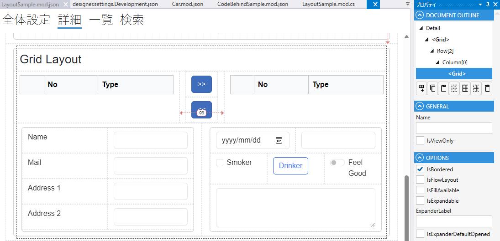
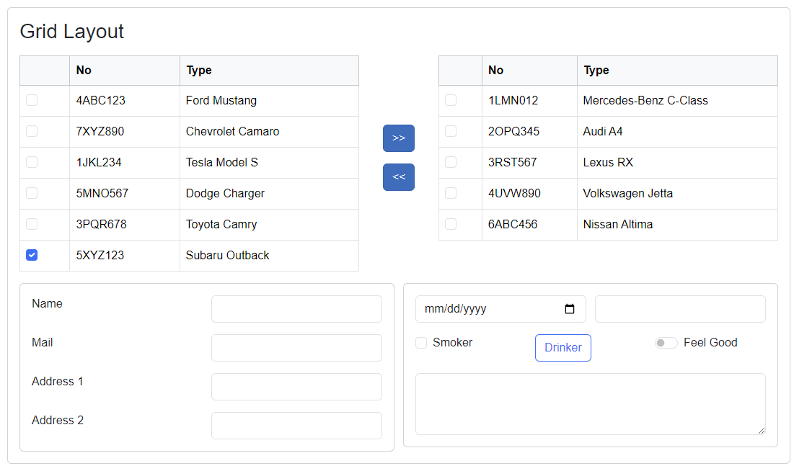
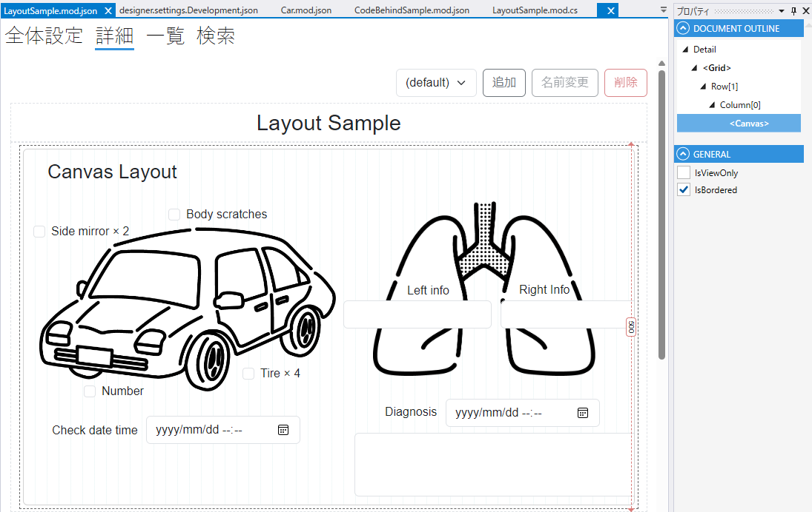
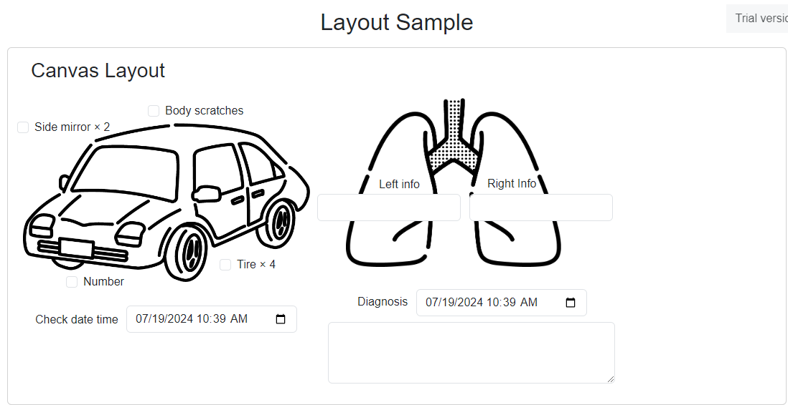
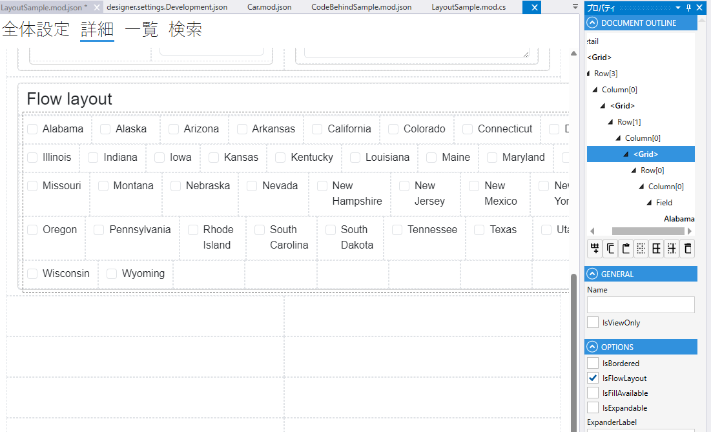
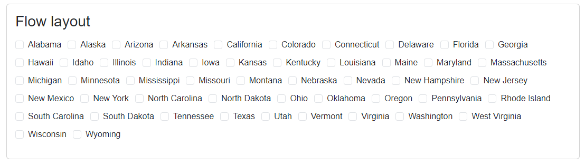
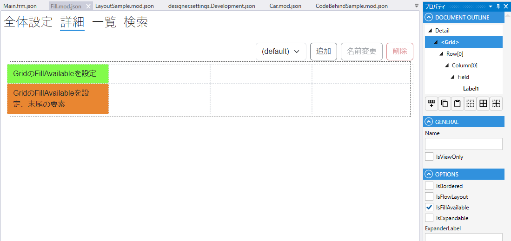
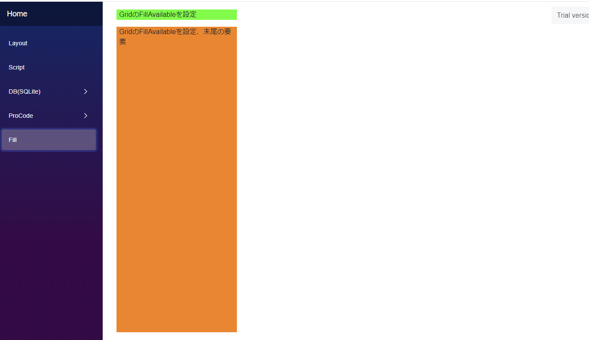

# レイアウト

Module の詳細・一覧・検索の各画面は、レイアウトの中に Field を配置して作ります。
3 種類のレイアウトを入れ子に組み合わせて画面を構成します。

| レイアウト | 特徴 | 主な用途 |
|---|---|---|
| **Grid** | 行 × 列のグリッドに配置（最も一般的） | 業務アプリの入力画面の基本 |
| **Canvas** | ピクセル座標で自由配置 | ダッシュボード・帳票風画面 |
| **Tab** | 複数の内容をタブで切替 | 画面が長くなる時の分割 |

Module の Root 要素は **Grid** です。多くの場合 Grid を基本にして、必要に応じて Canvas・Tab・入れ子の Grid を組み合わせます。

> 補足: Grid の `IsFlowLayout` をオンにすると「行・列構造を無視して横一列に並べて折り返す Flow モード」になります。タグ列・ボタンバーなどに使います。詳細は [Wrap 系の使い分け](#wrap-系の使い分けisflowlayout--isautofillwrap--iswrap) を参照。

---

## 全レイアウト共通のプロパティ

すべてのレイアウト（Grid / Canvas / Tab）で使えるプロパティ:

| プロパティ | 説明 |
|---|---|
| **Name** | レイアウトの識別子（スクリプトから参照する名前） |
| **IsViewOnly** | 読み取り専用 |
| **BackgroundColor** | 背景色（指定なしは親からカスケード） |

---

## Grid レイアウト

行と列のグリッドに要素を配置します。入れ子が可能で、セルの中にさらに Grid や Canvas を入れられます。




### 列幅の決定ルール

列幅は以下の優先度で決まります（上から順に最初に該当したものが適用）:

1. **`IsAutoFillWrap`（Grid または Row）** — CSS Grid の `auto-fit` で均等折り返し。`MinWidth` 必須、カラム個別の `Width`/`MaxWidth` は無効
2. **`Width` 指定**（固定幅） — カラムは正確に指定 px に固定
3. **`MinWidth` 指定** — 均等に伸び、最小幅を保証。`MaxWidth` を併用すると伸びすぎ防止
4. **センタリングパターン** — 行が `[空 \| 中身 \| 空]` の 3 列構成のとき、中身カラムはコンテンツ幅にフィット
5. **指定なし** — 均等に伸びてコンテンツが幅を決める

| プロパティ | 用途 |
|---|---|
| **Width** | 固定幅（px） |
| **MinWidth** | 最小幅。不足時に折り返す |
| **MaxWidth** | 最大幅（`MinWidth` と併用） |
| **IsAutoFillWrap** | 折り返し時に自動で均等割り（`MinWidth` 必須、`MaxWidth` は無効） |

### 標準のマージン・パディング

Grid は標準でいくつかのマージン・パディングを持ち、要素間に適切なスペースが確保されています。

- **Grid** — 通常はなし。`IsBordered` オン時は内側に上下 `1rem` / 左右 `0.625rem` のパディング
- **Row** — 上下それぞれに `1rem` のマージン
- **Column** — 左右に `0.375rem` のパディング。`BorderStyle` を指定した Column はさらに上下 `0.5rem` のパディング

各 Grid・Row・Column 個別に `Padding` / `Margin` プロパティで上書きすることもできますし、`app.css` から CSS 変数で**アプリ全体の既定値**を上書きすることもできます。変数名・既定値の一覧は [カスタマイズ可能な CSS 変数](../look_and_feel/css.md#カスタマイズ可能な-css-変数) を参照してください。

### Grid プロパティ

| プロパティ | 説明 |
|---|---|
| **Name** | 識別子 |
| **IsViewOnly** | 読み取り専用 |
| **IsBordered** | 枠付き（カード）として描画。`background-color` は標準で透過 |
| **UseBorderedShrinkWrap** | カード幅をコンテンツに収めて余白を作る（`IsBordered` 併用時） |
| **Padding** | 内側のパディング（上下左右指定） |
| **IsFlowLayout** | 行・列構造を無視して横並び＋折り返しのフロー配置にする |
| **IsAutoFillWrap** | 全行を CSS Grid `auto-fit` で均等折り返し（`MinWidth` 必須） |
| **IsFillAvailable** | このグリッドが root のとき、ページの残り高さを埋めるよう末尾 Normal 行を伸ばす |
| **ScrollDirection** | スクロール方向。`Unset` / `Vertical` / `Horizontal`（`Flags` なので組合せ可） |
| **IsExpandable** | 折りたたみ可能なグリッドにする |
| **ExpanderLabel** | 折りたたみヘッダのラベル |
| **IsExpanderDefaultOpened** | 初期状態で開いておくか |
| **BackgroundColor** | 背景色（指定なしは親からカスケード） |
| **OnKeyDown** | このグリッド内でキーが押された時のスクリプト（[OnKeyDown イベント](#onkeydown-イベント) 参照） |

> **`.card` の背景透過**: `IsBordered` をオンにすると Bootstrap の `.card` クラスでレンダリングされますが、標準で `background-color: transparent` が当たっています。背景色を付けたい場合は `BackgroundColor` を明示的に設定してください。

### Row プロパティ

| プロパティ | 説明 |
|---|---|
| **Height** | 行の高さ（px） |
| **GridRowType** | `Normal` / `Header` / `Footer`。`IsFillAvailable` のとき末尾の `Normal` 行が伸びる対象 |
| **Margin** | 行のマージン（上下左右） |
| **BackgroundColor** | 行全体の背景色 |
| **CanResize** | ユーザーによる行サイズ変更を許可 |
| **IsWrap** | 列が入りきらないときに折り返す |
| **IsAutoFillWrap** | この行だけ `auto-fit` で均等折り返しにする（`MinWidth` 必須） |

### Column プロパティ

| プロパティ | 説明 |
|---|---|
| **Width** / **MinWidth** / **MaxWidth** | 幅指定（[列幅の決定ルール](#列幅の決定ルール)参照） |
| **Padding** | カラム内のパディング（上下左右） |
| **BackgroundColor** | カラムの背景色 |
| **BorderStyle** | 上下左右それぞれの罫線（太さ・色を辺ごとに指定） |
| **HorizontalAlignment** | 水平位置。`Start` / `Center` / `End` / `Stretch`（既定: Stretch） |
| **VerticalAlignment** | 垂直位置。`Top` / `Middle` / `Bottom` / `Stretch`（既定: Stretch） |
| **CanResize** | ユーザーによる列サイズ変更を許可 |

> **横アライメントの副作用**: `Stretch` 以外（`Start` / `Center` / `End`）にすると、中身がカラム幅にフィットせずコンテンツの固有幅になります。長いテキストはカラム幅をはみ出す可能性があるので注意してください。

---

## Canvas レイアウト

ピクセル座標で自由に要素を配置します。デザイナ上でドラッグ＆ドロップでサイズと位置を決めます。




### Canvas プロパティ

| プロパティ | 説明 |
|---|---|
| **Name** | 識別子 |
| **IsViewOnly** | 読み取り専用 |
| **IsBordered** | 枠を描画 |
| **BackgroundColor** | 背景色 |
| **ScrollDirection** | スクロール方向。`Unset` / `Vertical` / `Horizontal` |

### Element（Canvas 上の各要素）のプロパティ

| プロパティ | 説明 |
|---|---|
| **Left** / **Top** | 配置座標（px） |
| **Width** / **Height** | サイズ（px） |
| **ZIndex** | 重なり順 |

---

## Tab レイアウト

複数のレイアウトをタブで切替表示します。情報量の多い画面の分割に便利です。

### Tab プロパティ

| プロパティ | 説明 |
|---|---|
| **Name** | 識別子 |
| **Tabs** | タブヘッダのラベル一覧（順番がタブの並び順） |
| **Padding** | タブパネル内側のパディング |
| **IsBordered** | タブパネルを枠付きで描画 |
| **Color** | タブヘッダの基本色 |
| **SelectedColor** | 選択中タブの色 |
| **BackgroundColor** | 背景色 |
| **IsViewOnly** | 読み取り専用 |
| **OnSelectedIndexChanged** | タブ切替「後」のスクリプト |
| **OnSelectedIndexChanging** | タブ切替「前」のスクリプト。`bool` を返し、`false` で切替キャンセル |

各タブの中身（Layouts）には Grid / Canvas / Tab をそれぞれ配置できます。

### スクリプトから操作

```csharp
// 現在選択中のタブインデックス（0 始まり）
var idx = MyTabs.SelectedIndex;

// プログラム的に切替
MyTabs.SelectedIndex = 2;

// 切替前バリデーション
bool MyTabs_OnSelectedIndexChanging(int index)
{
    if (index == 2 && string.IsNullOrEmpty(NameField.Value))
    {
        Toaster.Warn("名前を入力してください");
        return false;  // 切替キャンセル
    }
    return true;
}
```

---

## SearchGridLayout（検索画面の Grid）

検索画面で使う Grid は `SearchGridLayout` という派生型で、**条件結合の演算子**を持ちます。

| プロパティ | 説明 |
|---|---|
| **Operator** | 子条件の結合方法。`And` / `Or` / `UserSpecified`（画面上でユーザーに選ばせる） |

入れ子の `SearchGridLayout` で複雑な条件式（`A AND (B OR C)` 等）を組み立てます。詳細は [モジュール検索設定](module_search.md) を参照。

---

## Wrap 系の使い分け（`IsFlowLayout` / `IsAutoFillWrap` / `IsWrap`）

折り返しまわりは似た名前のプロパティが複数あります。違いを整理します。

| プロパティ | 適用範囲 | 挙動 |
|---|---|---|
| **`IsWrap`** | Row | カラムが入りきらないとき、行内で折り返す |
| **`IsAutoFillWrap`** | Grid または Row | CSS Grid `auto-fit` で**均等幅**にして折り返す（`MinWidth` 必須） |
| **`IsFlowLayout`** | Grid | 行・列の構造を**完全に無視**して横並び＋折り返しのフロー配置にする |

| やりたいこと | 推奨 |
|---|---|
| 入力フォームで横が狭くなったら折り返したい | Row の `IsWrap` |
| カードを画面幅に応じて 2 列・3 列・4 列と均等に並べたい | Grid または Row の `IsAutoFillWrap` + `MinWidth` |
| タグ・アイコン列・ボタンバーで自然に流したい | Grid の `IsFlowLayout` |




---

## FillAvailable（残領域に広げる）

Grid の `IsFillAvailable` をオンにすると、**そのグリッドが Module の root のとき**、ページの残り領域を埋める高さまで**末尾の Normal 行**が伸びます。

- 対象は `GridRowType = Normal` の行のうち最後のもの。`Header` / `Footer` の行は対象外
- ListField を画面いっぱいの高さで表示したい場面でよく使います




---

## 入れ子

各レイアウトはセル / Element / タブの中に別のレイアウトを入れられます。

- Grid のセル → Grid / Canvas / Tab
- Canvas の Element → Grid / Canvas / Tab
- Tab の各タブ → Grid / Canvas / Tab

これにより「上半分は Grid で入力フォーム、下半分は Tab で関連情報」のような複雑な画面構成が可能です。

---

## OnKeyDown イベント

Grid の `OnKeyDown` プロパティにスクリプトを設定すると、そのグリッド内でキーが押された時に呼び出されます。Enter / Escape / Ctrl+S 等のキー操作に応じた処理を書けます。

```csharp
void GridLayoutDesign_OnKeyDown(KeyboardEventArgs e)
{
    if (e.Key == "Enter")
    {
        // 何か処理
    }
}
```

### `KeyboardEventArgs` の主なプロパティ

| プロパティ | 説明 |
|---|---|
| `Key` | 押されたキー文字列。`"Enter"` / `"Escape"` / `"a"` / `"ArrowUp"` 等 |
| `Code` | 物理キーコード |
| `CtrlKey` / `ShiftKey` / `AltKey` / `MetaKey` | 修飾キー押下状態 |
| `Repeat` | 長押しによるリピートか |

### IME 変換中のキーは届かない

日本語入力（IME）で変換中に押される Enter キー（変換確定）等は OnKeyDown には届きません。フレームワーク側で IME 変換中のキー入力を除外しているため、変換確定の Enter で意図せず処理が走る心配は不要です。

### Enter 押下時の入力値の確定タイミング

入力中のフィールド（TextField 等）にフォーカスがある状態で Enter を押した場合、**OnKeyDown が呼ばれた瞬間はまだ Field の Value に値が反映されていません**。これはブラウザの仕様で、入力ボックスの値は keydown イベントの**後**に確定するためです。

確定後の値を見たい場合は、ハンドラの先頭で `Task.Delay(1)` を呼んでください。

```csharp
void GridLayoutDesign_OnKeyDown(KeyboardEventArgs e)
{
    if (e.Key == "Enter")
    {
        Task.Delay(1);  // ブラウザの値確定処理が走るのを待つ
        Toaster.Success(NameField.Value);  // ここでは反映済み
    }
}
```

#### なぜ `Task.Delay(1)` で解決できるのか

ブラウザはキー入力をおおよそ次の順で処理します:

1. `keydown` ← OnKeyDown が呼ばれる（**この時点では Value 未確定**）
2. （内部処理）入力ボックスの値を確定 → Field の Value に反映
3. `keyup`

`Task.Delay(1)` は「1 ミリ秒後にスクリプトの続きを実行」という意味ですが、その 1 ミリ秒の間にブラウザが上記 2 番の値確定処理を行います。続きの処理が走る時点では Value が最新の状態になっているため、自然に最新値が読めます。

`Task.Delay(0)` でも動作する場合がありますが、`Task.Delay(1)` の方が確実です。

### フォーカスが入力中フィールド以外の場合

ボタンに焦点が当たっている、画面のどこも入力中でない、といった状態で Enter を押した場合は、Value は既に確定済みです。`Task.Delay(1)` は不要で、いきなり値を読んで構いません。

「入力中のフィールド」かどうかは `Field.HasFocus()` で判定できます。

```csharp
void GridLayoutDesign_OnKeyDown(KeyboardEventArgs e)
{
    if (e.Key != "Enter") return;

    // 入力中なら値確定を待つ
    if (NameField.HasFocus())
    {
        Task.Delay(1);
    }

    Toaster.Success(NameField.Value);
}
```

---

## Field のレイアウト個別プロパティ

レイアウトに配置した Field は、Field 本来のプロパティのほかに**配置場所固有のプロパティ**を持ちます。

| プロパティ | 説明 |
|---|---|
| **ClassName** | 任意の CSS クラス名を付与（独自スタイル用） |
| **ContextMenu** | 右クリック時に表示する `ContextMenuField` を Field 名で指定 |
| **FontFamily** / **FontSize** / **FontWeight** / **FontStyle** | フォント指定（指定なしは親からカスケード） |
| **Color** | 文字色（指定なしは親からカスケード） |

> 同じ Field を別レイアウトに配置すると、レイアウト個別プロパティは**配置ごとに別々**に持てます（例: 一覧では小さく、詳細では大きく表示）。

---

## カスケード（Color / Font / BackgroundColor）

`Color` / `BackgroundColor` / `FontFamily` / `FontSize` は **明示的に指定しない場合、親レイアウトから値を引き継ぎ**ます。

```
Module (詳細レイアウトの Color/Font 設定)
  └── Grid （未指定 → Module から継承）
        └── Row → Column
              └── Field (未指定 → 上位レイアウトから継承)
```

このため、Module の詳細レイアウトのプロパティで全体のフォントサイズを変えれば、内側の全 Field に伝わります。個別に変えたい箇所だけ Field 配置側で上書きします。

---

## デザイナ上の表示との差異

デザイナ上の表示は、ブラウザ上の表示と完全には一致しません。最終的な表示は**デプロイ後に Web ブラウザで確認**してください。

特に次の項目はデザイナ上で実際の見た目と乖離しやすいです:

- `IsFillAvailable` の伸び（実際のブラウザ高さに依存）
- `IsFlowLayout` / `IsAutoFillWrap` の折り返し（ブラウザ幅に依存）
- カスケードした Color / Font の表示

---

## スクリプトから

### 全レイアウト共通

| プロパティ | 型 | 説明 |
|---|---|---|
| `Name` | string | レイアウト名 |
| `LayoutName` | string | 親モジュールの現在のレイアウト名 |
| `ModuleLayoutType` | ModuleLayoutType | `Detail` / `List` / `Search` |
| `IsEnabled` | bool | 有効・無効 |
| `IsVisible` | bool | 表示・非表示 |
| `IsViewOnly` | bool | 読み取り専用 |
| `BackgroundColor` | string? | 背景色（取得時は親からカスケードした値も返す） |
| `Color` | string? | 文字色（カスケード反映） |
| `FontFamily` | string? | フォント（カスケード反映） |
| `FontSize` | int? | フォントサイズ（カスケード反映） |

### Grid 固有

| プロパティ | 型 | 説明 |
|---|---|---|
| `IsExpanded` | bool | 折りたたみグリッドの開閉状態（`IsExpandable` のとき有効） |

### Tab 固有

| プロパティ | 型 | 説明 |
|---|---|---|
| `SelectedIndex` | int | 現在選択中のタブ（取得・設定可。設定すると `OnSelectedIndexChanged` も発火） |

### SearchGridLayout 固有

| プロパティ | 型 | 説明 |
|---|---|---|
| `IsOrMatch` | bool? | OR 検索かどうか。`null` のときは設定の `Operator` に従う |

### よく使う例

```csharp
// 初期化前にリストのロードを止める
void DetailLayoutDesign_OnBeforeInitialization()
{
    ListCookingStep.AllowLoad = false;
}

// 条件に応じてセクションを隠す
AdvancedGrid.IsVisible = IsAdmin.Value;

// プログラム的にタブを切り替える
SettingTabs.SelectedIndex = 1;

// 折りたたみグリッドを開く
DetailGrid.IsExpanded = true;

// OR 検索に切り替える（SearchGridLayout）
SearchLayout.IsOrMatch = true;
```

---

## 動画ガイド

- [レイアウトガイド - 概要編](https://www.youtube.com/watch?v=DepPNToMjGE)
- [レイアウトガイド - Grid 編 基本的な使い方](https://www.youtube.com/watch?v=Y7a9al6Wk3Y)

※レイアウトシリーズの動画は順次追加予定

---

## 関連項目

- [Module 概要](module.md)
- [詳細設定](module_detail.md) / [一覧設定](module_list.md) / [検索設定](module_search.md)
- [Document Outline と Property パネル](DocumentOutline.md)
- [Field 一覧](../fields/field.md)
- [Field 共通プロパティ](../fields/common_properties.md)
- [スクリプト概要](../script/script.md)
