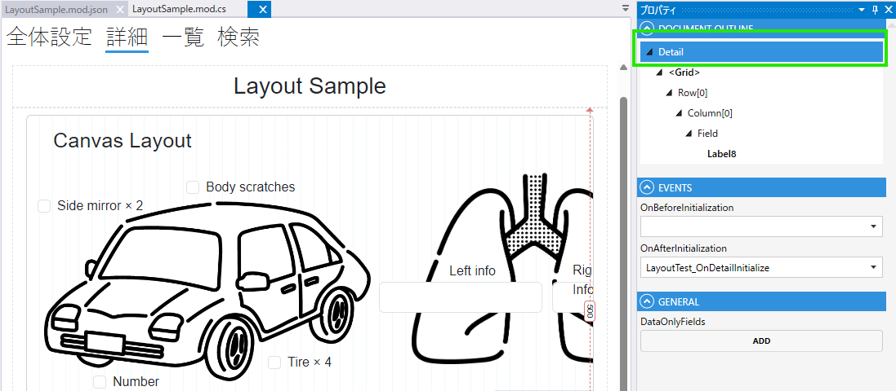
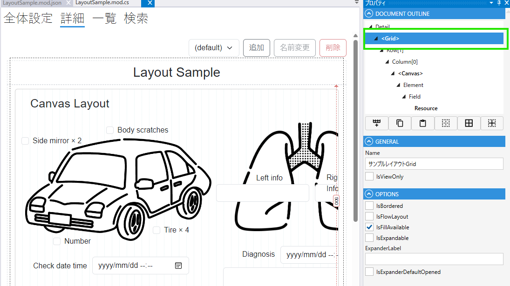
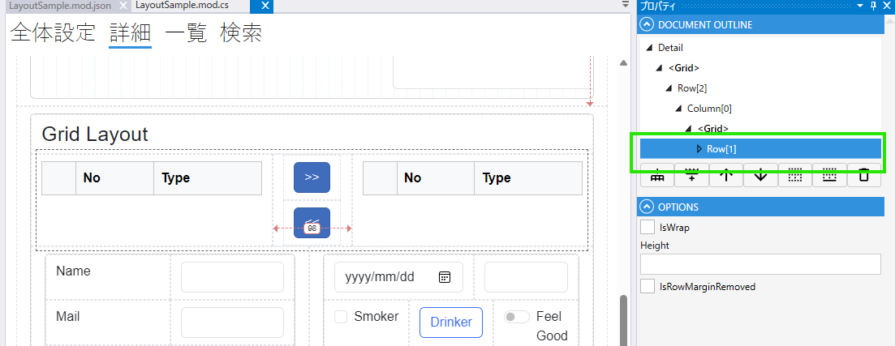
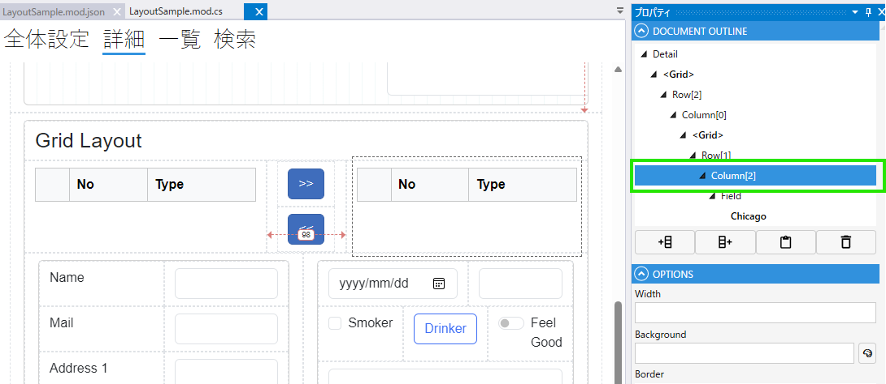
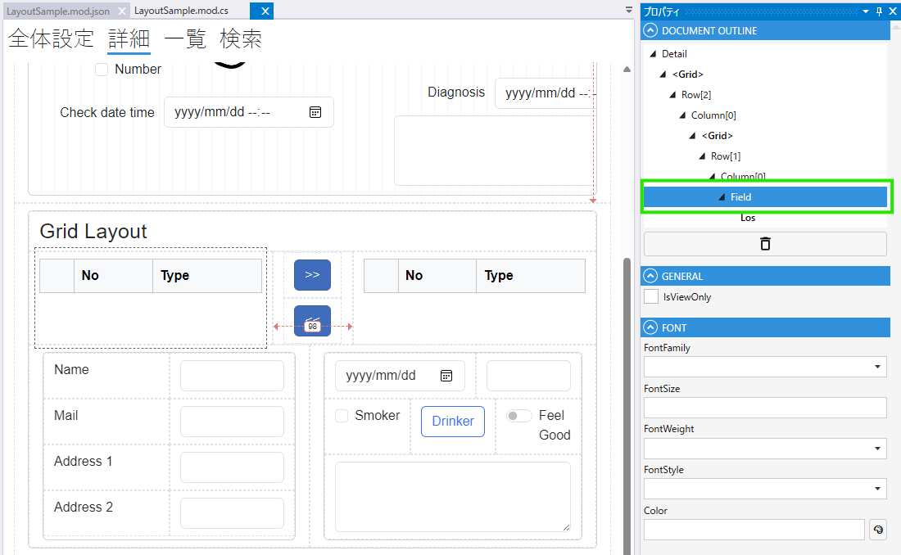
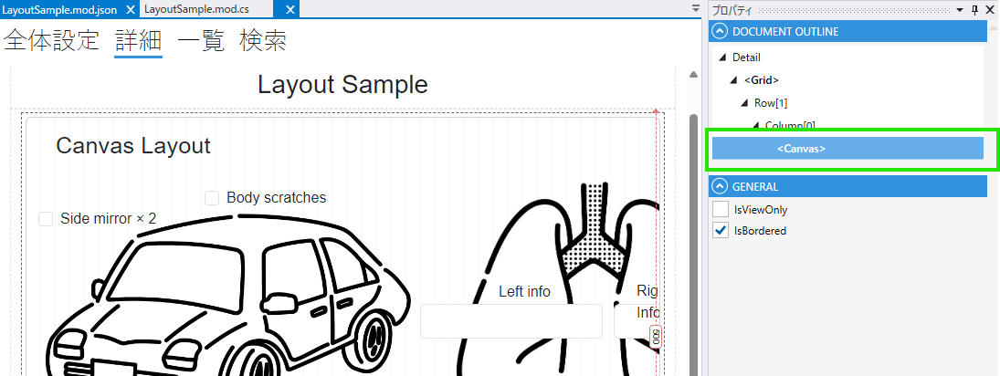
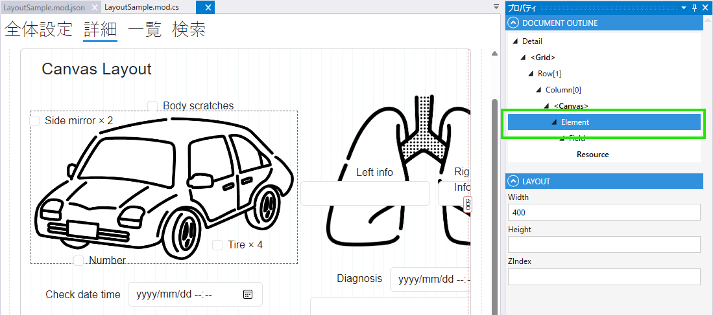

# レイアウト

このソフトウェアは2種類のレイアウトをサポートしています。

- Grid
- Canvas

ここではそれぞれのレイアウトの特徴と、詳細な動作について説明します。

## レイアウトの特徴

### Grid

Gridレイアウトは列と行を使ったレイアウトです。各要素には、 `Button` や `Label` をはじめとするフィールドや、他のGridやCanvasを含むことができます。

ModuleやSearchのRoot要素はGridレイアウトが設定されているため、Gridを基本的なレイアウトとして使用してデザインしていくことになります。

通常Gridの各Columnは標準状態でRow全体の幅を含まれているColumnの数で等分した幅を持っています。
しかし、いくつかのField（Date, DateTime など）はUserAgent（ここではブラウザ）のスタイルシートなどでそれ以上小さくできない幅を持っている場合があります。
これらの最低幅を持ったFieldがColumnに含まれている場合、ほかのColumnに割り当てられる幅がRow全体を等分したものより小さくなることがあります。

### Canvas

Canvasレイアウトは自由な配置が可能なレイアウトです。ドラッグドロップで要素を配置することができ、要素のサイズ・配置を自由に変更することができます。

## マージンとパディング

### Grid

Gridレイアウトは標準状態でいくつかのマージンやパディングを含んでいます。これにより、要素間に適切なスペースが確保されます。

標準のマージンやパディングは、`Row` では `Margin` プロパティ、`Grid` および `Column` では `Padding` プロパティを設定することで動作を上書きすることができます。
空欄では標準のマージンやパディングが適用され、それ以外の何らかの数値が入力されている場合その値が反映されます。

標準で適用されているマージンとパディングがどのような値になるかは `Grid` 自体や、`Row`、 `Column` などのプロパティによって変わります。
ここではそれぞれのプロパティとマージンやパディングがどのように適用されるかを説明します。

#### Grid

Grid自体はマージン・パディングを含んでいません。ただし、Gridの `IsBorderd` プロパティが設定された場合は、Gridの内側に `1rem` のパディングが適用されます。

#### Row

Rowは下部に適用されるマージン `1rem` が設定されています。ただし、`Row` に含まれる直下の `Column` について枠線が設定されている場合上部にマージン `1rem` が設定されます。

#### Column

Columnは左右に適用されるパディング `0.75rem` が設定されています。ただし、GridやCanvasが配置された場合に限り、次の条件を満たす場合にパディングが適用されません。

- Grid, Canvas の `IsBordered` プロパティが `false` に設定されている

### Canvas

Canvasレイアウトは標準状態でマージンやパディングを含みません。ただし、Canvasの `IsBordered` プロパティが設定された場合は、Canvasの内側に `1rem` のパディングが適用されます。

## 特殊なレイアウトモード

### Grid.IsFlowLayout

Grid レイアウトには特殊なレイアウトモードとして、 `IsFlowLayout` があります。
このモードが有効になっている場合、Gridの要素は左から右へ順番に配置され、右端に達した場合は次の行に配置されます。

### Row.FillAvailable

Row には特殊なレイアウトモードとして、 `FillAvailable` があります。
このモードが有効になっているRowが、そのGridの末尾要素の場合にページボディの空き領域をすべて埋める高さまでRowが広げられます。

## デザイナ上の表示との差異

デザイナ上では、GridやCanvasの配置を確認することができますが正確にブラウザ上での表示と同一にはなっていません。
最終的な表示を確認するには、デプロイ後のページを確認してください。

## プロパティ
### Detail

| プロパティ名                 | 説明             |
|------------------------|----------------| 
| OnBeforeInitialization | UI初期化前の処理を設定する |
| OnAfterInitialization  | UI初期化後の処理を設定する |
| DataOnlyFields         | TODO           |

### Grid

| プロパティ名                  | 説明                                         |
|-------------------------|--------------------------------------------| 
| Name                    | フィールド名を設定する                                |
| IsViewOnly              | 読取専用を設定する                                  |
| IsBordered              | 枠を設定する                                     |
| IsFlowLayout            | フローレイアウトを設定する                              |
| IsFillAvailable         | Gridの末尾要素の場合にページボディの空き領域をすべて埋める高さまでRowが広げる |
| IsExpandable            | 開閉を設定する                                    |
| ExpanderLabel           | 開閉ラベルを設定する                                 |
| IsExpanderDefaultOpened | デフォルトで開いているかどうかを設定する                       |

### Row

| プロパティ名             | 説明            |
|--------------------|---------------| 
| IsWrap             | 行を自動で折り返す     |
| Height             | 行の高さを設定する     |
| IsRowMarginRemoved | 行のマージン有無を設定する |

### Column

| プロパティ名              | 説明                                        |
|---------------------|-------------------------------------------| 
| Width               | 列の幅を設定する                                  |
| BackGround          | 背景色を設定する                                  |
| Border              | 罫線を設定する                                   |
| HorizontalAlignment | 水平方向の位置を設定する start/center/end/stretch |
| VerticalAlignment   | 垂直方向の位置を設定する top/middle/end/stretch   |
| canResize           | サイズの変更可否を設定する                             |

### Field 

| プロパティ名     | 説明            |
|------------|---------------| 
| IsViewOnly | 読取専用を設定する     |
| FontFamily | フォントを設定する     |
| FontSize   | フォントサイズを設定する  |
| FontWeight | フォントウェイトを設定する |
| FontStyle  | フォントスタイルを設定する |
| Color      | 色を設定する        |

### Canvas

| プロパティ名                  | 説明                   |
|-------------------------|----------------------| 
| IsViewOnly              | 読取専用を設定する            |
| IsBordered              | 枠を設定する               |

### Element

| プロパティ名 | 説明          |
|--------|-------------| 
| width  | 幅を設定する      |
| height | 高さを設定する     |
| zindex | zindexを設定する |

## スクリプト
### Layout
| プロパティ名                 | 型                | 説明            |
|------------------------|------------------|---------------|
| IsEnabled              | bool             | 一括で有効/無効を変更する |
| IsExpanded             | bool             | Gridが開いているか   |
| IsViewOnly             | bool             | Gridが読み取り専用か  |
| IsVisible              | bool             | Gridが表示されているか |
| LayoutName             | string           | レイアウト名        |
| ModuleLayoutType       | ModuleLayoutType | レイアウトのタイプ     |
| Name                   | string           | 名前            |

### GridLayout

  | プロパティ名           | 型                | 説明            |
  |------------------|------------------|---------------|
  | IsEnabled        | bool             | 一括で有効/無効を変更する |
  | IsExpanded       | bool             | Gridが開いているか   |
  | IsViewOnly       | bool             | Gridが読み取り専用か  |
  | IsVisible        | bool             | Gridが表示されているか |
  | LayoutName       | string           | レイアウト名        |
  | ModuleLayoutType | ModuleLayoutType | レイアウトのタイプ     |
  | Name             | string           | 名前            |
  | IsExpanded       | bool             | 開いているかどうか     |

### SearchLayout

  | プロパティ名           | 型                | 説明            |
  |------------------|------------------|---------------|
  | IsEnabled        | bool             | 一括で有効/無効を変更する |
  | IsExpanded       | bool             | Gridが開いているか   |
  | IsViewOnly       | bool             | Gridが読み取り専用か  |
  | IsVisible        | bool             | Gridが表示されているか |
  | LayoutName       | string           | レイアウト名        |
  | ModuleLayoutType | ModuleLayoutType | レイアウトのタイプ     |
  | Name             | string           | 名前            |
  | IsExpanded       | bool             | 開いているかどうか     |
  | IsOrMatch        | bool?            | OR検索かどうか      |
