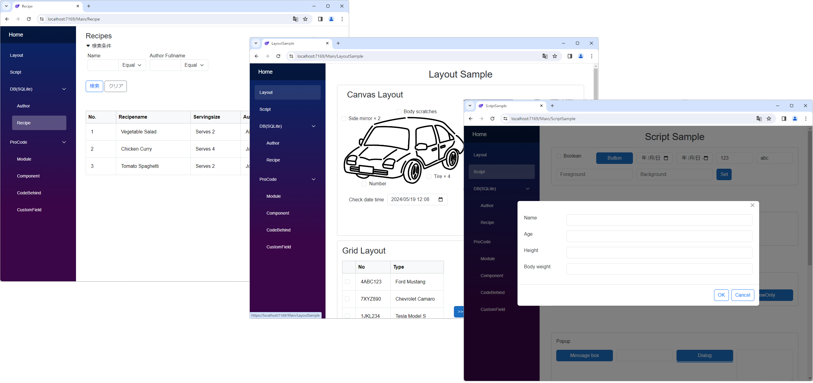

# Module
ModuleはC#のclassに近い概念です。
- [Field](../fields/field.md)を配置することによりデータとして振る舞うことができます。
- DBとマッピングすることによりORマッパーのEntityとして振る舞うこともできます。
- またUIのレイアウトも持ち画面表示（一覧画面、詳細画面、ダイアログ、他の画面の一部）をすることもできます。
- スクリプトでメソッドを定義することもできます。

## 全体設定

全体設定ではDBとの入出力やアクセス権の設定など主にデータとしての振る舞いを設定します。
画面上に表示しないFieldもここで設定することができます。スクリプト中でModuleSearcherを用いてデータとして取得/利用することができます。

- [全体設定](module_general.md)

## 画面レイアウト

Moduleは画面レイアウトを設定することで画面を表示できます。詳細、一覧、検索のUI表現を設定できます。設定方法はそれぞれの参照してください。
- [詳細設定](module_detail.md)
- [一覧設定](module_list.md)
- [検索設定](module_search.md)

### 画面で利用できるデータ
サーバー側のDataSourceと連携している場合に各レイアウトで表示するために取得するデータは以下のものです。例えば一覧画面などでは多くの場合すべてのフィールドのデータを持ってくると非効率になります。ただ場合によっては画面には表示しないFieldも必要になるのでその場合はDataOnlyFieldsで設定できるようにしています。
- レイアウトに表示しているもの
- レイアウトでDataOnlyFieldsに設定されているもの
- IdField、OptimisticLockingField（Moduleに設定されている場合）

### 複数レイアウト
レイアウト（詳細、一覧、検索）で重要なポイントはそれぞれでレイアウトを複数作成できることです。

作成したレイアウトは以下で使用できます。

| レイアウト種類 | 使用場所                                                                            |
|---------|---------------------------------------------------------------------------------|
| 一覧レイアウト | 一覧ページ(defaultレイアウト), LinkField                                                  |
| 詳細レイアウト | 詳細ページ(defaultレイアウト), ダイアログ, ListField, DetailList, TileList, ModuleField |
| 検索レイアウト | 一覧ページ(defaultレイアウト), SearchField                                                |

### プロパティ

| プロパティ名           | 型                | 説明        |
|------------------|------------------|-----------|
| BackGroundColor  | string?          | 背景色を取得する  |
| ForeGroundColor  | string?          | 前面色を取得する  |
| IsDeleted        | bool             | 削除済みか     |
| IsEnabled        | bool             | 有効/無効     |
| IsViewOnly       | bool             | 読み取り専用か   |
| IsModified       | bool             | 変更済か      |
| IsNewData        | bool             | 新しいデータか   |
| PageTitle        | string           | ページタイトル   |
| IsVisible        | bool             | 表示されているか  |
| LayoutName       | string           | レイアウト名    |
| ModuleLayoutType | ModuleLayoutType | レイアウトのタイプ |
| Name             | string           | 名前        |

### Script 

| メソッド名                       | 戻り値          | 説明              |
|-----------------------------|--------------|-----------------|
| CloseDialog()               | Task         | objectをシリアライズする |
| Delete()                    | Task<bool>   | jsonを返却する       |
| ReloadWithLock()            | Task         | jsonを返却する       |
| SetJsonObject()             | Task         | jsonを返却する       |
| ShowDialog()                | Task<string> | jsonObjectを返却する |
| Submit()                    | Task<bool?>  | jsonを返却する       |
| ToJsonObject()              | JsonObject   | jsonを返却する       |
| ValidateInput()             | bool         | validateする      |
| NotifyStateChanged()        | void         | 状態の変更を通知する      |
| SuspendNotifyStateChanged() | void         | 状態の変更を中止する      |