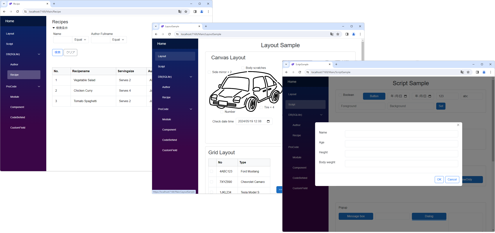

# Module

**Module は画面 1 つ分とそのデータをまとめた単位**です。C# の class に近い概念で、1 つの Module に以下が詰まっています:

- [Field](../fields/field.md) の集まり — データと UI の部品
- DB との対応（テーブル・View にマッピング可能）
- 画面レイアウト（詳細・一覧・検索）
- スクリプト（イベントハンドラ・メソッド）
- 権限設定

Module を DB テーブルにマッピングすると、**追加・編集・削除・一覧・検索が自動で動く**ようになります。

---

## Module の 4 つのタブ

デザイナで Module を開くと 4 つのタブがあり、それぞれ異なる役割を担います。

| タブ | 役割 | リファレンス |
|---|---|---|
| **全体設定** | DB との入出力・アクセス権・スクリプトなど、データとしての振る舞い | [全体設定](module_general.md) |
| **詳細** | 1 件のデータを表示・編集する画面レイアウト | [詳細設定](module_detail.md) |
| **一覧** | 複数件を並べる画面レイアウト | [一覧設定](module_list.md) |
| **検索** | 一覧の上に出る検索条件のレイアウト | [検索設定](module_search.md) |



---

## 画面で利用できるデータ

DB と連携している場合、各レイアウトで表示するために取得するデータは以下です:

- レイアウトに**表示されている** Field
- レイアウトの `DataOnlyFields` に設定されている Field
- `IdField` / `OptimisticLockingField`（Module に設定されている場合）

一覧画面などですべての Field を取得すると非効率なので、**表示だけしない Field は DataOnlyFields** で指定するのが基本です。

---

## 複数レイアウト

各タブ（詳細・一覧・検索）は、複数のレイアウトを定義できます。

| レイアウト種類 | 使用される場所 |
|---|---|
| **一覧レイアウト** | 一覧ページ（`default`）、LinkField の検索結果 |
| **詳細レイアウト** | 詳細ページ（`default`）、ダイアログ、ListField、DetailList、TileList、ModuleField |
| **検索レイアウト** | 一覧ページ（`default`）、SearchField |

`default` は削除・改名できない固定レイアウトです。追加レイアウトは自由に命名でき、
LinkField / ListField など参照側で切り替えて使います。

---

## スクリプトから Module を操作する

### プロパティ

| プロパティ | 型 | 説明 |
|---|---|---|
| `Name` | string | Module 名 |
| `PageTitle` | string | ページタイトル |
| `LayoutName` | string | 現在のレイアウト名 |
| `ModuleLayoutType` | ModuleLayoutType | 現在のレイアウトタイプ（Detail / List / Search） |
| `IsEnabled` / `IsVisible` / `IsViewOnly` | bool | 全体の有効・表示・読み取り専用 |
| `IsModified` | bool | 変更されたか |
| `IsNewData` | bool | 新規データか |
| `IsDeleted` | bool | 削除済みか |
| `BackgroundColor` / `ForeGroundColor` | string? | 色設定 |

### メソッド

| メソッド | 戻り値 | 説明 |
|---|---|---|
| `Submit()` | Task<bool?> | 登録・更新（標準の Submit 動作） |
| `Delete()` | Task<bool> | 削除 |
| `ValidateInput()` | bool | バリデーション実行 |
| `ShowDialog()` | Task<string> | Module をダイアログで開く |
| `CloseDialog()` | Task | ダイアログを閉じる |
| `ReloadWithLock()` | Task | ロック付きで再読み込み |
| `ToJsonObject()` | JsonObject | JSON 化 |
| `SetJsonObject()` | Task | JSON を流し込む |
| `NotifyStateChanged()` | void | 再描画を促す |
| `SuspendNotifyStateChanged()` | IDisposable | 再描画を一時停止（バッチ更新用） |

### よく使う例

```csharp
// 詳細画面の Submit ボタンで処理を追加
void SaveButton_OnClick()
{
    // 独自バリデーション
    if (string.IsNullOrEmpty(Name.Value))
    {
        Name.SetError("名前を入力してください");
        return;
    }

    if (!await ValidateInput()) return;

    if (await Submit())
    {
        Toaster.Success("保存しました");
    }
}

// ダイアログとして開く
var result = await new EditDialog().ShowDialog();
```

---

## 認可

Module には 4 種類の権限設定があります。詳しくは [認証・認可](../authorization/authorization.md) を参照。

| 条件 | 意味 |
|---|---|
| **UserRead** | このユーザーが Module を読めるか |
| **UserWrite** | このユーザーが Module を書き換えられるか |
| **DataRead** | このデータを（このユーザーが）読めるか |
| **DataWrite** | このデータを（このユーザーが）書き換えられるか |

---

## 関連項目

- [Field 一覧](../fields/field.md)
- [Field 共通プロパティ](../fields/common_properties.md)
- [レイアウト](layout.md)
- [Document Outline と Property パネル](DocumentOutline.md)
- [データモデルと Module](../data_model/data-model.md)
- [認証・認可](../authorization/authorization.md)
- [スクリプト概要](../overview/script.md)
