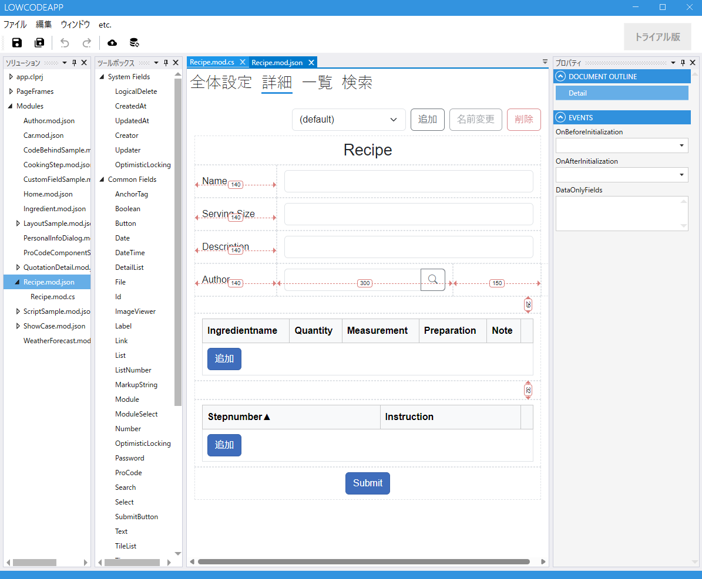
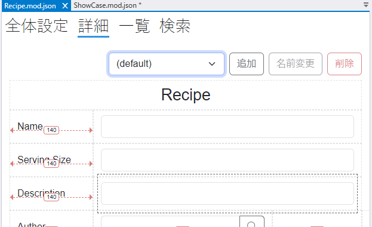
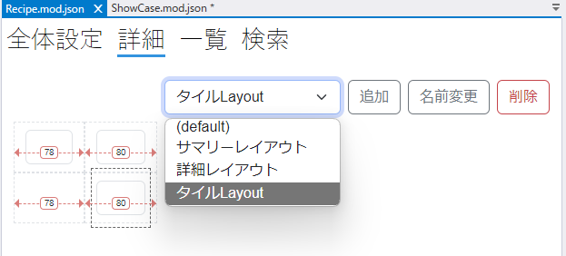
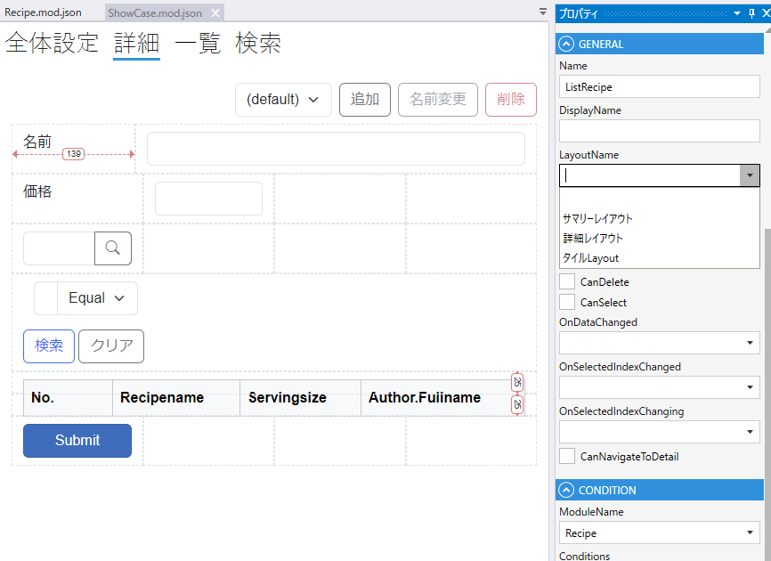

# モジュール詳細設定

Enityの表示画面，登録/更新画面を設定します.

## ツールボックス
モジュールで使用するFieldを選択します。

| 項目           | 説明                                               |
|--------------|--------------------------------------------------|
| SystemFields | SystemFieldの一覧が表示されます                            |
| CommonFields | CommonFieldの一覧が表示されます                            |
| DB Fields    | 全体設定でDataSourceを指定した場合に，テーブルのカラムからField候補が表示されます |
| Rest Fields  | DB Fieldsで詳細設定で（まだ）使用していないFieldが表示されます           |
| Link Fields  | Linkフィールドを作成した場合に，Link先のフィールドが表示されます             |
| Layout       | 詳細画面でGridレイアウト，Canvasレイアウトを設定時に使用します             |

## 詳細設定
プロパティペインで列，行を追加/削除を行い，レイアウトを設定します。

追加ボタンをクリックして複数のレイアウトを作成できます。

[レイアウトの詳細](layout.md)はこちらを参照してください。

## プロパティ
選択しているレイアウトのプロパティが表示されます

## レイアウト詳細

モジュールの詳細設定画面で詳細のレイアウトを設定します．

## デフォルトレイアウト

モジュールの詳細画面に使うレイアウト設定はdefaultという名前で作成されます．（変更できません）

モジュールの詳細ページにはdefaultのレイアウトが適用されます．

## 複数レイアウト

追加ボタンをクリックしてデフォルトとは異なるレイアウトを作成できます．

`ListField`, `DetailList`, `TileList` にdefaultを含む作成済みのすべてのレイアウトから, 適用するレイアウトを指定できます.

