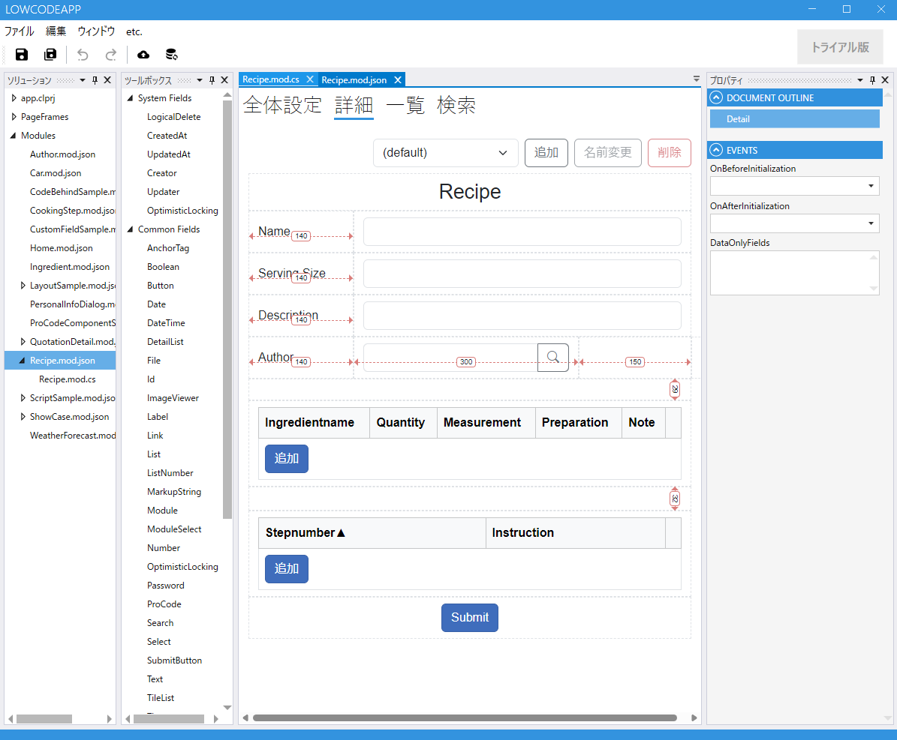
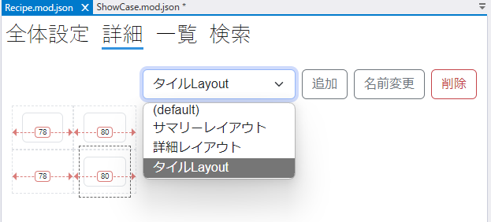
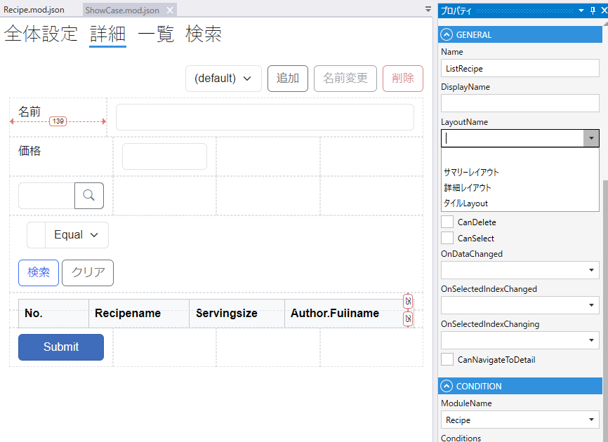

# モジュール詳細設定

**詳細タブ**では、1 件のデータを表示・編集する画面のレイアウトを設定します。新規追加・編集ダイアログにもここで定義したレイアウトが使われます。

---

## 設定の流れ

1. プロパティパネルで Grid / Canvas などのレイアウトを設定
2. 「未使用フィールド」から Field をドラッグ＆ドロップで配置
3. 各 Field のプロパティ（幅・揃え・読み取り専用など）を調整

レイアウトの詳細な仕様は [レイアウト](layout.md) を参照してください。

---

## default レイアウトと追加レイアウト

| レイアウト | 用途 |
|---|---|
| **default** | 詳細ページの標準レイアウト（削除・改名不可） |
| **追加レイアウト** | ダイアログ・ListField・DetailList・TileList・ModuleField で使い分け可能 |

追加レイアウトは「＋」ボタンで作成できます。

### 使い分けの例

- **default** — 標準の編集画面用（最も情報量が多い）
- **compact** — ListField の行内編集で使う簡易版
- **readonly** — 参照専用の表示版

参照側（ListField など）のプロパティで、使いたいレイアウト名を指定します。

---

## ツールボックス

[全体設定のツールボックス](module_general.md#ツールボックス) と同じ構成ですが、詳細タブでは以下も選べます:

- **Layout** — Grid / Canvas / Tab レイアウト要素

---

## レイアウトのプロパティ

詳細レイアウト全体のプロパティ:

| プロパティ | 説明 |
|---|---|
| **OnBeforeInitialization** | UI 初期化前のスクリプト |
| **OnAfterInitialization** | UI 初期化後のスクリプト |
| **DataOnlyFields** | UI には表示しないが、サーバーから取得する Field |

---

## 関連項目

- [Module 概要](module.md) / [全体設定](module_general.md)
- [レイアウト](layout.md)
- [Document Outline と Property パネル](DocumentOutline.md)
