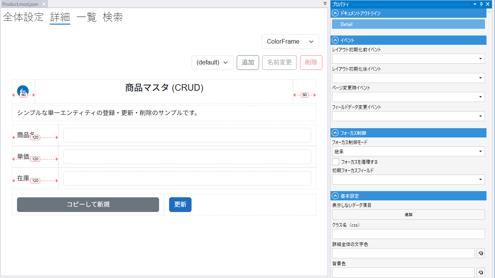
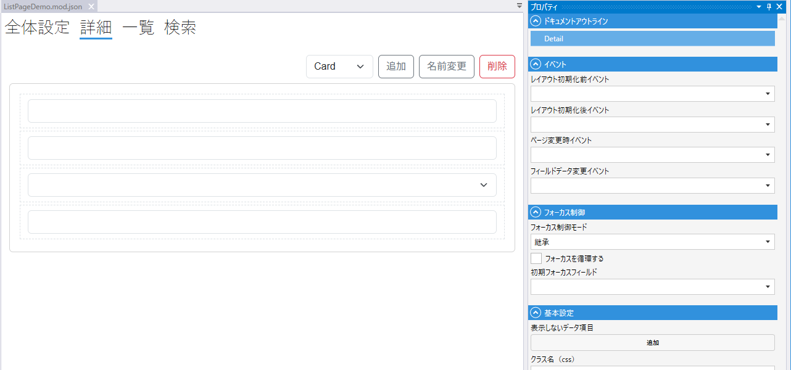
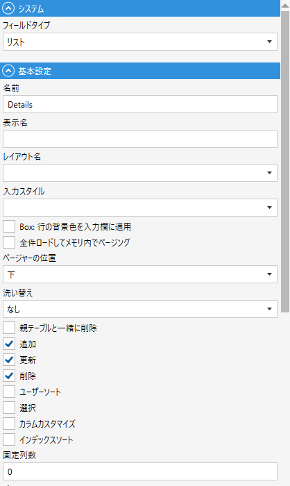

# モジュール詳細設定

**詳細タブ**では、1 件のデータを表示・編集する画面のレイアウトを設定します。新規追加・編集ダイアログにもここで定義したレイアウトが使われます。

---

## 設定の流れ

1. プロパティパネルで Grid / Canvas などのレイアウトを設定
2. 「未使用フィールド」から Field をドラッグ＆ドロップで配置
3. 各 Field のプロパティ（幅・揃え・読み取り専用など）を調整

レイアウトの詳細な仕様は [レイアウト](layout.md) を参照してください。

---

## default レイアウトと追加レイアウト

| レイアウト | 用途 |
|---|---|
| **default** | 詳細ページの標準レイアウト（削除・改名不可） |
| **追加レイアウト** | ダイアログ・ListField・DetailList・TileList・ModuleField で使い分け可能 |

追加レイアウトはレイアウト名のドロップダウン横の「追加」ボタンで作成できます（「名前変更」「削除」も同じ場所）。

### 使い分けの例

- **default** — 標準の編集画面用（最も情報量が多い）
- **compact** — ListField の行内編集で使う簡易版
- **readonly** — 参照専用の表示版

参照側（ListField など）のプロパティで、使いたいレイアウト名を指定します。

---

## ツールボックス

[全体設定のツールボックス](module_general.md#ツールボックス) と同じ構成ですが、詳細タブでは以下も選べます:

- **Layout** — Grid / Canvas / Tab レイアウト要素

---

## レイアウトのプロパティ

詳細レイアウト全体のプロパティ:

| プロパティ | 説明 |
|---|---|
| **OnBeforeInitialization** | UI 初期化前のスクリプト |
| **OnAfterInitialization** | UI 初期化後のスクリプト |
| **OnLocationChanging**（ページ変更時イベント） | 詳細ページから別のページへ移動する直前に呼ばれるスクリプト。`bool` を返し、`false` を返すと移動を中止する（未保存の入力がある場合の確認などに使う）。同じページのままクエリ文字列だけが変わる場合は呼ばれない |
| **OnFieldDataChanged**（フィールドデータ変更イベント） | このレイアウトのいずれかの Field の値が変わったときに呼ばれるスクリプト。引数 `fieldName` に変わった Field 名が渡る。個々の Field の `OnDataChanged` をまとめて 1 か所で扱いたいときに使う |
| **DataOnlyFields** | UI には表示しないが、サーバーから取得する Field |
| **ClassName**（クラス名（css）） | 詳細レイアウト全体に付ける CSS クラス名 |
| **Color**（詳細全体の文字色） / **BackgroundColor**（背景色） | 詳細レイアウト全体の文字色・背景色。中の Grid・Field で指定しなければこの値が引き継がれる（[カスケード](layout.md#カスケードcolor--font--backgroundcolor)） |
| **FontFamily**（フォント種類） / **FontSize**（フォントサイズ） | 詳細レイアウト全体のフォント。同じく中の要素に引き継がれる |
| **FocusControlMode** / **IsFocusWrap** / **InitialFocusField** | Enter / Tab キーでのフォーカス移動の設定（[フォーカス制御](focus_control.md)） |

---

## 関連項目

- [Module 概要](module.md) / [全体設定](module_general.md)
- [レイアウト](layout.md)
- [フォーカス制御](focus_control.md)
- [Document Outline と Property パネル](DocumentOutline.md)
