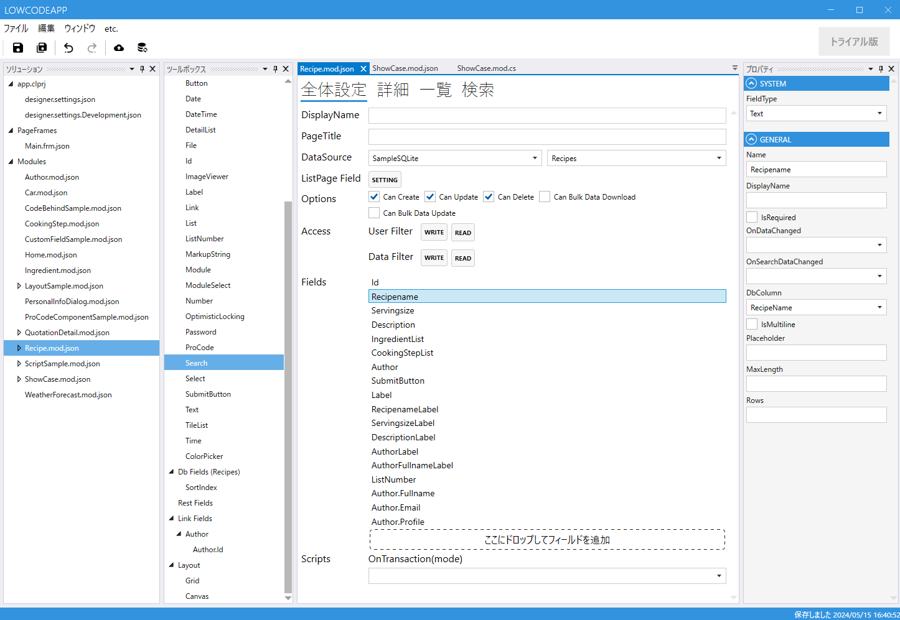

# モジュール全体設定

**全体設定タブ**では、Module の DB 連携・アクセス権・スクリプトなど、**データとしての振る舞い**を設定します。画面に表示しない Field もここで管理します。

---

## 設定項目

| 項目 | 説明 |
|---|---|
| **DataSource** | 対応する DB テーブル / View。[designer.settings](../designer/designer_settings.md) で事前に定義しておく |
| **Options** | `作成` / `更新` / `削除` の有効化 |
| **Access** | ユーザー・データ単位のアクセス制御。[認証・認可](../authorization/authorization.md) 参照 |
| **Fields** | Module で使用する Field 一覧（ツールボックスからドロップで追加） |
| **Scripts** | Module レベルのスクリプト関数 |

---

## ツールボックス

Module で使う Field をドラッグ＆ドロップで追加します。

| 項目 | 表示される内容 |
|---|---|
| **SystemFields** | Id・LogicalDelete・CreatedAt などの [System Field](../fields/field.md#system-field--特別な役割を持つ-field) |
| **CommonFields** | 汎用的な UI Field（Button・Label など） |
| **DB Fields** | DataSource が設定されている場合に、テーブルの列から自動で候補が出る |
| **Rest Fields** | まだレイアウトに使用していない Field |
| **Link Fields** | LinkField を作った場合、リンク先の Field |
| **Layout** | 詳細・検索画面で使う Grid / Canvas 等のレイアウト要素 |

---

## プロパティパネル

選択中の Field / Layout のプロパティが表示されます。各 Field 固有のプロパティは [Field 一覧](../fields/field.md) の各ページを参照。

---

## モジュール作成時の注意点

**新規登録・更新・削除を行う Module には、System Field の `Id` が必須**です。これが無いと詳細画面への遷移や新規登録ができません。

DB 列名が `Id` 以外の場合は、System Field の `Id` を配置したあと、`DbColumn` プロパティで対応する列を指定してください。

詳しくは [モジュール作成時の注意点](../Help/PointToNote_CreateModule.md) を参照。

### 名前の付け方

モジュール名・ページフレーム名は、アプリ内で **一意の名前** にしてください。他のモジュール・ページフレームはもちろん、フィールドの型名やスクリプトで使う型名（`DateTime` `List` など）とも重複させられません。**大文字小文字の違いは区別されません**（`Order` と `order` は同じ名前として扱われます）。

また、名前は英字または `_` で始め、英数字・`_`・日本語などで構成してください（`.`・空白・記号や、`if` `class` などのキーワードは使えません）。重複や使えない文字があると、デザインチェックでエラーになります。

---

## 関連項目

- [Module 概要](module.md)
- [詳細設定](module_detail.md) / [一覧設定](module_list.md) / [検索設定](module_search.md)
- [Field 一覧](../fields/field.md)
- [Document Outline と Property パネル](DocumentOutline.md)
- [認証・認可](../authorization/authorization.md)
