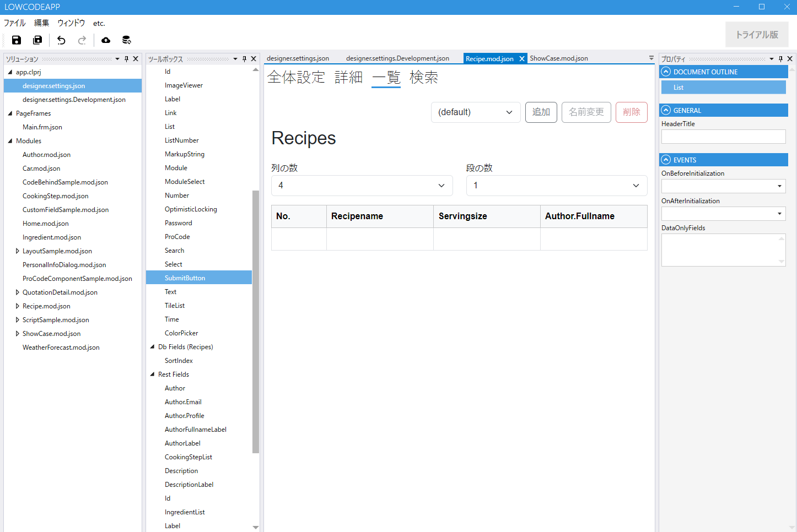
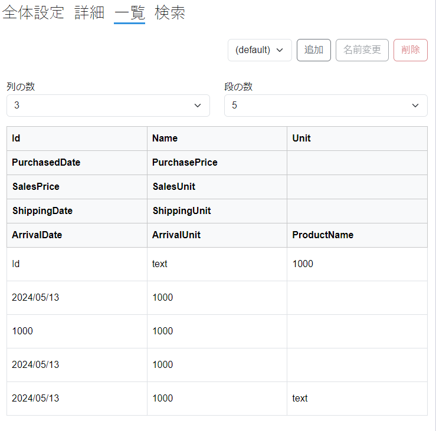
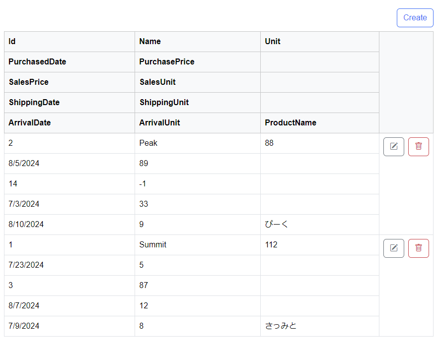
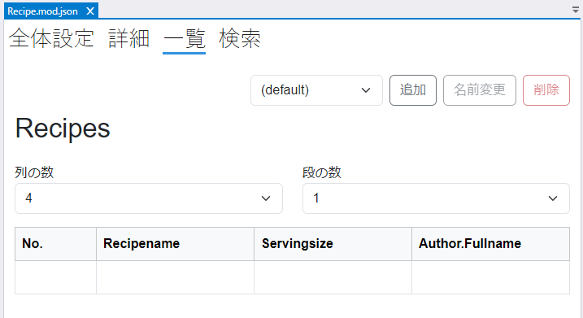
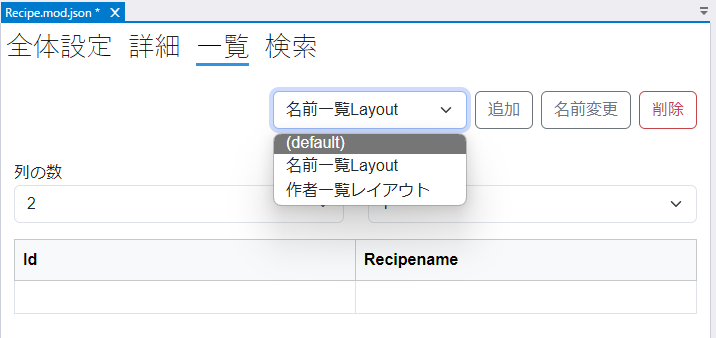
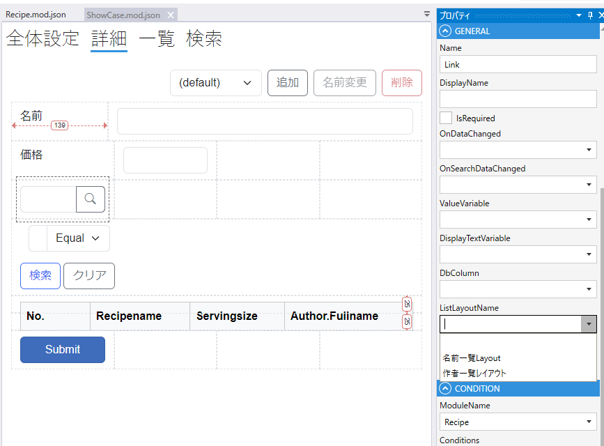

# モジュール一覧設定

Entityの一覧画面の設定をします.

全体設定で作成したフィールドから一覧に表示するフィールドを選択します.

## ツールボックス
モジュールで使用するFieldを選択します．

| 項目           | 説明                                               |
|--------------|--------------------------------------------------|
| SystemFields | SystemFieldの一覧が表示されます                            |
| CommonFields | CommonFieldの一覧が表示されます                            |
| DB Fields    | 全体設定でDataSourceを指定した場合に，テーブルのカラムからField候補が表示されます |
| Rest Fields  | DB Fieldsで詳細設定で（まだ）使用していないFieldが表示されます．          |
| Link Fields  | Linkフィールドを作成した場合に，Link先のフィールドが表示されます.            |
| Layout       | 詳細画面でGridレイアウト，Canvasレイアウトを設定時に使用します．            |

## 一覧設定
列，段の数を指定して一覧表示の設定をします．
追加ボタンをクリックして複数のレイアウトを作成できます.

一覧に表示するフィールドが多い場合，多段リストを使えます．

## プロパティ
選択しているFieldのプロパティが表示されます

## レイアウト設定

モジュールの一覧設定画面で一覧のレイアウトを設定します．

## デフォルトレイアウト

モジュールの一覧画面に使うレイアウト設定はdefaultという名前で作成されます．（変更できません）

モジュールの一覧ページにはdefaultのレイアウトが適用されます．

## 複数レイアウト

追加ボタンをクリックしてデフォルトとは異なるレイアウトを作成できます．

`LinkField` にdefaultを含む作成済みのすべてのレイアウトから, 適用するレイアウトを指定できます.

