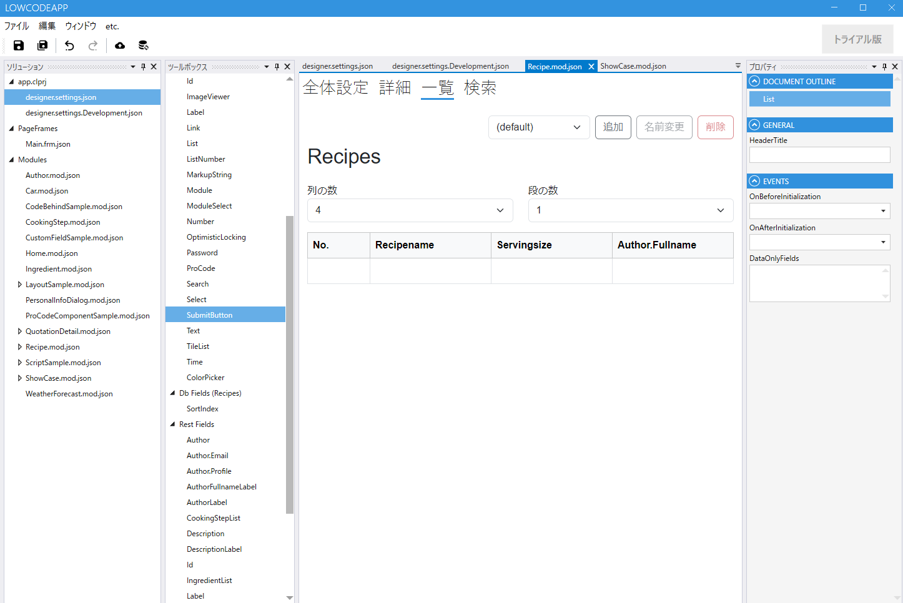
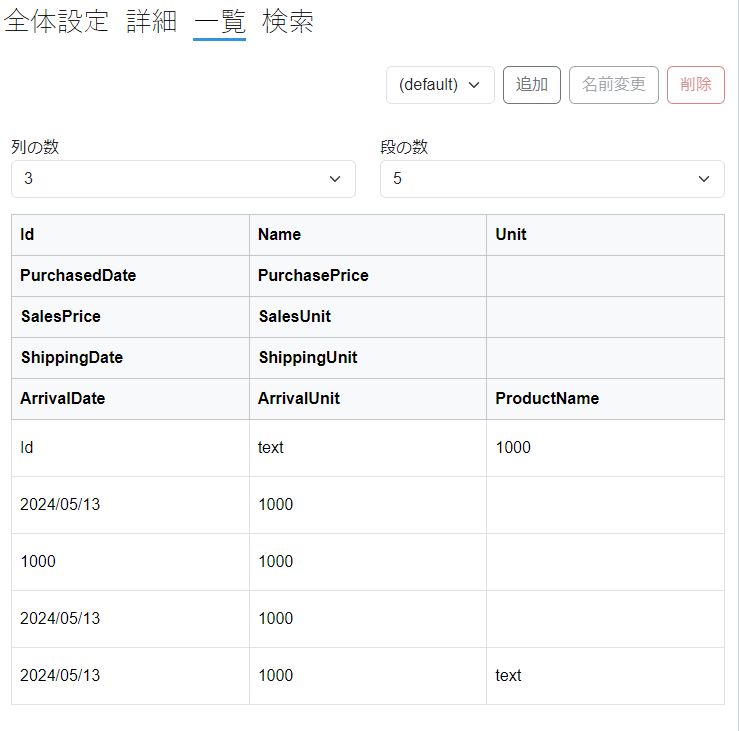
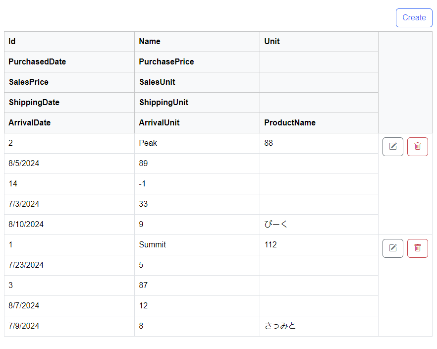
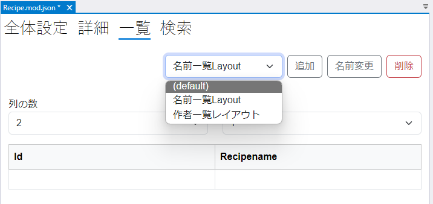

# モジュール一覧設定

**一覧タブ**では、複数件のデータをテーブル形式で並べる画面のレイアウトを設定します。

---

## 設定の流れ

1. 段数・列数を指定
2. 「未使用フィールド」から Field をドラッグ＆ドロップで配置
3. 各 Field の幅・折り返し・表示オプションを調整

---

## 多段リスト

1 行に収まらないほど列が多い場合は、**段数を増やす**ことで複数行での表示に切り替えられます。

---

## default レイアウトと追加レイアウト

| レイアウト | 用途 |
|---|---|
| **default** | 一覧ページの標準レイアウト |
| **追加レイアウト** | LinkField の検索結果で使い分け可能 |

---

## 一覧プロパティ

| プロパティ | 説明 |
|---|---|
| **OnBeforeInitialization** | 一覧初期化前のスクリプト |
| **OnAfterInitialization** | 一覧初期化後のスクリプト |
| **DataOnlyFields** | 表示しないがサーバーから取得する Field |

## 列ごとのプロパティ（Element）

| プロパティ | 説明 |
|---|---|
| **Label** | 列ヘッダーのラベル |
| **Width** | 列幅 |
| **ColumnSpan** / **RowSpan** | 列・行の結合 |
| **IsViewOnly** | 読み取り専用 |
| **TextWrap** | 改行設定（`unset` / `break` / `Ellipsis`） |
| **CanResize** | リサイズ許可 |
| **FontFamily** / **FontSize** / **FontWeight** / **FontStyle** / **Color** | 文字表示 |

---

## 関連項目

- [Module 概要](module.md) / [全体設定](module_general.md) / [詳細設定](module_detail.md)
- [List / DetailList / TileList](../fields/List.md)
- [レイアウト](layout.md)
