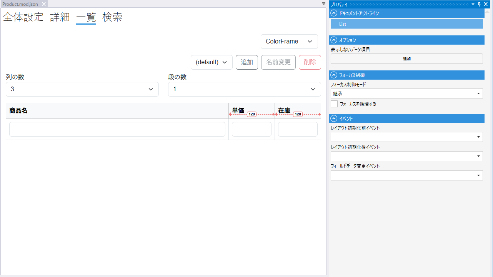
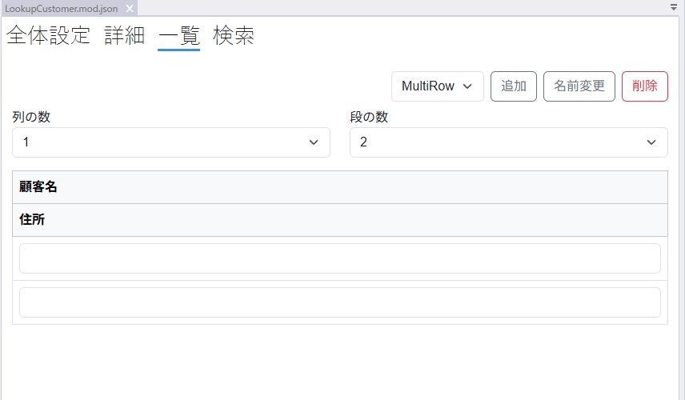
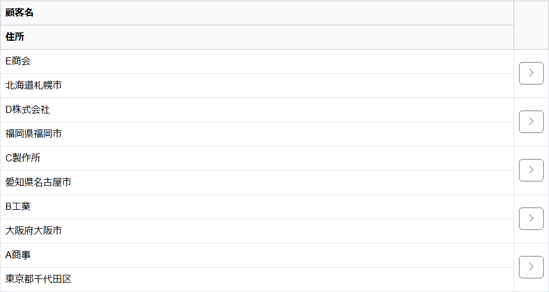
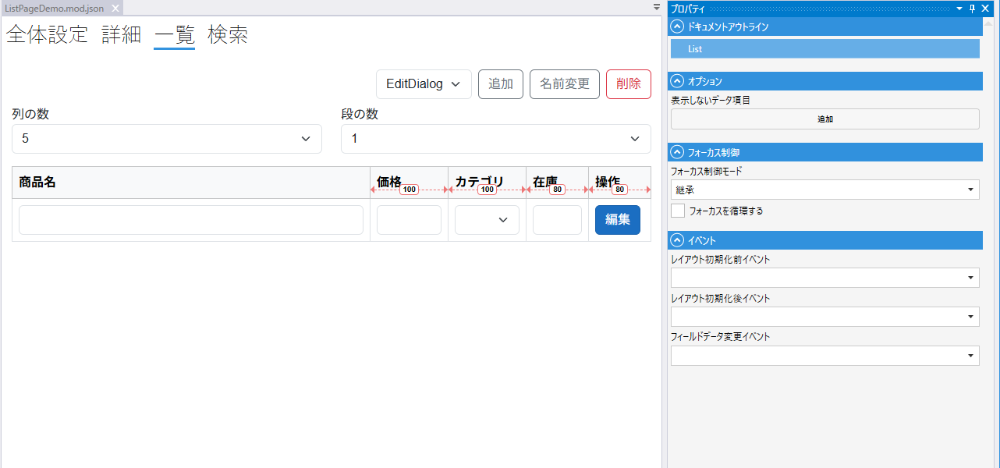

# モジュール一覧設定

**一覧タブ**では、複数件のデータをテーブル形式で並べる画面のレイアウトを設定します。

---

## 設定の流れ

1. 段数・列数を指定
2. 「未使用フィールド」から Field をドラッグ＆ドロップで配置
3. 各 Field の幅・折り返し・表示オプションを調整

---

## 多段リスト

1 行に収まらないほど列が多い場合は、**段数を増やす**ことで複数行での表示に切り替えられます。

---

## default レイアウトと追加レイアウト

| レイアウト | 用途 |
|---|---|
| **default** | 一覧ページの標準レイアウト |
| **追加レイアウト** | LinkField の検索結果で使い分け可能 |

---

## 一覧プロパティ

| プロパティ | 説明 |
|---|---|
| **OnBeforeInitialization** | 一覧初期化前のスクリプト |
| **OnAfterInitialization** | 一覧初期化後のスクリプト |
| **OnFieldDataChanged**（フィールドデータ変更イベント） | 行のいずれかの Field の値が変わったときに呼ばれるスクリプト（行のモジュール上で実行）。引数 `fieldName` に変わった Field 名が渡る |
| **DataOnlyFields** | 表示しないがサーバーから取得する Field |
| **FocusControlMode** / **IsFocusWrap** | 編集できるセルの間を Enter / Tab キーで移動する設定（[フォーカス制御](focus_control.md)） |

## 列ごとのプロパティ（Element）

| プロパティ | 説明 |
|---|---|
| **Label** | 列ヘッダーのラベル |
| **Width** | 列幅 |
| **IsMaxWidthFixed**（最大幅固定） | 一覧の幅に余りがあっても、この列を `Width` の幅より広げない（余りは他の列に回る）。`Width` の指定が必須（未指定はデザインチェックでエラー） |
| **ColumnSpan** / **RowSpan** | 列・行の結合 |
| **IsViewOnly** | 読み取り専用 |
| **TextWrap** | 改行設定（`Unset`（未設定） / `BreakAll`（折り返し） / `Ellipsis`（省略記号）） |
| **CanResize** | リサイズ許可 |
| **CanUserSort**（ユーザーソート） | ヘッダーのクリックでこの列を並べ替えられるようにする（既定: オン）。ListField 側の並べ替えが許可されているときに有効 |
| **HeaderHorizontalAlignment**（ヘッダーの横方向の配置） | 列ヘッダーの文字の横位置（`Start` / `Center` / `End` / `Stretch`） |
| **HorizontalAlignment**（横方向の配置） | セルの中身の横位置（`Start` / `Center` / `End` / `Stretch`） |
| **ClassName**（クラス名（css）） | このセルに置いた Field に付ける CSS クラス名 |
| **FontFamily** / **FontSize** / **FontWeight** / **FontStyle** / **Color** | 文字表示 |
| **BackgroundColor**（背景色） | セルの背景色（Field 側に背景色が設定されている場合はそちらが優先） |
| **ContextMenu**（コンテキストメニュー） | セルを右クリックしたときに表示する [ContextMenuField](../fields/ContextMenu.md) を Field 名で指定 |
| **DetailLayoutName**（詳細レイアウト） | Field の代わりに、行モジュールの詳細レイアウトをセルの中にまるごと表示する（[セル内に詳細レイアウトを表示](../patterns/list_patterns.md)） |
| **ListElementComponent**（プロコード） | 列ヘッダーをプロコードのコンポーネントで描画する。候補には、プロジェクトに追加した一覧ヘッダー用のコンポーネントが表示される |

---

## 関連項目

- [Module 概要](module.md) / [全体設定](module_general.md) / [詳細設定](module_detail.md)
- [List / DetailList / TileList](../fields/List.md)
- [レイアウト](layout.md)
- [フォーカス制御](focus_control.md)
