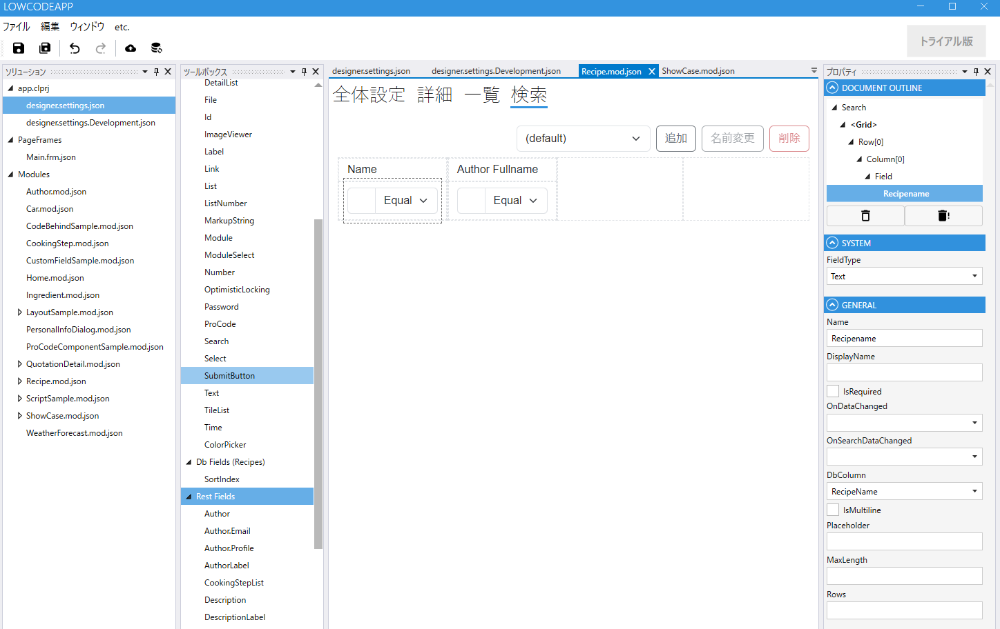
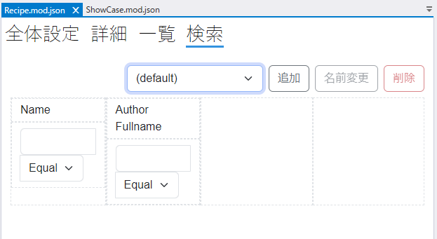
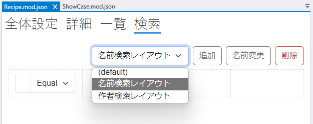
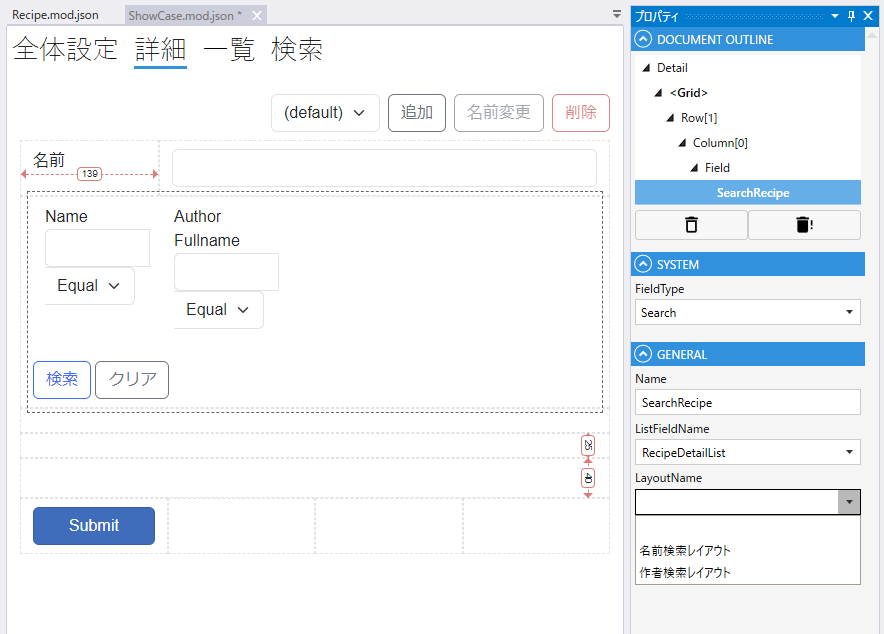

# モジュール検索設定

一覧画面で表示するEntityをフィルターするための検索条件を設定します.

## ツールボックス
モジュールで使用するFieldを選択します．

| 項目           | 説明                                               |
|--------------|--------------------------------------------------|
| SystemFields | SystemFieldの一覧が表示されます                            |
| CommonFields | CommonFieldの一覧が表示されます                            |
| DB Fields    | 全体設定でDataSourceを指定した場合に，テーブルのカラムからField候補が表示されます |
| Rest Fields  | DB Fieldsで詳細設定で（まだ）使用していないFieldが表示されます．          |
| Link Fields  | Linkフィールドを作成した場合に，Link先のフィールドが表示されます.            |
| Layout       | 詳細画面でGridレイアウト，Canvasレイアウトを設定時に使用します．            |

## 検索設定
検索に使用するFieldを選択して，グリッドに設定します.

追加ボタンをクリックして複数のレイアウトを作成できます.

[レイアウトの詳細](layout.md)はこちらを参照してください。

## プロパティ
選択しているFieldのプロパティが表示されます

## レイアウト

モジュールの検索設定画面で検索のレイアウトを設定します．

## デフォルトレイアウト

モジュールの検索画面に使うレイアウト設定はdefaultという名前で作成されます．（変更できません）

モジュールの検索ページにはdefaultのレイアウトが適用されます．

## 複数レイアウト

追加ボタンをクリックしてデフォルトとは異なるレイアウトを作成することができます．

`SearchField` にdefaultを含む作成済みのすべてのレイアウトから, 適用するレイアウトを指定できます.

