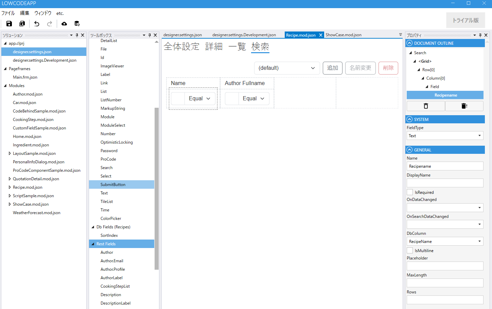

# モジュール検索設定

**検索タブ**では、一覧画面の上に表示される検索条件のレイアウトを設定します。

---

## 設定の流れ

1. 検索に使う Field を選び、Grid に配置
2. 複数条件を組む場合は Grid を入れ子にして `And` / `Or` を指定

レイアウトの使い方は [レイアウト](layout.md) を参照してください。

---

## 検索条件の結合（And / Or / ユーザー指定）

Grid 単位で検索条件の結合方法を指定できます。

- **And 検索** — すべての条件を満たす（既定）
- **Or 検索** — いずれかの条件を満たす
- **ユーザー指定** — 画面上でユーザーが And / Or を選ぶ

Grid を入れ子にすることで、複雑な条件を組み立てられます:

**例**: `NAMEの条件 AND ProductNameの条件 AND (PurchaseDateの条件 OR ShippingDateの条件)`

外側の Grid を And、内側の Grid を Or にします。

---

## default レイアウトと追加レイアウト

| レイアウト | 用途 |
|---|---|
| **default** | 一覧ページの標準検索 |
| **追加レイアウト** | SearchField で使い分け可能（簡易検索・詳細検索など） |

---

## 関連項目

- [Module 概要](module.md) / [全体設定](module_general.md)
- [SearchField](../fields/Search.md)
- [レイアウト](layout.md)
- [Tips: 検索条件に初期値を設定](../Examples/Tips_SearchCriteriaInitialValueSetting.md)
