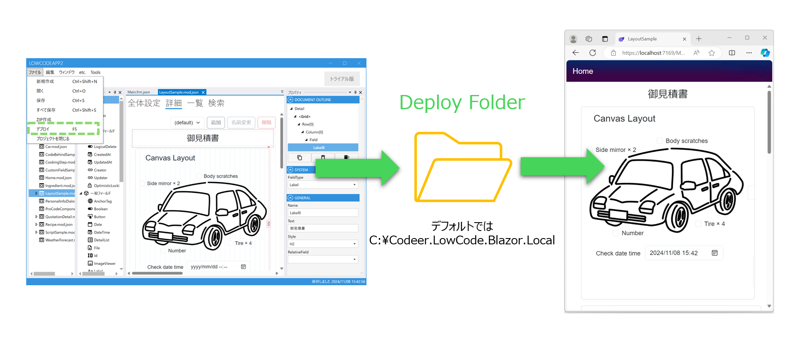

# デプロイフォルダ
## 概要
Designerでプロジェクトをデプロイしますと、プロジェクトファイルがデプロイフォルダに出力されます。

Blazor Serverアプリはデプロイフォルダの中のファイル内容をもとにUIに描画します。




## デプロイフォルダの場所
デプロイフォルダのデフォルト場所は```C:\Codeer.LowCode.Blazor.Local```です。
以下の設定で場所変更することが可能です。
### Blazor Serverの場合
Visual Studioで```[プロジェクト名].Server``` → ```appsettings.Development.json```でフォルダ場所を指定できます。

### Designerの場合
Designerのソリューションパネルで```designer.settings.Development.json```でフォルダ場所を指定できます。

### WinForm/WPFアプリの場合
[Codeer.LowCode.Blazor.Templates](https://marketplace.visualstudio.com/items?itemName=Codeer.LowCodeBlazor)はBlazorプロジェクト以外にWinForms/WPFプロジェクトも作成できます。

プロジェクトの構造は異なりますが、それぞれのプロジェクトで```appsettings.Development.json```を編集することでデプロイフォルダの場所を変更できます。

## 関連ページ
- [Visual Studioプロジェクト](vs_projects.md)