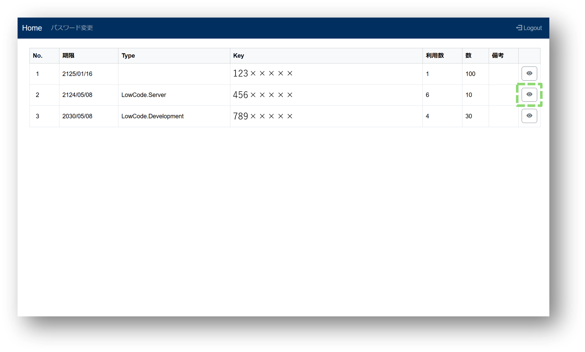
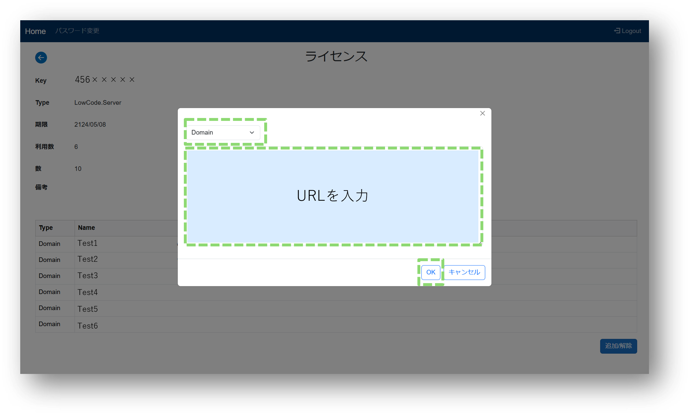

# ドメインライセンスを登録する方法
## 登録方法

### 1.ライセンス管理にログインする
### 2.詳細画面を開く

### 3.追加/解除をクリックする
### 4.「Domain」を選択し、登録したいURLを入力する
### 5.OKをクリックする

### 6.登録したドメインを選択し、署名取得をクリックする
### 7.署名をコピーし、該当の環境の環境変数のDomainLicenseに署名の値を設定する

