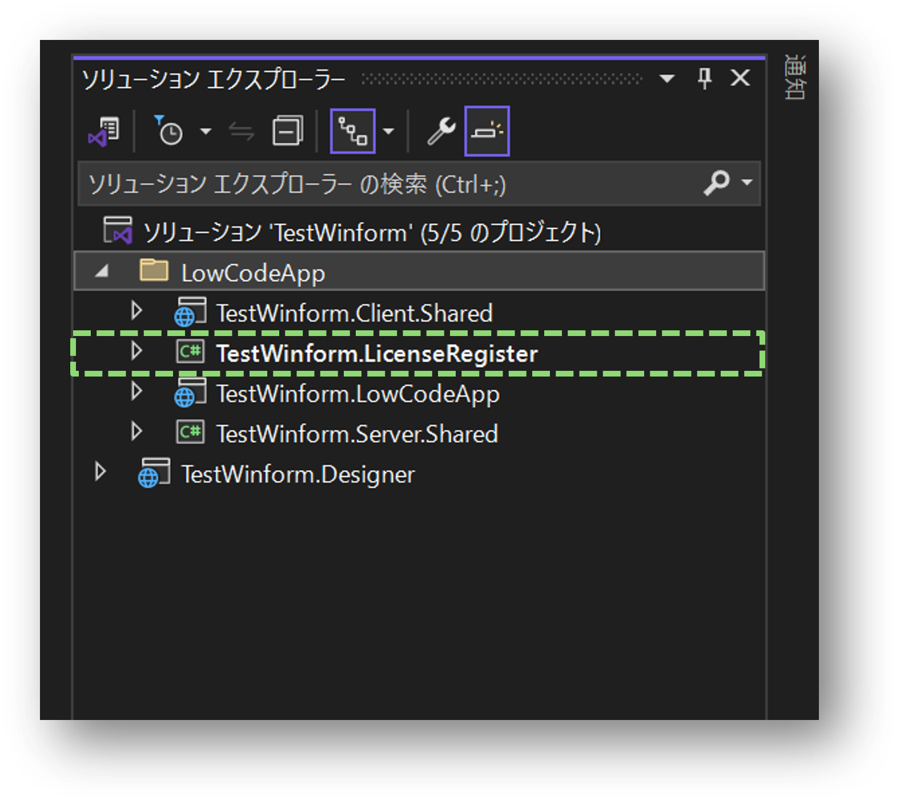
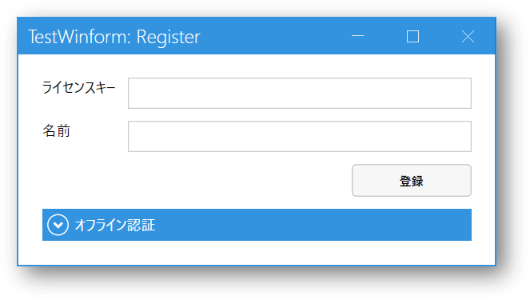

# LicenseRegisterについて
## アプリケーションの起動

### 1.WinForm / WPF でクライアントサーバーアプリを作成する
### 2.「プロジェクト名.LicenseRegister」をビルドする

### 3.LicenseRegisterアプリケーションを起動する

### 4.ライセンスの登録または解除を行う

登録方法、解除方法はDesignerを使用する方法と同様です。

#### オンライン
- [登録](license_online_registration.md)
- [解除](license_online_cancellation.md)

#### オフライン（WEB経由）
- [登録](license_web_registration.md)
- [解除](license_web_cancellation.md)