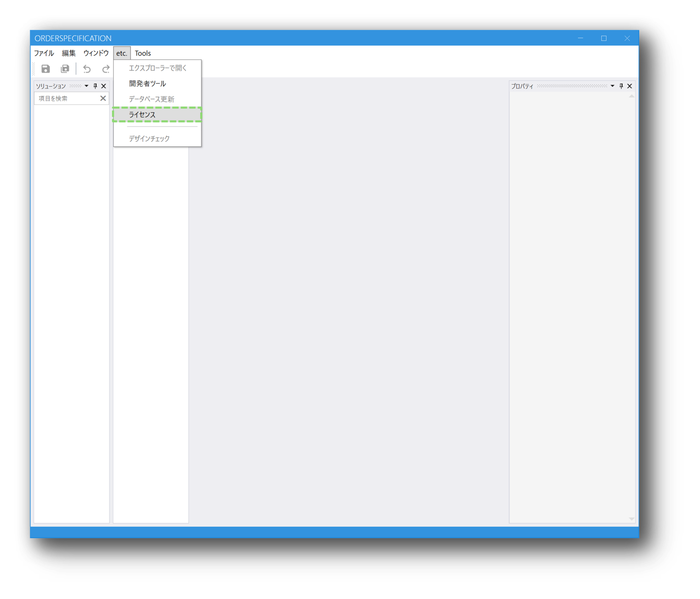
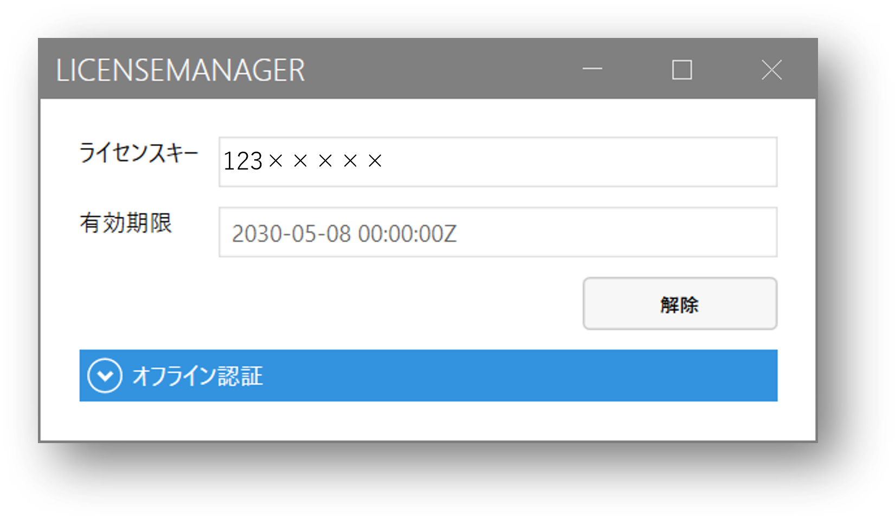
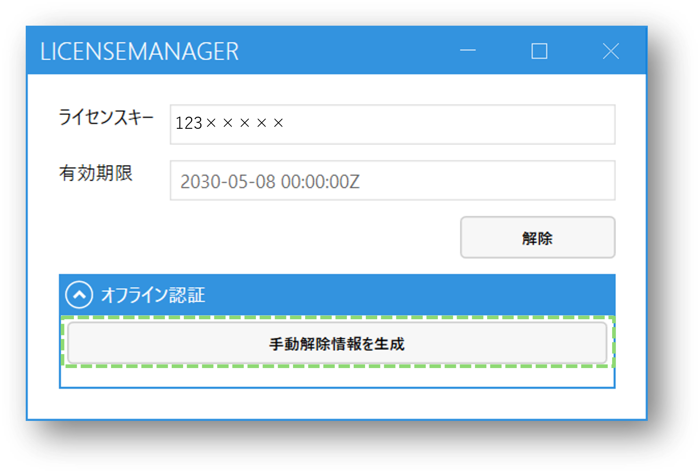
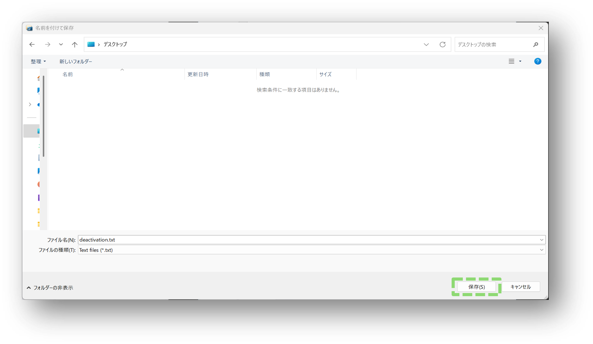
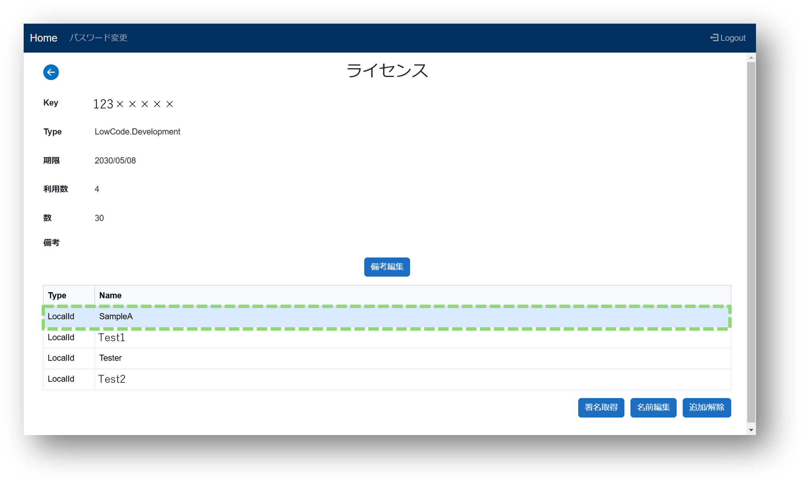
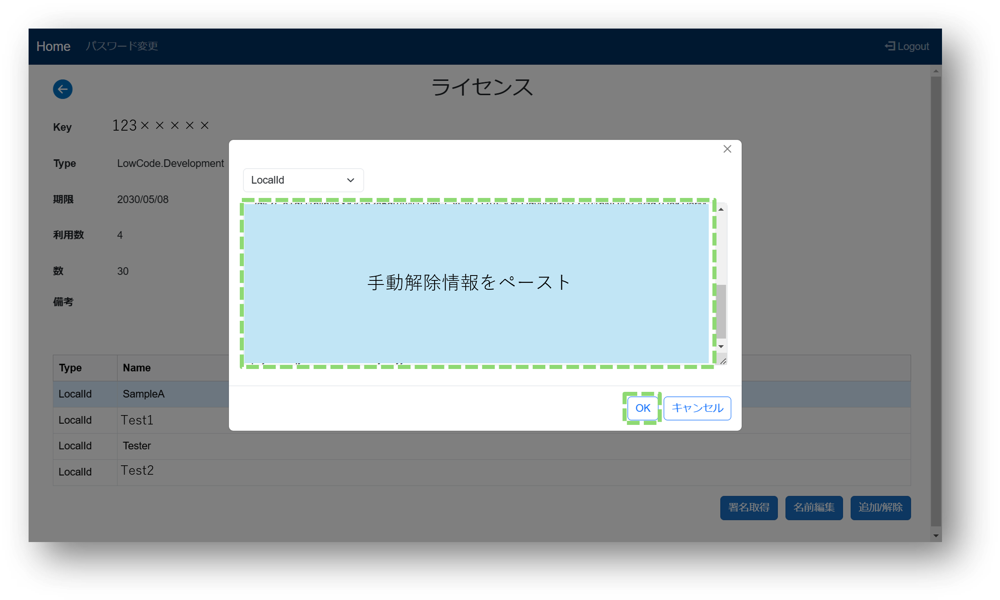
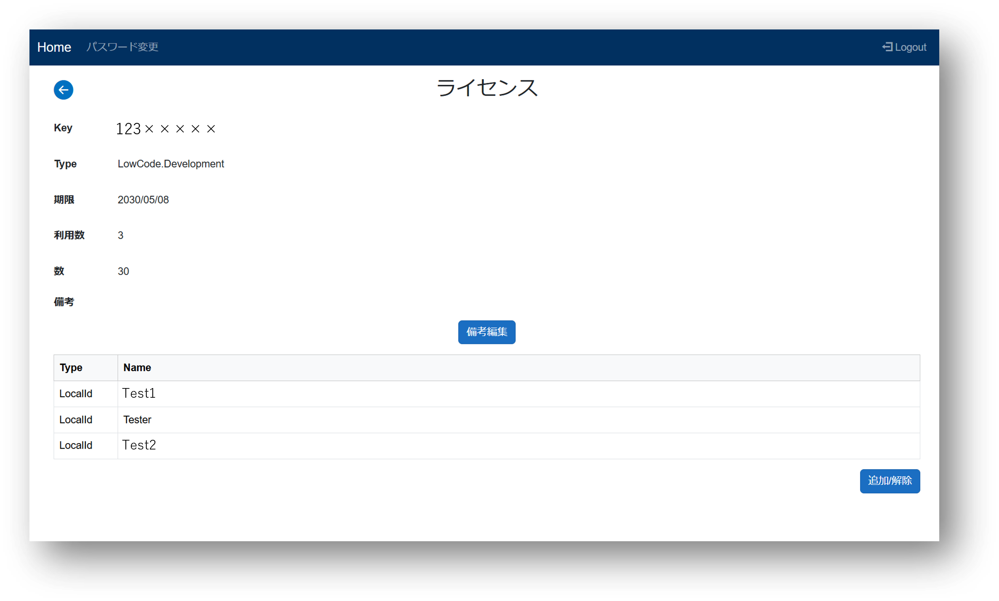
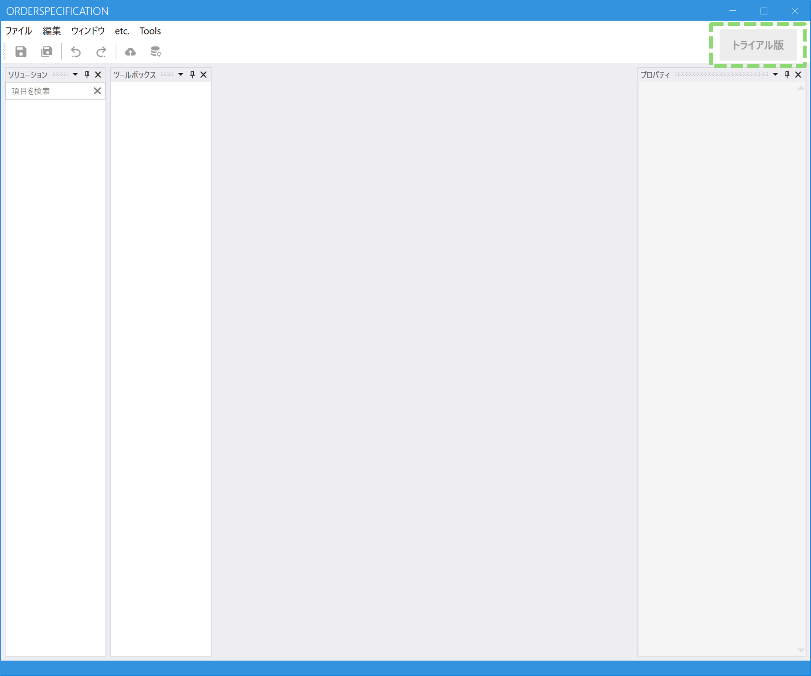

# オフライン（WEB経由）で解除する方法
## 解除方法

### 1.ライセンス管理にログインする

### 2.Designerを開く
### 3.etc.のライセンスをクリックし、ライセンスマネージャーを開く

「変更を加えることを許可しますか」と聞かれたら「はい」を選択します。

### 4.オフライン認証を開く
### 5.手動解除情報生成を行う

解除キーがクリップボードに保存されます。  
解除キーが記載されたファイルが出力されますので、任意の場所に保存して下さい。

### 6.ライセンス管理の詳細画面を開く
### 7.該当のユーザーをクリックし、追加/解除をクリックする

### 8.「LocalId」を選択し、クリップボードに登録された手動解除情報をペーストする

※クリップボードの情報が失われた場合は、テキストファイルの内容をペーストしてください。

### 9.OKをクリックする

ライセンス詳細画面から該当のユーザーが削除されていること、
該当ユーザーのDesignerに「トライアル版」と表記されていることが確認できれば完了です。

