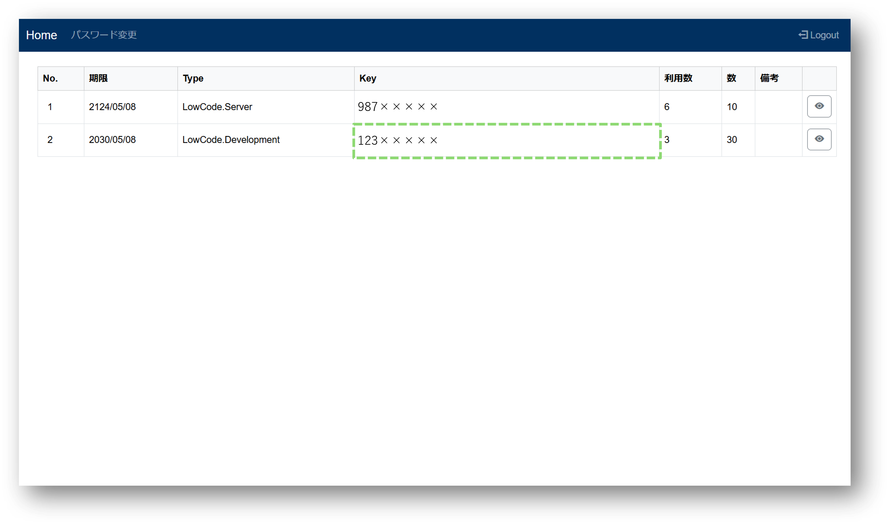
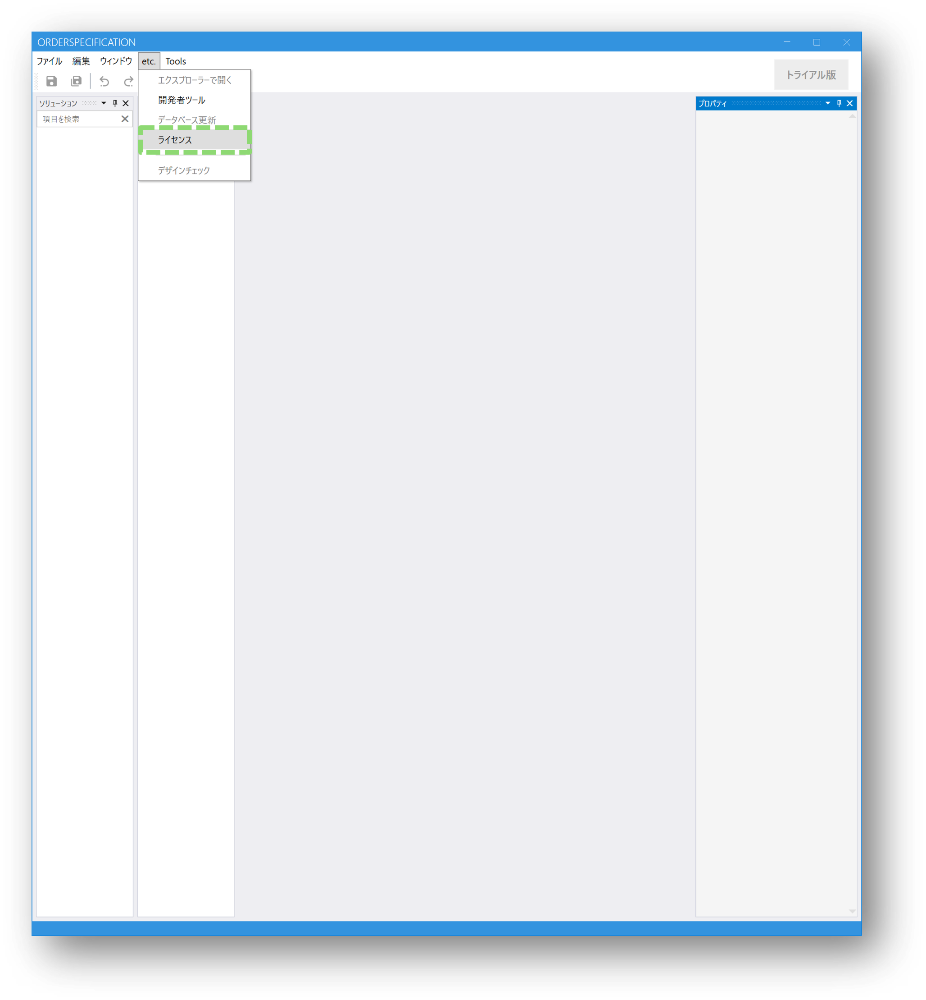
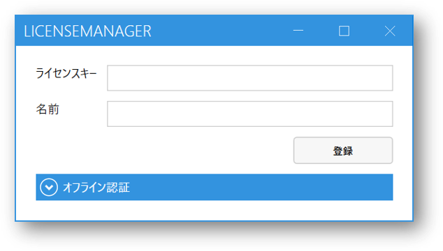
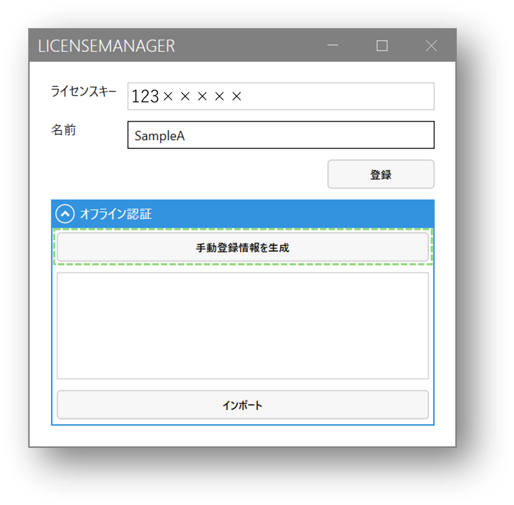
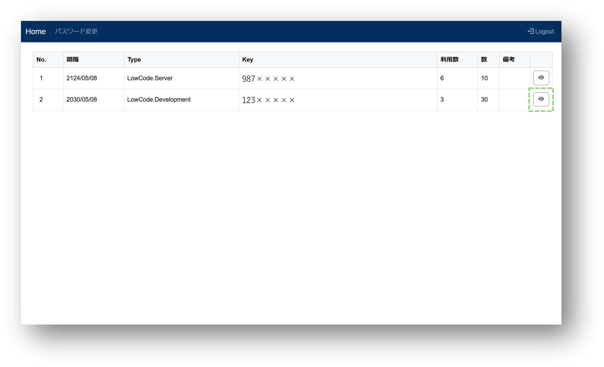
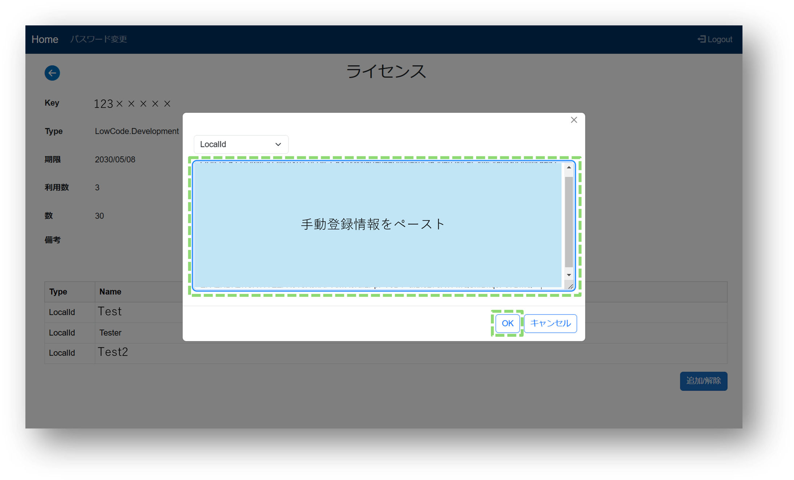
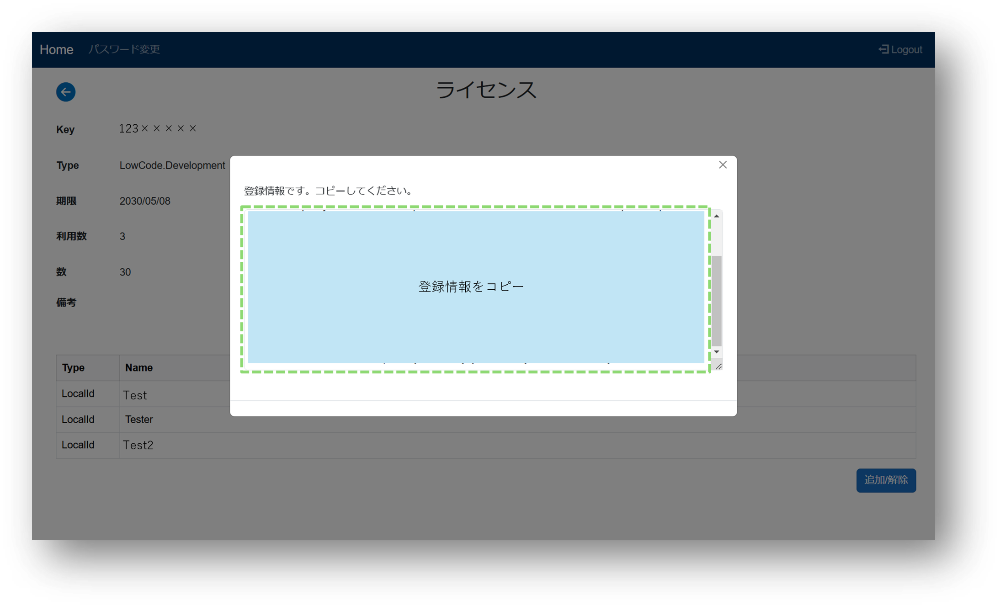
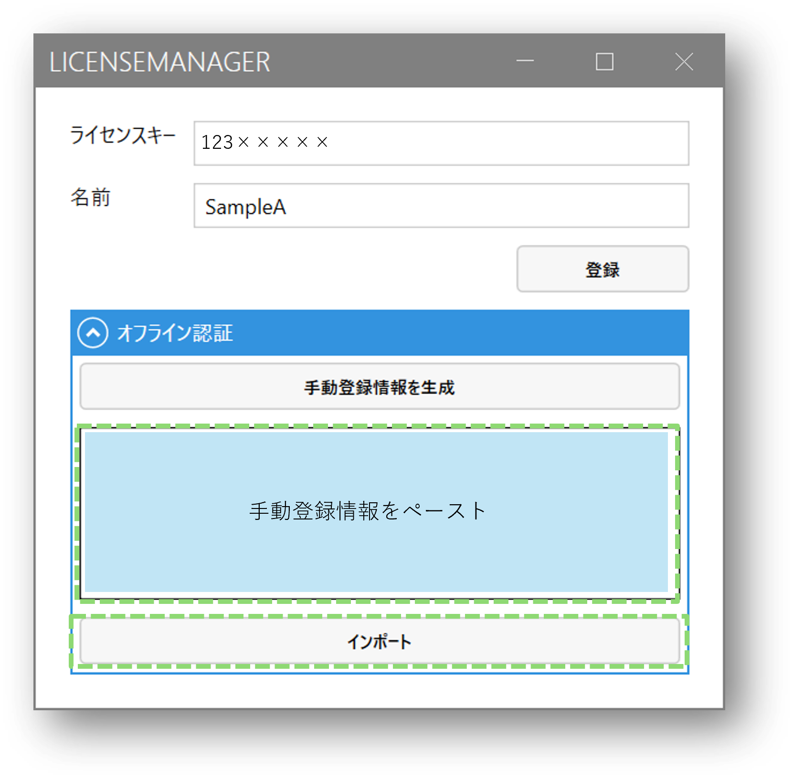

# オフライン（WEB経由）で登録する方法
## 登録方法

### 1.ライセンス管理にログインする
### 2.ライセンスキーをコピーする

### 3.Designerを開く
### 4.etc.のライセンスをクリックし、ライセンスマネージャーを開く

「変更を加えることを許可しますか」と聞かれたら「はい」を選択します。

### 5.コピーしたライセンスキーと名前を入力する
### 6.オフライン認証を開く
### 7.手動登録情報生成を行う

登録キーがクリップボードに保存されます。

### 8.ライセンス管理の詳細画面を開く

### 9.追加/解除をクリックする
### 10.「LocalId」を選択し、クリップボードに登録された手動登録情報をペーストする
### 11.OKをクリックする

### 12.登録情報をコピーする

### 13.Designerのライセンスマネージャーにコピーした登録情報をペーストする
### 14.インポートをクリックする

正常にライセンス情報が登録されれば完了です。
