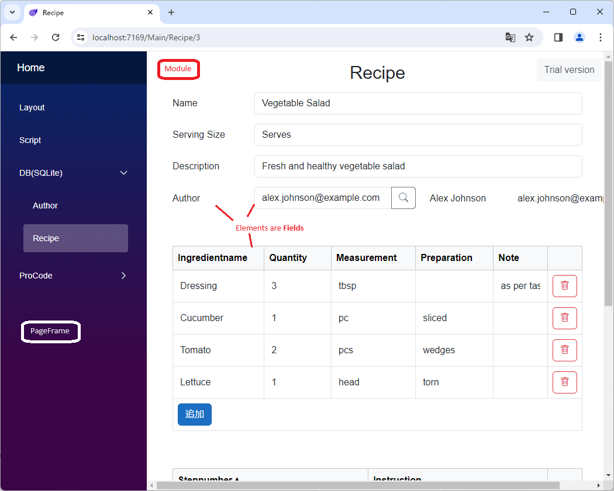

# 概略

ようこそ、**Codeer.LowCode.Blazor**はBlazorアプリに実行エンジン型のロー（ノー）コード機能を組み込むためのライブラリです。そのため、以下をシームレスに組み合わせて非常に効率の高い開発手法を利用することができます。

- **ノーコード**（Designerでの設定）
- **ローコード**（スクリプト）
- **プロコード**（.NETアプリとしての実装）

## 画面の構成

Codeer.LowCode.Blazorは、BlazorアプリにNugetで実行エンジン型のローコード機能を組み込むためのライブラリです。ローコード実行エンジンは強力なので、それだけでアプリの大部分を作成することも可能です。基本的には[PageFrame](../designer/page_frame.md)と[Module](../module/module.md)で画面を作成し、Moduleには[Field](../fields/field.md)を配置します。

### PageFrame

[PageFrame](../designer/page_frame.md)はアプリの外枠の部分です。また、そのPageFrame内で表示可能なModuleを設定します。表示可能なModuleはHome、ヘッダ、サイドバー(Left, Right)に指定されたModuleその他表示可能で指定されたModuleです。

### Module

[Module](../module/module.md)はC#のclassに近い概念です。
- [Field](../fields/field.md)を配置することによりデータとして振る舞うことができます。
- DBとマッピングすることによりORマッパーのEntityとして振る舞うこともできます。
- またUIのレイアウトも持ち画面表示（一覧画面、詳細画面、ダイアログ、他の画面の一部）をすることもできます。
- スクリプトでメソッドを定義することもできます。

### Field

[Field](../fields/field.md)はModuleを構成する部品です。わかりやすいものはTextFieldなどのUIを持つ部品です。これもWinFormsなどでFormクラスがTextContolをプロパティとして持つことをイメージしてもらうとわかりやすいと思います。UIに表示せずにデータの入出力だけに使うことも可能です。
- 大部分のFieldはデータを持ちます。
- ModuleをDBとマッピングしたときにカラムを割り当てて入出力することができます。
- 大部分のFieldはUIを持ちレイアウトに配置することができます。
- Webのフロントで表示する場合はレイアウトに配置されてるかもしくはDataOnlyFieldsに配置しているFieldのみサーバーからデータを取得します。
- メソッドプロパティを持ちスクリプトから操作することもできます。

## ProCodeとの連携

[ProCode](procode.md)との連携もCodeer.LowCode.Blazorでは重要な機能です。やはり込み入ったところはプロコードの実装が最適なケースも多々あります。またプロコードを使うことにより既存のC#のエコシステムの機能と連携することができます。
- プロコードで実装した画面の表示
- CodeBehind
- Custom Field
- スクリプトからプロコード機能呼び出し

## ユーザーコードを含む全体像
[ユーザーコード](../user_code/user_code.md)を含むした全体像です。[テンプレート](https://marketplace.visualstudio.com/items?itemName=Codeer.LowCodeBlazor)を使ってプロジェクトを作成するとユーザーコードの部分も出力されます。
Codeer.LowCode.Blazor以外のユーザーコードも重要な役割を果たしています。この部分をカスタマイズすることでプロジェクト毎の要件を満たすことができます。

Webアプリ 

Windowsアプリ（クライアントサーバー） 

