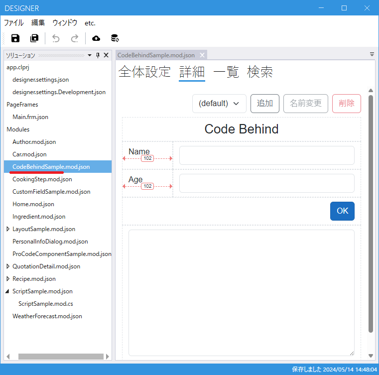
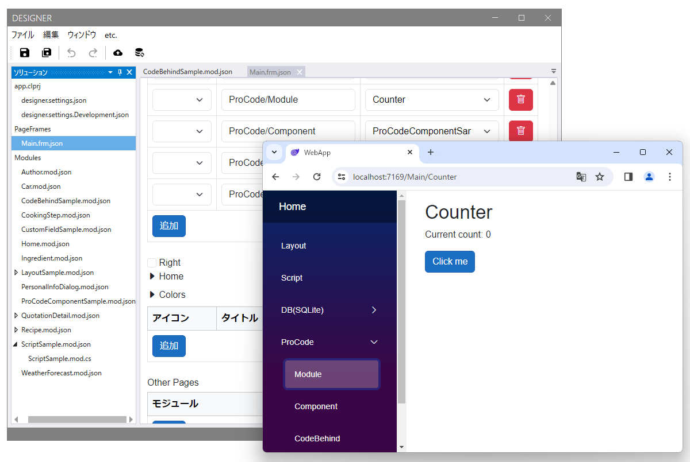
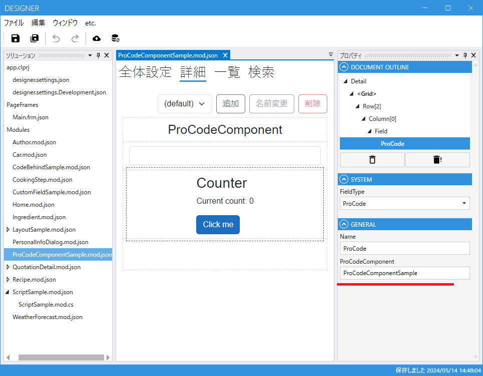
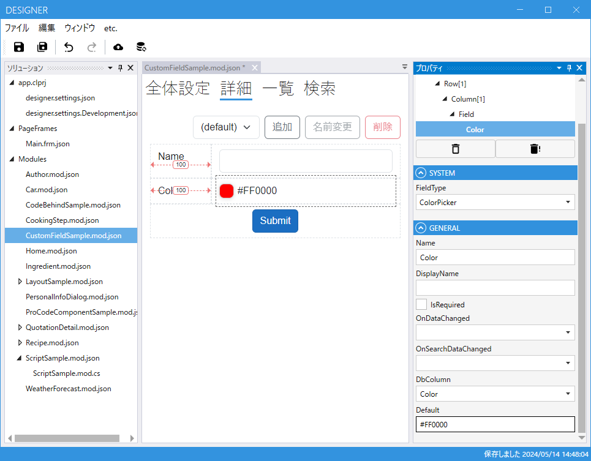

# プロコード
Codeer.LowCode.BlazorはBlazorに組み込むライブラリですので、もちろん通常のBlazorや.NETの実装も可能です。

## コードビハインド


Designerで作成したModuleと同名のクラスを作成してProCodeBehindBaseを継承させます。
Webの画面でModuleが表示されたときにインスタンスが生成され関連付けられます。
Moduleで配置したフィールドと同型/同名のフィールドをpublicプロパティで配置することでそこにも実行中のインスタンスが設定されます。

```csharp
public class CodeBehindSample : ProCodeBehindBase
{
    public TextField? Name { get; set; }
    public NumberField? Age { get; set; }
    public ButtonField? OK { get; set; }
    public TextField? Result { get; set; }

    public override async Task OnBeforeDetailInitializationAsync(string layoutName)
    {
        await Task.CompletedTask;
        if (OK != null)OK.OnClickAsync = OK_Click;
    }

    private async Task OK_Click()
    {
        var value = @$"This is a sample code-behind.
This string is created using C# code.
Implemented in {GetType().FullName}.
Your name is {Name?.Value}.
And I'm {Age?.Value} years old.";

        if (Result != null) await Result.SetValueAsync(value);
    }
}

```

## 画面全体をrazorファイルで実装する
ProCodeModuleBaseを継承したコンポーネントを実装するとPageFrameなどから利用できるようになります。画面の部分にそのまま表示できます。


```csharp
@using Microsoft.AspNetCore.Components.Web
@using Codeer.LowCode.Blazor.ProCode
@inherits ProCodeModuleBase

<h1>Counter</h1>

<p role="status">Current count: @_currentCount</p>

<button class="btn btn-primary" @onclick="IncrementCount">Click me</button>

@code {
    private int _currentCount = 0;

    private void IncrementCount()
    {
        _currentCount++;
    }
}
```
## 画面の一部をrazorファイルで実装する
ProCodeComponentBaseを実装したクラスを作成してそれをProCodeFieldに設定すると表示することができます。
この場合、データを格納するフィールドを別に作りそこにデータを格納することでデータの入出力をLowCode機能の方に任せることができます。



```csharp
@using Microsoft.AspNetCore.Components.Web
@using Codeer.LowCode.Blazor.ProCode
@inherits ProCodeComponentBase

<h1>Counter</h1>

<p role="status">Current count: @_currentCount</p>

<button class="btn btn-primary" @onclick="IncrementCount">Click me</button>

@code {
    private int _currentCount = 0;

    private void IncrementCount()
    {
        _currentCount++;
    }
}
```

## カスタムフィールドを作成する
カスタムフィールドを作るとDesigner画面でポトペタでそれを配置できるようになります。3rdパーティ製のコンポーネントもLowCodeで使えるようになるのです。
Field,FieldDesignの実装が必要になります。必要に応じてFieldComponent,FieldData,FieldSearchComponent,FieldSearchControlを実装します。


### FieldDesignBaseを継承したクラス
FieldDesignBaseを継承したクラスを作ります。
これはDesignerでの設定を格納するクラスです。
これは実装が必須です。
DesignerAttributeをつけたPropertyがDesignerのProperty画面に表示され編集することができます。
また以下のメソッドを実装することで関連するインスタンスを実行時に生成できます。
- **GetWebComponentTypeFullName**
  - Web上でのコンポーネントのTypeFullName。FieldComponentBase<T>を継承している必要があります。通常は実装しますがデータだけのFieldとして作成したい場合は必要ありません。string.Emptyを返してください。

- **GetSearchWebComponentTypeFullName**
  - Web上での検索コンポーネントのTypeFullName。検索が必要なければ実装は不要です。string.Emptyを返してください。

- **GetSearchControlTypeFullName**
  - WPFのDesigner上でのListFieldなどの検索条件で表示される検索コントロールのTypeFullName。ListFieldなどでの条件に必要ない場合は実装は不要です。string.Emptyを返してください。

- **CreateField**
  - FieldBaseを継承したクラスを生成。実装は必須です。

- **CreateData**
  - FieldDataBaseを継承したクラスを生成。通常は実装が必要ですがDBにデータを入出力する必要がなければ不要です。

```csharp
using Codeer.LowCode.Blazor.OperatingModel;
using Codeer.LowCode.Blazor.Repository.Data;
using Codeer.LowCode.Blazor.Repository.Design;
using LowCodeApp.Client.Shared.Samples.ColorPicker;

namespace Design.Samples.ColorPicker
{
    public class ColorPickerFieldDesign : ValueFieldDesignBase
    {
        public ColorPickerFieldDesign() : base(typeof(ColorPickerFieldDesign).FullName!) { }

        [Designer(Index = 0, CandidateType = CandidateType.DbColumn), DbColumn(nameof(ColorPickerFieldData.Value))]
        public string DbColumn { get; set; } = string.Empty;

        [Designer(Index = 1)]
        public string Default { get; set; } = "#000000";

        public override string GetWebComponentTypeFullName() => typeof(ColorPickerFieldComponent).FullName!;
        public override string GetSearchWebComponentTypeFullName() => String.Empty;
        public override string GetSearchControlTypeFullName() => String.Empty;
        public override FieldBase CreateField() => new ColorPickerField(this);
        public override FieldDataBase? CreateData() => new ColorPickerFieldData();
    }
}

```

### FieldBaseを継承したクラス
FieldBaseを継承したクラスは実行時に生成されるクラスです。これはスクリプトからも操作することができます。publicなメソッド/プロパティは操作可能ですがScriptHideAttributeをつけている場合はスクリプトからのアクセスを禁止することができます。これ自体は画面を持ちません。
```csharp
using Codeer.LowCode.Blazor.OperatingModel;
using Codeer.LowCode.Blazor.Script;
using Design.Samples.ColorPicker;

namespace LowCodeApp.Client.Shared.Samples.ColorPicker
{
    public class ColorPickerField : ValueField<ColorPickerFieldDesign, ColorPickerFieldData, string>
    {
        ColorPickerFieldDesign _design;
        public ColorPickerField(ColorPickerFieldDesign design) : base(design) => _design = design;

        [ScriptHide]
        public override bool ValidateInput() => true;
    }
}

```

### FieldDataBaseを継承したクラス
Databaseへの入出力用です。どのプロパティをDBに書き込むかはFieldDesignBaseを継承したクラスでDbColumnAttributeで指定します。

```csharp
using Codeer.LowCode.Blazor.Repository.Data;

namespace LowCodeApp.Client.Shared.Samples.ColorPicker
{
    public class ColorPickerFieldData : ValueFieldDataBase<string>
    {
        public ColorPickerFieldData() : base(typeof(ColorPickerFieldData).FullName!) { }
    }
}

```

### Webのコンポーネントクラス
FieldComponentBase<T>を継承する必要があります。FieldComponentBase<T>がFieldプロパティを持ち、そこにFieldBaseを継承したクラスのインスタンスが入っています。

```csharp
@using Codeer.LowCode.Blazor.Components
@using Microsoft.AspNetCore.Components.Web
@using Codeer.LowCode.Blazor.Components.Fields
@using System.Text
@inherits FieldComponentBase<ColorPickerField>


@if (IsViewMode == true) {
  <div class="d-flex py-2">
    <div class="color-tip" style="background:@(Value)"></div>
    <span class="d-block" style="@GetStyleString()">@Value</span>
  </div>
} else {
  <label class="d-flex align-items-center">
    <input class="color-picker"
           type="color"
           disabled="@IsDisabled"
           id="@WebElementId"
           value="@Value"
           @onchange="RaiseOnValueChanged"/>
    <span style="@GetStyleString()">@Value</span>
  </label>
}

@code {
  public bool? IsDisabled => Field?.IsEnabled == false;

  public bool? IsViewMode => Field?.IsViewOnly;

  public string? Value => string.IsNullOrEmpty(Field.Value) ? Field.Design?.Default : Field.Value;

  protected override void OnParametersSet() {
    base.OnParametersSet();
    Field.SetStateChangedReceiver(StateHasChanged);
  }

  private async Task RaiseOnValueChanged(ChangeEventArgs e) {
    if (Field == null) return;
    await Field.SetValueAsync(e.Value?.ToString());
  }

  string? GetStyleString()
  {
    var style = new StringBuilder();
    if (!string.IsNullOrEmpty(Field.BackgroundColor))
    {
      style.Append($"--background: {Field.BackgroundColor};");
    }

    if (!string.IsNullOrEmpty(Field.Color))
    {
      style.Append($"--foreground: {Field.Color};");
    }

    return style.Length == 0 ? null : style.ToString();
  }
}

```
## .NETの実装をスクリプトから呼び出す
[スクリプト](script.md#target-line)のProCode連携を参照してください。

## WebAPIを.NETで実装してスクリプトから呼び出す
Codeer.LowCode.Blazorの機能ではないのですが、テンプレートコードにWebAPIをスクリプトから呼び出すためのサービスを登録しています。例えばこのようにWebAPIを呼び出してサーバーで処理を実行して結果を画面に表示することができます。
```csharp
var data = WebApiService.Get("/testapi").JsonObject;
WeatherForecastList.DeleteAllRows();
foreach(var e in data)
{
    var row = new WeatherForecast();
    row.Date.Value = e.Date;
    row.TemperatureC.Value = e.TemperatureC;
    row.TemperatureF.Value = e.TemperatureF;
    row.Summary.Value = e.Summary;
    WeatherForecastList.AddRow(row);
}    
```
