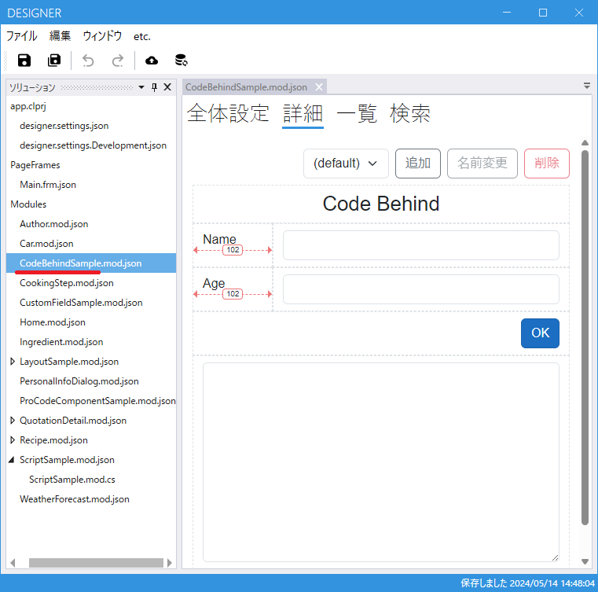
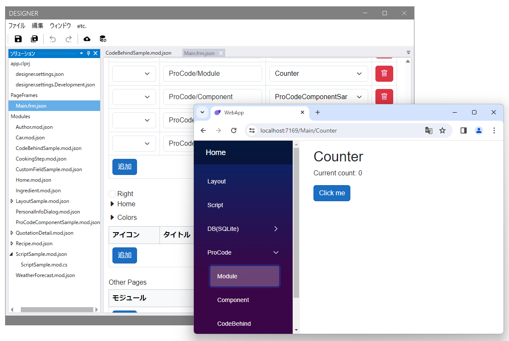
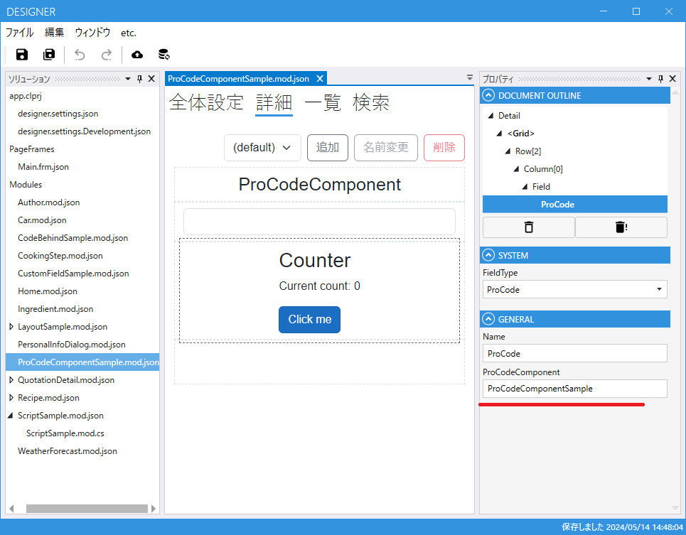
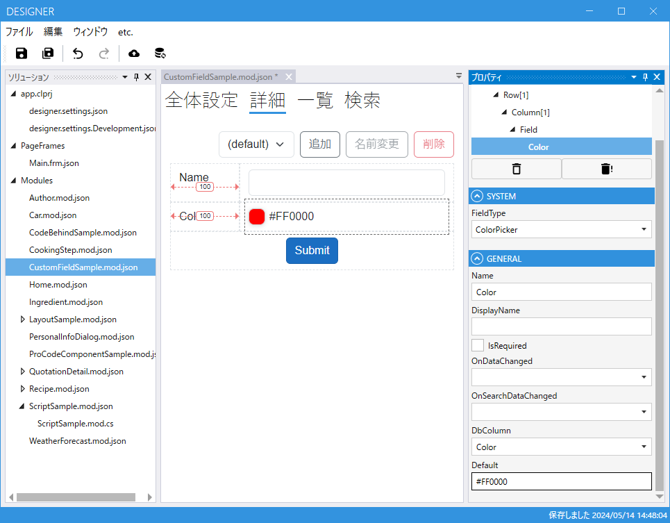

# プロコード

Codeer.LowCode.Blazor は Blazor のライブラリなので、**.NET / Blazor の通常のコードを自由に追加**できます。
標準機能で足りない部分はプロコードで補完するのが基本の考え方です。

## プロコードの 5 つの拡張パターン

| パターン | 用途 | 使う基底クラス |
|---|---|---|
| **コードビハインド** | 既存 Module の挙動に C# コードを足す | `ProCodeBehindBase` |
| **フル Razor ページ** | 画面全体を独自実装して PageFrame から呼び出す | `ProCodeModuleBase` |
| **部分 Razor コンポーネント** | 画面の一部を独自実装（[ProCodeField](../fields/ProCode.md)） | `ProCodeComponentBase` |
| **カスタム Field** | 独自 Field を作ってツールボックスに登録 | `FieldBase` / `FieldDesignBase` 等 |
| **.NET コードをスクリプトから呼び出し** | ライブラリ関数・ビジネスロジックを提供 | `AddType` / `AddService` |

---

## 1. コードビハインド



Designer で作成した Module と**同名のクラス**を作り `ProCodeBehindBase` を継承します。
Web 画面で Module が表示されたときにインスタンスが生成・関連付けられます。

Module に配置した Field と**同型・同名のプロパティ**を public で置くと、実行中の Field インスタンスが自動で注入されます。

```csharp
public class CodeBehindSample : ProCodeBehindBase
{
    public TextField? Name { get; set; }
    public NumberField? Age { get; set; }
    public ButtonField? OK { get; set; }
    public TextField? Result { get; set; }

    public override async Task OnBeforeDetailInitializationAsync(string layoutName)
    {
        if (OK != null) OK.OnClickAsync = OK_Click;
        await Task.CompletedTask;
    }

    private async Task OK_Click()
    {
        var value = $"Hello {Name?.Value}, {Age?.Value} years old.";
        if (Result != null) await Result.SetValueAsync(value);
    }
}
```

---

## 2. フル Razor ページ（ProCodeModuleBase）

`ProCodeModuleBase` を継承したコンポーネントを実装すると、PageFrame に登録して普通のページとして使えます。



```razor
@using Codeer.LowCode.Blazor.ProCode
@inherits ProCodeModuleBase

<h1>Counter</h1>

<p role="status">Current count: @_currentCount</p>

<button class="btn btn-primary" @onclick="IncrementCount">Click me</button>

@code {
    private int _currentCount = 0;

    private void IncrementCount()
    {
        _currentCount++;
    }
}
```

---

## 3. 部分 Razor コンポーネント（ProCodeField）

`ProCodeComponentBase` を継承したコンポーネントを作り、[ProCodeField](../fields/ProCode.md) に指定すると画面の一部として埋め込めます。



```razor
@using Codeer.LowCode.Blazor.ProCode
@inherits ProCodeComponentBase

<h1>Counter</h1>
<p role="status">Current count: @_currentCount</p>
<button class="btn btn-primary" @onclick="IncrementCount">Click me</button>

@code {
    private int _currentCount = 0;
    private void IncrementCount() => _currentCount++;
}
```

データを持たせたい場合は、別途 Field（TextField や NumberField）を配置して、そこにデータを格納するのが簡便です。

---

## 4. カスタム Field

デザイナのツールボックスから配置できる独自 Field を作れます。サードパーティ製 Blazor コンポーネントをローコードで使いたい場合にも便利です。



実装が必要なクラス:

| クラス | 必須 | 役割 |
|---|---|---|
| `XxxFieldDesign` | ✓ | デザイナでの設定を保持 |
| `XxxField` | ✓ | 実行時インスタンス |
| `XxxFieldData` | データを DB と入出力するなら必要 | DB 入出力用 |
| `XxxFieldComponent` | UI を持つなら必要 | Web 上の Blazor コンポーネント |
| `XxxFieldSearchComponent` | 検索で使うなら必要 | 検索 UI |
| `XxxFieldSearchControl` | ListField の検索条件で使うなら必要 | WPF 検索コントロール |

### XxxFieldDesign の例

```csharp
public class ColorPickerFieldDesign : ValueFieldDesignBase
{
    public ColorPickerFieldDesign() : base(typeof(ColorPickerFieldDesign).FullName!) { }

    [Designer(Index = 0, CandidateType = CandidateType.DbColumn)]
    [DbColumn(nameof(ColorPickerFieldData.Value))]
    public string DbColumn { get; set; } = string.Empty;

    [Designer(Index = 1)]
    public string Default { get; set; } = "#000000";

    public override string GetWebComponentTypeFullName() => typeof(ColorPickerFieldComponent).FullName!;
    public override string GetSearchWebComponentTypeFullName() => string.Empty;
    public override string GetSearchControlTypeFullName() => string.Empty;
    public override FieldBase CreateField() => new ColorPickerField(this);
    public override FieldDataBase? CreateData() => new ColorPickerFieldData();
}
```

### 実装する 4 つのメソッド（FieldDesignBase）

| メソッド | 役割 | 省略可能な条件 |
|---|---|---|
| `GetWebComponentTypeFullName` | Web 上の表示コンポーネント名 | データのみなら `string.Empty` を返せばよい |
| `GetSearchWebComponentTypeFullName` | 検索用コンポーネント名 | 検索不要なら `string.Empty` |
| `GetSearchControlTypeFullName` | ListField 検索条件での WPF コントロール | 不要なら `string.Empty` |
| `CreateField` | 実行時インスタンス生成 | **必須** |
| `CreateData` | データ保持用インスタンス | DB に入出力しないなら不要 |

### XxxField の例

```csharp
public class ColorPickerField : ValueField<ColorPickerFieldDesign, ColorPickerFieldData, string>
{
    public ColorPickerField(ColorPickerFieldDesign design) : base(design) { }

    [ScriptHide]  // スクリプトから隠したい場合
    public override bool ValidateInput() => true;
}
```

### XxxFieldData の例

```csharp
public class ColorPickerFieldData : ValueFieldDataBase<string>
{
    public ColorPickerFieldData() : base(typeof(ColorPickerFieldData).FullName!) { }
}
```

### XxxFieldComponent の例（Razor）

```razor
@using Codeer.LowCode.Blazor.Components
@inherits FieldComponentBase<ColorPickerField>

@if (Field.IsViewOnly)
{
    <span>@Field.Value</span>
}
else
{
    <input type="color"
           disabled="@(Field.IsEnabled == false)"
           value="@Field.Value"
           @onchange="OnValueChanged" />
}

@code {
    private async Task OnValueChanged(ChangeEventArgs e)
    {
        await Field.SetValueAsync(e.Value?.ToString());
    }
}
```

---

## 5. .NET コードをスクリプトから呼び出す

スクリプト側でタイプ・サービスを使えるようにするには、ユーザーコードで登録します。

```csharp
scriptRuntimeTypeManager.AddType<MemoryStream>();
scriptRuntimeTypeManager.AddType(typeof(Math));
scriptRuntimeTypeManager.AddService(new WebApiService(http, logger));
```

詳しくは [スクリプトの拡張](../script/script_extend.md) を参照。

---

## 関連項目

- [スクリプト概要](../script/script.md)
- [スクリプトの拡張](../script/script_extend.md)
- [ProCode フィールド](../fields/ProCode.md)
- [チュートリアル: WebAPI 連携](../tutorials/tutorial_webapi.md)
- [ユーザーコード](../user_code/user_code.md)
