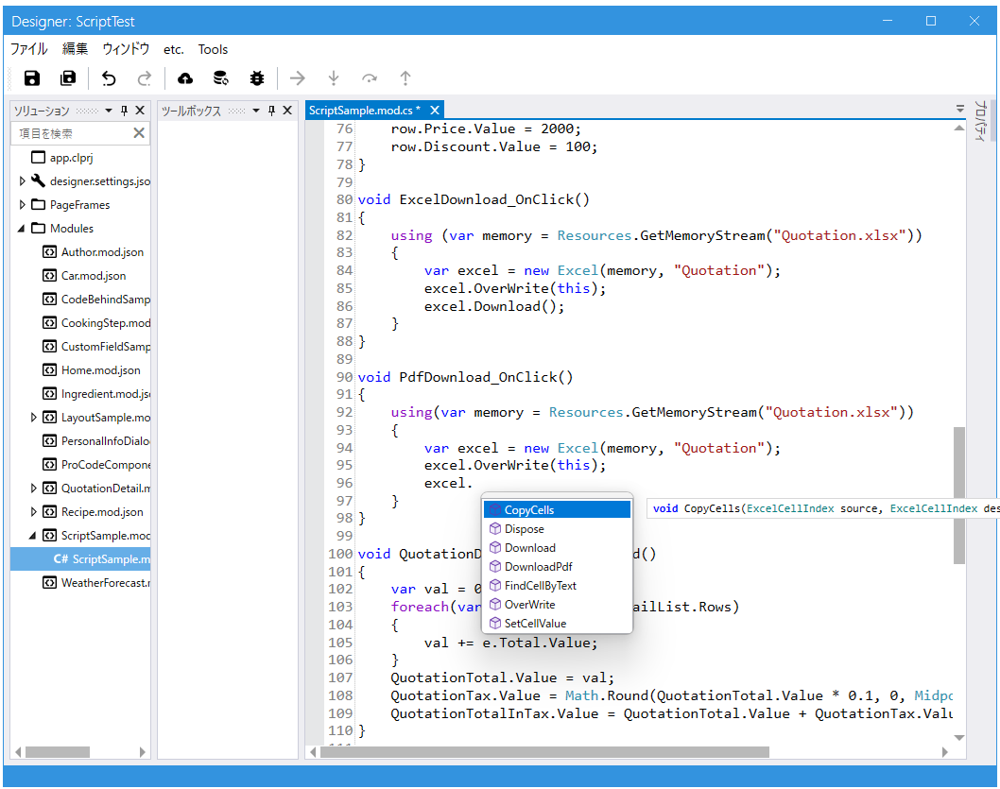

# スクリプト



C#の基本的な構文で記述できます。イベントをトリガとして実行され、モジュールのメソッドとして追加されます。全てpublicとなり外部から呼び出すことも可能です。Moduleやその中で使っているFieldを操作できます。プロコードから利用可能なクラスを設定できるのでスクリプトからプロコードで実装した機能を呼び出すことが可能です。

## 利用可能文法

- if, else, elseif
- 三項演算子
- switch
- for, foreach
- using
- break, continue
- return

## 利用可能な型

### プリミティブな型

- bool
- byte
- char
- ushort
- short
- uint
- int
- ulong
- long
- float
- decimal
- string

### その他使える.NETの型
- MemoryStream
- Math
- DateTime
- DateOnly
- TimeOnly
- TimeSpan
- DateTimeOffset
- Guid
- MidpointRounding

### Module, 各Field

- [module](../module/module.md)
- [field](../fields/field.md)

## メソッドの定義と呼び出し

メソッドは定義して呼び出すことができます。また定義したメソッドはpublicになっていて別のモジュールから呼び出すことも可能です。

```csharp
void Button_OnClick()
{
    // メソッドの定義と呼び出し
    var result = MyMethod(10, 100);
    
    // 別のModuleのメソッドを呼び出す
    var author = new Author();
    var info = author.GetInfo();
}
```

## ProCode連携
<a id="procode-line"></a>
.Netのクラスを追加することができます。IAppInfoServiceを実装するクラスでScriptRuntimeTypeManager GetScriptRuntimeTypeManager()で返すオブジェクトに追加できます。

### AddType

利用できるタイプを追加できます。追加されたタイプは利用可能なコンストラクタがあればnewで生成することができ、staticな操作があれば利用できるようになります。またenumも使えるようになります。コンストラクタ、メソッドは利用可能なタイプのもののみ使えます。例えば以下の例でMathクラスを登録していますがこれだけでは public static decimal Round(decimal d, MidpointRounding mode) は利用することができません。一緒にMidpointRoundingを登録しているのでRoundメソッドが利用可能になります。

※以下の例の型はライブラリ内でデフォルトで登録されています。

```csharp
scriptRuntimeTypeManager.AddType<MemoryStream>();
scriptRuntimeTypeManager.AddType(typeof(Math));
scriptRuntimeTypeManager.AddType<MidpointRounding>();
```

スクリプト例

```csharp
var result = Math.Round(1.23, MidpointRounding.AwayFromZero);
```

### AddService

サービスとしてインスタンスを登録できます。スクリプト中ではstaticメソッドのように利用できます。

※以下の例はテンプレートコード内で登録されています。

```csharp
scriptRuntimeTypeManager.AddService(new WebApiService(http, logger));
```

```csharp
var data = WebApiService.Get("/testapi").JsonObject;
WeatherForecastList.DeleteAllRows();
foreach(var e in data)
{
    var row = new WeatherForecast();
    row.Date.Value = e.Date;
    row.TemperatureC.Value = e.TemperatureC;
    row.TemperatureF.Value = e.TemperatureF;
    row.Summary.Value = e.Summary;
    WeatherForecastList.AddRow(row);
}    
```

### その他スクリプトから使えるAPI
