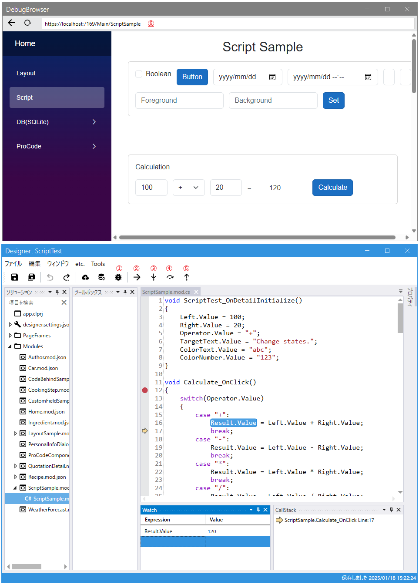

# スクリプトデバッガ



スクリプトをデバッグすることができます。Webアプリの方ではCanScriptDebugをtrueにする必要があります。

## 設定
IAppInfoServiceのCanScriptDebugでtrueを返すと利用可能になります。
Codeer.LowCode.Blazor.TemplatesのVer1.1.22.1以降で作成したコードでは
appsettings.Development.jsonの設定でCanScriptDebugで指定できます。
```cs
public class AppInfoService : IAppInfoService
{
    readonly NavigationManager _navigationManager;
    readonly HttpService _http;
    readonly ScriptRuntimeTypeManager _scriptRuntimeTypeManager = new();
    readonly ToasterEx _toaster;
    HubConnection? _hubConnection;
    DesignData? _design;
    DateTime _lastHotReload = DateTime.Now;
    SystemConfigForFront? _config;

    public ModuleData? CurrentUserData { get; private set; }

    public string CurrentUserId { get; set; } = string.Empty;

    public Guid Guid { get; set; } = Guid.NewGuid();

    public event EventHandler OnHotReload = delegate { };

    public bool IsDesignMode => false;

    public DesignData GetDesignData() => _design ?? new();

    //スクリプトデバッグの設定
    public bool CanScriptDebug => _config?.CanScriptDebug == true;
```
```json
{
  "ConnectionStrings": {
    "Main": "",
    "SampleSQLite": "Data Source=C:\\Codeer.LowCode.Blazor.Local\\Data\\sqlite_sample.db;Version=3;"
  },
  "FileStorages": [
    {
      "Name": "Local",
      "FileStorageType": "FileSystem",
      "Directory": "C:\\Codeer.LowCode.Blazor.Local\\Storages"
    }
  ],
  "DesignFileDirectory": "C:\\Codeer.LowCode.Blazor.Local\\Designs",
  "FontFileDirectory": "C:\\Codeer.LowCode.Blazor.Local\\Font",
  "UseHotReload": true,
  "CanScriptDebug": true, //スクリプトデバッグの設定
  "IsLicenseAutoUpdate": true,
  "IsLicenseAuthenticationByDomain": false,
  "AISettings": {
    "OpenAIEndPoint": "",
    "OpenAIKey": "",
    "ChatModel": "",
    "DocumentAnalysisEndPoint": "",
    "DocumentAnalysisKey": ""
  },
  "MailSettings": {
    "Host": "",
    "Port": "",
    "SenderMailAddress": "",
    "Password": "",
    "SSL": ""
  }
}
```
## 操作
①でを押すことによってデバッグ用のブラウザを起動できます。⑥にデバッグ対象のURLを入力してください。後の操作はVisualStudio等と同じようにできます。

| 操作 | ショートカットキー | ボタン |
|----------|----------|----------|
| デバッガ起動 | F5 | ① |
| 実行 | F5 | ② |
| ステップイン | F11 | ③ |
| ステップオーバー | F10 | ④ |
| ステップアウト | Shift+F11 | ⑤ |
