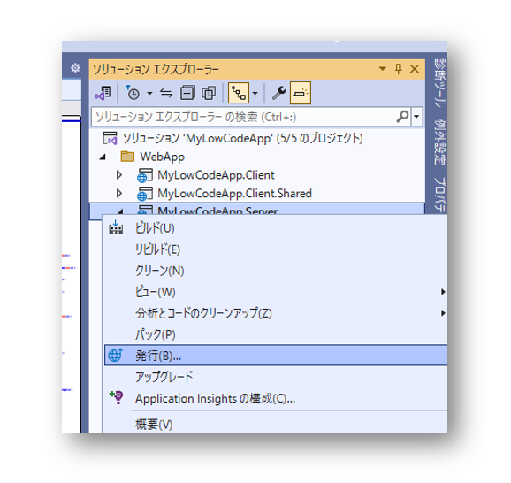
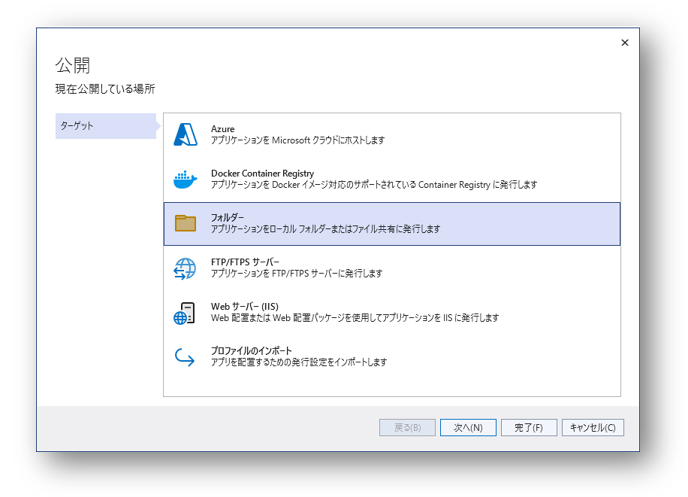
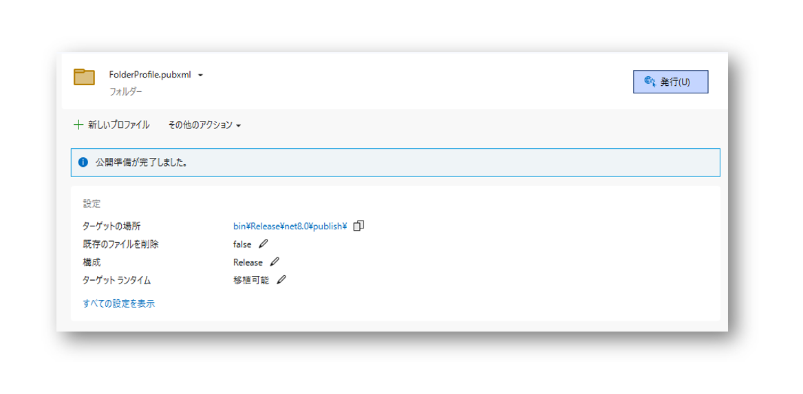
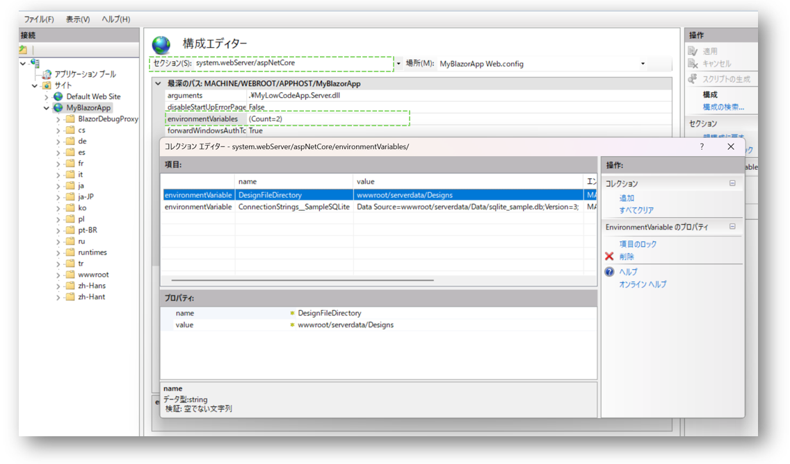

# Webサーバーへデプロイする
## Visual Studioで発行してサーバーへデプロイ
### ```プロジェクト名.Server```プロジェクトを右クリックして、「発行」を実行します


### 画面の指示ににしたがって発行設定します
直接にサーバーへ発行するオプションもありますが、ここではフォルダを選び、のちにサーバーへコピーするとします。


### 「発行」ボタンを押して、発行ファイルを「ターゲットの場所」へ保存します
これでデプロイに必要なファイルがビルドされ、指定の場所に保存されます。
また、この画面でターゲットランタイム等の設定も可能です。ここでの説明は省略します。


### デプロイファイルをサーバーの物理パスへコピーします
サーバーの種類によってコピー先は異なります。サーバーのドキュメントをご参照ください。

## サーバー設定
デザインファイルの場所、ConnectionString、画像等のファイル保存場所の設定が必要になります。
設定方法はデプロイ先のサーバーの種類によってことなりますが、おおよそ2種類あります。

また、Pathを記入する際にサーバー上のファイルシステム絶対パス例:```C:\\Deploy\\Data```、サーバーでの相対パス例:```wwwroot/Data/Design```があります。相対パスの場合は、上記**Publish**フォルダをルートとします。
### 1. ```appsettings.json```での設定
DesignFileDirectory設定(モジュール、サイドバー等のデータの場所、必須)
```json
  "DesignFileDirectory": "wwwroot/serverdata/Designs",
```

#### DataSources及びConnectionsStringsの設定(データベースを使用する場合)
```json
  "DataSources": [
    {
      "Name": "SampleSQLite",
      "DataSourceType": "SQLite"
    }
  ],
  "ConnectionStrings": {
    "Main": "",
    "SampleSQLite": "Data Source=wwwroot/serverdata/Data/sqlite_sample.db;Version=3;"
  }
  ```
#### FileStorages設定(追加写真等のファイルを使用する場合)
  ```json
  "FileStorages": [
    {
      "Name": "Local",
      "FileStorageType": "FileSystem",
      "Directory": "wwwroot/serverdata/Storages"
    }
  ]
```

### 2. サーバー側での設定
appsettings.jsonに上記の一部の設定を置かずにサーバー側で設定する場合もあります。下記例をもって説明します。

## サーバー設定例
### IIS
デプロイフォルダをIISの物理パスへコピーした後、DesignFileDirectory及びConnectionStringをIISの環境変数へ登録する場合は下図のように設定します。

**ターゲットサイト → 構成エディター → セッション:System.webServer/aspNetCore → environmentVariables**


### Nginx (Linux)

#### Nginx, Asp.NET Coreのruntime等はインストール済みの環境とします。
#### 1. 上記「発行」されたフォルダ```publish```をLinuxの```/var/www/```にコピーします。
#### 2. Designerがデプロイしたファイル: デフォルトとして開発機の```C:\Codeer.LowCode.Blazor.Local```下にあるファイルを```/var/www/publish/wwwroot/serverdata```にコピーします。
この際はappsettings.jsonでも``` "DesignFileDirectory": "wwwroot/serverdata/Designs",```になっていることを確認します。
コピー後はフォルダーに適宜なアクセス権限を設定してください。
#### 3. 発行されたアプリのdllを実行するためのサービスを作成します。この例ではMyLowCodeApp.Server.dll
```shell
sudo nano /etc/systemd/system/blazorapp.service
```

```conf
[Unit]
Description=BlazorApp

[Service]
WorkingDirectory=/var/www/publish
ExecStart=/usr/bin/dotnet /var/www/publish/MyLowCodeApp.Server.dll
Restart=always
RestartSec=10
SyslogIdentifier=blazorapp
User=www-data
Environment=ASPNETCORE_ENVIRONMENT=Production

[Install]
WantedBy=multi-user.target
```

#### 4. Nginxの設定ファイルを変更します

```shell
sudo nano /etc/nginx/sites-available/default
```
ここでの設定変更は最小限としています。
BlazorのNginxの設定については[マイクロソフトのドキュメント](https://learn.microsoft.com/ja-jp/aspnet/core/blazor/host-and-deploy/server?view=aspnetcore-8.0)をご参考ください。
```conf
server {
        listen 80 default_server;
        index index.html index.htm index.nginx-debian.html;
        server_name _;

        location / {
                try_files $uri $uri/ /index.html =404;
                proxy_pass http://localhost:5000;
        }
}
```
#### 5. BlazorAppのサービスを起動し、Nginxを再起動して完了です
```shell
sudo systemctl start blazorapp
sudo systemctl enable blazorapp

sudo systemctl restart nginx
```
これでNginxの80ポートを経由してBlazorAppをアクセスできます。
