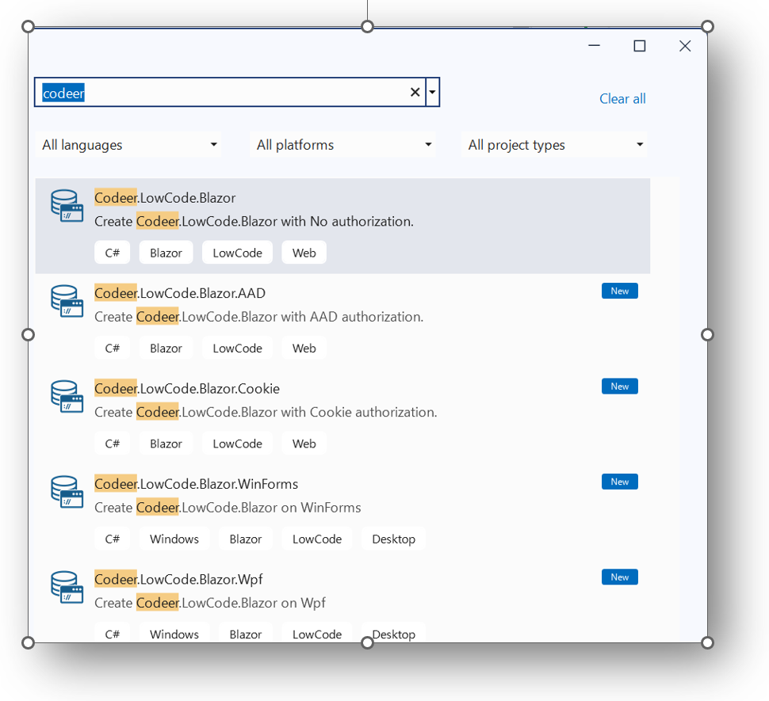
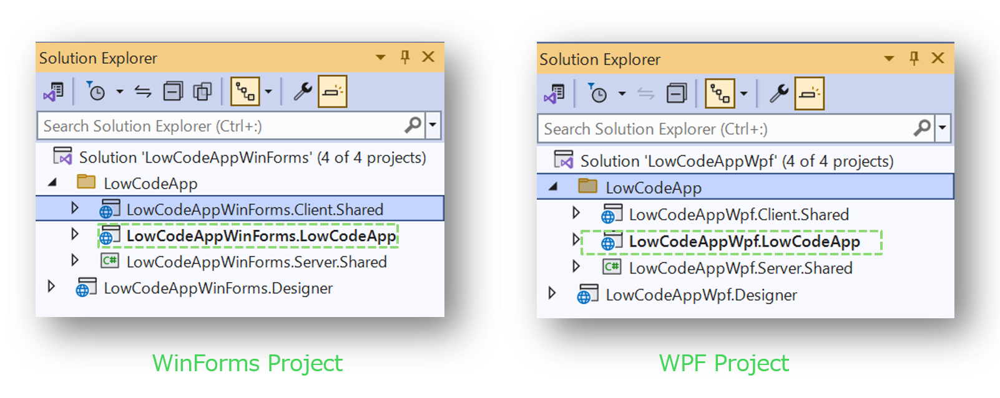

# Visual Studio ソリューション
## 概要
[Codeer.LowCode.Blazor.Templates](https://marketplace.visualstudio.com/items?itemName=Codeer.LowCodeBlazor)を使ってVisual Studioソリューションを作成すれば、複数のプロジェクトに含まれる「**ユーザーコード**」が出力されます。
テンプレートのタイプはBlazor/WPF/WinFormsになります。

## プロジェクトの種類と役割
### Blazorタイプのソリューション

| Project | 説明 |
| --------------- | --------------- | 
|[ProjectName].Server  | Blazorアプリのサーバー部分、 WebApi等でカスタマイズ可能 | 
|[ProjectName].Server.Shared  | DesignerとServerが共有する部分| 
|[ProjectName].Client  |BlazorアプリのClient(WebAssembly)部分、HTML/JS/CSS等を含むことが可能です| 
|[ProjectName].Client.Shared  | DesignerとClientが共有する部分| 
|[ProjectName].Designer  | Designer(WPF)アプリの部分、プロコードによるメニュー追加カスタマイズ可能 | 

これらのプロジェクトに[プロコード](overview/procode.md)を格納することが可能です。

### WPF/WinFormsソリューション

WPF/WinFormsソリューションでは、ServerおよびClientプロジェクトはWPFあるいはWinFormsプロジェクトに集約されています。

## 関連ページ
- [プロコード](overview/procode.md)

