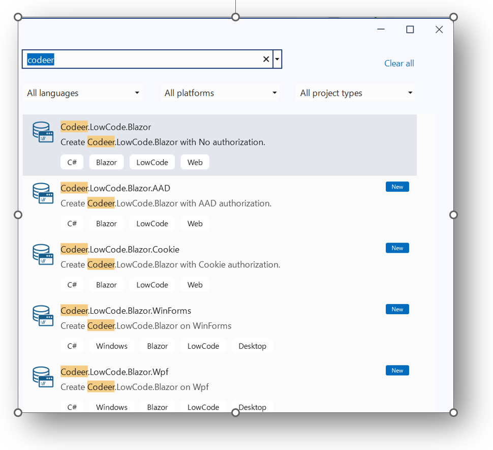
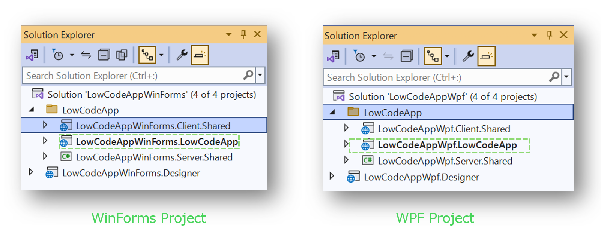

# Visual Studio ソリューションおよびデプロイ
## 概要
[Codeer.LowCode.Blazor.Templates](https://marketplace.visualstudio.com/items?itemName=Codeer.LowCodeBlazor)を使ってVisual Studioソリューションを作成すれば、複数のプロジェクトに含まれる「**ユーザーコード**」が出力されます。
テンプレートのタイプはBlazor/WPF/WinFormsになります。


## プロジェクトの種類と役割
### Blazorタイプのソリューション


| Project | 説明 |
| --------------- | --------------- | 
|[ProjectName].Server  | Blazorアプリのサーバー部分、 WebApi等でカスタマイズ可能 | 
|[ProjectName].Server.Shared  | DesignerとServerが共有する部分| 
|[ProjectName].Client  |BlazorアプリのClient(WebAssembly)部分、HTML/JS/CSS等を含むことが可能です| 
|[ProjectName].Client.Shared  | DesignerとClientが共有する部分| 
|[ProjectName].Designer  | Designer(WPF)アプリの部分、プロコードによるメニュー追加カスタマイズ可能 | 

これらのプロジェクトに[プロコード](overview/procode.md)を格納することが可能です。

### WPF/WinFormsソリューション

WPF/WinFormsソリューションでは、ServerおよびClientプロジェクトはWPFあるいはWinFormsプロジェクトに集約されています。



## デプロイ方法
### Blazor/WPF/WinFormsアプリの部分
成果物としてアプリをデプロイするには、Server/WPF/WinFormsプロジェクトを選択したうえで、Visual Studioの「**ビルド**」メニューから「**発行**」あるいは「**公開**」してください。
### Designerの部分
同上。

```注意：Debug構成でデザイナをビルドしますと、正常に動作しない場合がありますので、必ずRelease設定でビルドしてください。```
### Designerプロジェクトの部分
デザイナメニュー「ファイル」→「デプロイ」を選んでください。デザイナプロジェクトの関連ファイルは[デプロイフォルダ](deploy_folder.md)に出力されます。

## デプロイ先 PC の前提

| デプロイ先で動かすもの | WebView2 ランタイム |
|---|---|
| Blazor の Web アプリ（Server プロジェクト）を Web サーバーでホストする | **不要** |
| WPF / WinForms 版のクライアントアプリを配布する | **必須** |
| デザイナ（Designer プロジェクト）を別 PC で動かす | **必須** |

WPF / WinForms / Designer は内部で **Microsoft Edge WebView2** を使ってBlazorコンポーネントを描画するため、配布先 PC に **Microsoft Edge WebView2 ランタイム** が入っている必要があります。

- Windows 11 は標準搭載。Windows 10 でも Microsoft Edge と一緒にインストールされていることが多いです。
- **Windows Server は標準では未搭載**なので、Windows Server に WPF / WinForms 版や Designer を配置する場合は注意してください。
- 入っていない PC ではアプリを起動しても画面が真っ白のままになります。
- 未インストールの場合は [Microsoft Edge WebView2 ダウンロードページ](https://developer.microsoft.com/microsoft-edge/webview2/) から「Evergreen Standalone Installer」をインストールしてください。

## 関連ページ
- [プロコード](overview/procode.md)
- [デプロイフォルダ](deploy_folder.md)
