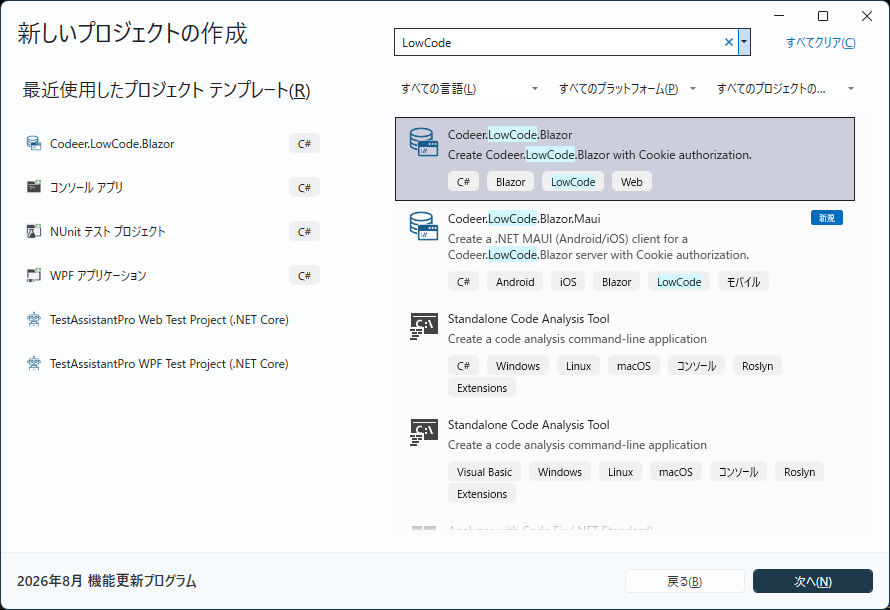
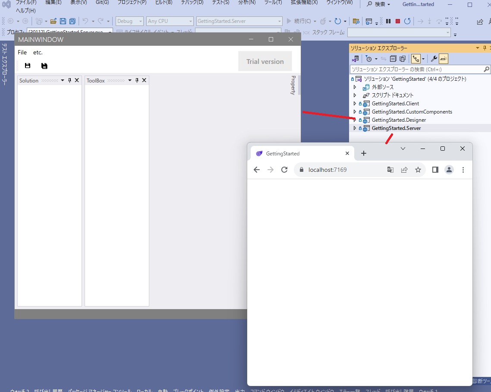

# Visual Studio ソリューションおよびデプロイ
## 概要
[Codeer.LowCode.Blazor.Templates](https://marketplace.visualstudio.com/items?itemName=Codeer.LowCodeBlazor)を使ってVisual Studioソリューションを作成すれば、複数のプロジェクトに含まれる「**ユーザーコード**」が出力されます。
テンプレートは 2 種類です。

| テンプレート | 内容 |
|---|---|
| `Codeer.LowCode.Blazor` | Blazor WebAssembly クライアント + ASP.NET Core サーバー + デザイナ。ログイン機能（Cookie 認証。外部 IdP・二要素認証は設定で追加）を含む。**通常はこちら** |
| `Codeer.LowCode.Blazor.Maui` | .NET MAUI（Android / iOS）クライアントのみ。上のテンプレートで作ったサーバーに接続するスマートフォンアプリ |



同じ内容のソリューションは [Starter リポジトリ](https://github.com/Codeer-Software/Codeer.LowCode.Blazor.Starter) からも入手できます（Claude Code に環境構築を任せる場合もこのリポジトリを使います）。

## プロジェクトの種類と役割
### Web ソリューション（Codeer.LowCode.Blazor）



| Project | 説明 |
| --------------- | --------------- |
|[ProjectName].Server  | Blazorアプリのサーバー部分。ログイン処理・WebApi等でカスタマイズ可能 |
|[ProjectName].Client  |BlazorアプリのClient(WebAssembly)部分、HTML/JS/CSS等を含むことが可能です|
|[ProjectName].Client.Shared  | DesignerとClientが共有する部分|
|[ProjectName].Designer  | Designer(WPF)アプリの部分、プロコードによるメニュー追加カスタマイズ可能 |
|[ProjectName].LicenseRegisterCli  | ライセンス登録用のコマンドラインツール（[Windows で CLI 登録](licence_windows_cli_registration.md)） |

これらのプロジェクトに[プロコード](procode.md)を格納することが可能です。

### MAUI テンプレート（Codeer.LowCode.Blazor.Maui）

| Project | 説明 |
| --------------- | --------------- |
|[ProjectName].Maui  | .NET MAUI（Android / iOS）アプリ。起動中の Web ソリューションのサーバーに接続する（URL はアプリの設定画面で入力） |
|[ProjectName].Client.Shared  | Web ソリューションと同じ共有部分 |

サーバー・デザイナ・ライセンスツールは Web ソリューション側のものを使います。デザインの変更はサーバー側のデプロイで反映されるため、ストアの更新は不要です。

### WPF / WinForms・ログイン画面なしの構成

WPF / WinForms のデスクトップアプリ構成、ログイン画面のない構成、マルチテナント構成は Visual Studio テンプレートとしては提供していません。
[Starter リポジトリ](https://github.com/Codeer-Software/Codeer.LowCode.Blazor.Starter) の `Source/Hosts/` に参考用のホスト（`Wpf` / `WinForms` / `MultiTenant`）があります。ログイン画面だけを外したい場合は、同リポジトリの `CLAUDE.md`「認証を外す」の手順で Web ソリューションから認証部分を外してください。

## デプロイ方法
### Web アプリの部分
成果物としてアプリをデプロイするには、Serverプロジェクトを選択したうえで、Visual Studioの「**ビルド**」メニューから「**発行**」あるいは「**公開**」してください。詳細は [Web サーバーへのデプロイ](server_deploy.md) を参照してください。
### Designerの部分
同上。

```注意：Debug構成でデザイナをビルドしますと、正常に動作しない場合がありますので、必ずRelease設定でビルドしてください。```
### デザインプロジェクトの部分
デザイナメニュー「ファイル」→「デプロイ」を選んでください。デザインプロジェクトの関連ファイルは[デプロイフォルダ](deploy_folder.md)に出力されます。

## デプロイ先 PC の前提

| デプロイ先で動かすもの | WebView2 ランタイム |
|---|---|
| Blazor の Web アプリ（Server プロジェクト）を Web サーバーでホストする | **不要** |
| WPF / WinForms 版のクライアントアプリを配布する | **必須** |
| デザイナ（Designer プロジェクト）を別 PC で動かす | **必須** |

WPF / WinForms / Designer は内部で **Microsoft Edge WebView2** を使ってBlazorコンポーネントを描画するため、配布先 PC に **Microsoft Edge WebView2 ランタイム** が入っている必要があります。

- Windows 11 は標準搭載。Windows 10 でも Microsoft Edge と一緒にインストールされていることが多いです。
- **Windows Server は標準では未搭載**なので、Windows Server に WPF / WinForms 版や Designer を配置する場合は注意してください。
- 入っていない PC ではアプリを起動しても画面が真っ白のままになります。
- 未インストールの場合は [Microsoft Edge WebView2 ダウンロードページ](https://developer.microsoft.com/microsoft-edge/webview2/) から「Evergreen Standalone Installer」をインストールしてください。

## 関連ページ
- [プロコード](procode.md)
- [デプロイフォルダ](deploy_folder.md)
- [Web サーバーへのデプロイ](server_deploy.md)
